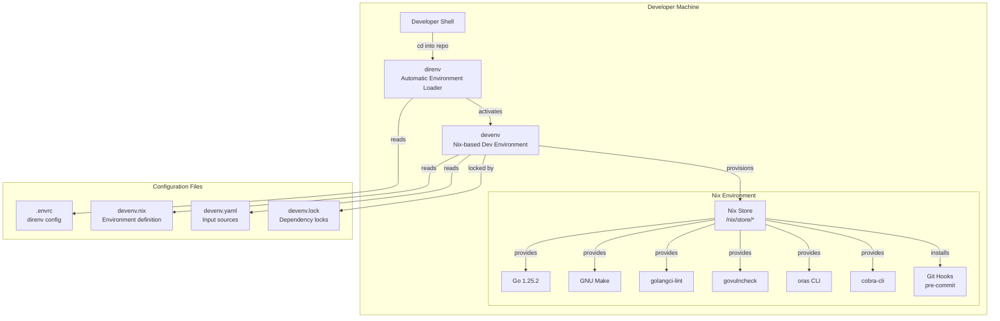

# Artifact Conduit (ARC) Developer Guide

This guide provides technical information for developers contributing to the Artifact Conduit (ARC) project. It covers the development workflow, build system, code organization, and common development tasks. For detailed information about specific topics, see the referenced sections.

## Development Environment Architecture

The ARC project uses a declarative, reproducible development environment based on Nix. This approach ensures that all developers work with identical tool versions and configurations, eliminating "works on my machine" issues.



**Environment Loading Flow**: When a developer navigates into the repository directory, `direnv` automatically detects the `.envrc` file and activates the `devenv` environment, which provisions all required tools from the Nix store.

## Prerequisites

Before setting up the ARC development environment, ensure the following software is installed on your system:

| Requirement             | Purpose                                                 | Minimum Version |
| ----------------------- | ------------------------------------------------------- | --------------- |
| **Nix Package Manager** | Provides reproducible package management                | 2.3+            |
| **direnv**              | Automatically loads environment when entering directory | 2.20+           |
| **Git**                 | Version control (provided by Nix if needed)             | 2.0+            |

## Development Workflow Overview

ARC follows a **code-generation-heavy pattern** typical in Kubernetes ecosystem projects. Changes to API types trigger code regeneration, which produces client libraries, OpenAPI specifications, and CRD manifests.

***

## Build System

The ARC build system uses a Makefile to orchestrate various tools, designed for reproducibility. All required tools are provided in the `bin/` directory.

| Target           | Purpose                                | Key Tools Used                              |
| ---------------- | -------------------------------------- | ------------------------------------------- |
| `make codegen`   | Generate client-go libraries & OpenAPI | `openapi-gen`, `kube_codegen.sh`            |
| `make manifests` | Generate CRDs and RBAC manifests       | `controller-gen`                            |
| `make fmt`       | Format code, add license headers       | `addlicense`, `go fmt`                      |
| `make lint`      | Run linters and checks                 | `golangci-lint`, `shellcheck`, `addlicense` |
| `make test`      | Run all tests with coverage            | `ginkgo`, `setup-envtest`                   |
| `make clean`     | Remove generated binaries              | -                                           |

### Tool Versions

The system **pins specific tool versions** for reproducibility:

- BDD testing framework: `v2.27.2`
- Go linter: `v2.5.0`
- CRD/RBAC generator: `v0.19.0`
- Kubernetes test API server: `release-0.22`
- K8s for integration tests: `1.34.1`

***

## Codebase Organization

ARC codebase follows standard Kubernetes project conventions:

| Directory           | Purpose                                 | Generated/Manual |
| ------------------- | --------------------------------------- | ---------------- |
| `api/arc/v1alpha1/` | Custom resource type definitions        | Manual           |
| `client-go/`        | Client libraries for ARC resources      | Generated        |
| `pkg/apiserver/`    | Extension API server implementation     | Manual           |
| `pkg/controller/`   | Controller reconciliation logic         | Manual           |
| `pkg/registry/`     | Storage strategies for custom resources | Manual           |
| `config/`           | Kubernetes manifests (CRDs, RBAC)       | Generated        |
| `hack/`             | Build and code generation scripts       | Manual           |

***

## Code Generation Process

ARC uses the Kubernetes code-generator to produce client libraries and OpenAPI specs.

- `make codegen` triggers `hack/update-codegen.sh`
- Generates:
  - Client-go libraries in `client-go/`
  - OpenAPI specs
  - CRD manifests

See Client Libraries section for usage details.

***

## Testing Strategy

ARC uses a multi-layered testing strategy:

- **Unit Tests**
- **Integration Tests** (uses `ENVTEST_K8S_VERSION=1.34.1`)
- **Controller Tests** via envtest

Run all tests and generate coverage:

```sh
make test
```

Setup environment for integration tests:

```sh
setup-envtest
export ENVTEST_K8S_VERSION=1.34.1
```

Test coverage is tracked using Coveralls.

***

## Continuous Integration (CI) Pipeline

Pipeline runs on every push and pull request, enforcing code quality and test coverage.

- **Lint Job**
  - `addlicense`
  - `shellcheck`
  - `golangci-lint`
- **Test Job** (runs after Lint)
  - `make test`

For customization details, see `.github/workflows/golang.yaml`.

***

## Adding a New Custom Resource

To introduce a new CRD:

1. **Create type definition** in `api/arc/v1alpha1/`
2. **Add OpenAPI model name**
3. **Regenerate code** via `make codegen`
4. **Implement storage** in `pkg/registry/`
5. **Add controller logic** in `pkg/controller/` if reconciliation is needed

See `hack/update-codegen.sh` for implementation details.

***

## Modifying Existing API Types

Typical steps:

1. Edit types in `api/arc/v1alpha1/`
2. Run `make codegen`
3. Run `make manifests`
4. Run `make test`

> **Note:** Breaking changes may affect existing clients. Follow semantic versioning and provide migration paths.

***

## Code Quality & Linting

Lint and license checks before committing:

- `addlicense` for Apache 2.0 headers
- `shellcheck` for scripts in `hack/`
- `golangci-lint` for Go linting

Fix issues with:

```sh
make fmt
make lint
```

***
