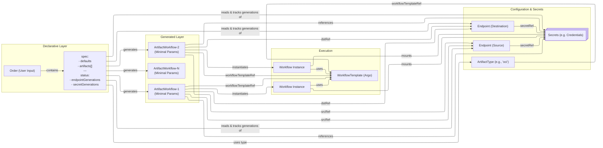

# Evaluate Future ARC Architecture Based on Predecessors

## Context and Problem Statement

This ADR is about finding the right architecture for the ARC suite of services based on the knowledge gained during the internal predecessors of this project.

### Glossary

- `Order`: Represents an order of one or more artifacts. Tracks generation numbers of referenced `Endpoints` and `Secrets` to detect changes and trigger `ArtifactWorkflow` reconciliation for idempotency.
- `ArtifactWorkflow`: Represents a single artifact to be processed as part of an `Order`. Minimal resource containing artifact type reference and source/destination endpoint references. Replaces legacy `OrderArtifactWorkflow`.
- `ArtifactType`: Defines rules, defaults, and the `WorkflowTemplate` reference for a specific artifact type like 'OCI'. Replaces legacy `OrderTypeDefinition`.
- `Endpoint`: General term for source or destination. Can be a source or destination for artifacts. Includes optional credentials to access it. Changes to `Endpoint` or its referenced `Secret` trigger `Order` reconciliation.
- `WorkflowTemplate`: Argo Workflows, see <https://argo-workflows.readthedocs.io/en/latest/fields/#workflowtemplate>
- `Workflow`: Argo Workflows, see <https://argo-workflows.readthedocs.io/en/latest/fields/#workflow>
- `ARC API Server`: A Kubernetes Extension API Server which handles storage of ARC API
- `ARC Controller Manager`: A set of Kubernetes Controller which reconciles `Orders`, creates/updates `ArtifactWorkflow` resources from `Order` artifacts and instantiates `Workflow` resources for each `ArtifactWorkflow`. Tracks `Endpoint` and `Secret` generations to ensure idempotency.

## Considered Options

### Classic Kubernetes Operators

- [CRDs](https://kubernetes.io/docs/concepts/extend-kubernetes/api-extension/custom-resources/) are used to interact with ARC via the Kubernetes API Server.
- Several operators come into play which reconcile the different custom resources.
- A sharding mechanism is implemented to be able to scale the workers horizontally and give every worker a given chunk of resources to reconcile.

#### Pros

- CRDs and Kubernetes are relatively simple to implement

#### Cons

- Storage may be limited by `etcd` and can bring the control plane of Kubernetes into trouble if too many resources are present
- The necessity to implement sharding may be hard work and error prone
- Thus said it may not scale in way necessary for such a solution

### Extension API Server and CNCF Landscape Tooling

#### Flavor A

Flavor uses several controllers to handle different parts of the API.
Orders are reconciled and converted to hydrated Orders which contain the source and destination information along with the artifact to process.
This information are published to some message queue which is subscribed by workers working on that queue.
Optionally [KEDA](https://keda.sh/) is used to scale, handle quotas and fairness.
The database to be used for the API Server is etcd.

#### Flavor B

Same as [Flavor A](#flavor-a) except the database for the API Server is something like Postgres instead of etcd.
Additionally the option is considered to let the controller access the Postgres directly to reconcile without using the Kubernetes API Server.

#### Flavor C

Same as [Flavor B](#flavor-b) except that no message queue is used but the job queue is stored directly in the Postgres database.

#### Flavor D

Same as [Flavor A](#flavor-a) except that no message queue is used.
The Order controller creates hydrated orders directly in `etcd` as readonly resource which is then consumed by workers directly.
This approach needs some kind of sharding mechanism to have the workers to know which shard of resources they need to handle.

#### Flavor E

This flavor is the most compelling due to the reduced amount of code that is necessary to bring this solution to live.
etcd is used as storage for the API server.
Argo Workflows is used to build workflows which do the steps necessary to process one artifact.
Kueue can be used to bring fairness, scaling, quotas into play which workflows.
The order controller creates "jobs" which are actually Argo Workflows.

This option is described in detail in the following document.

#### Technology

- Instead of [CRDs](https://kubernetes.io/docs/concepts/extend-kubernetes/api-extension/custom-resources/), `ARC` uses an [Extension API Server](https://kubernetes.io/docs/tasks/extend-kubernetes/setup-extension-api-server/) via the [Kubernetes API Aggregation Layer](https://kubernetes.io/docs/concepts/extend-kubernetes/api-extension/apiserver-aggregation/) to handle API requests.
- This gives it the possibility to use a dedicated `etcd` or a even more suitable storage backend for the high amount of resources and status information in case this is necessary.
- While `etcd` still can be used as storage backend, it is one separated from the `etcd` used by the Kubernetes control plane and reduces the risk of bringing the whole cluster into trouble.
- As the storage implementation is under our control, we can implement a custom storage interface or use `kind` down the line.
- Additional links
  - <https://github.com/kubernetes-sigs/apiserver-runtime>
  - <https://github.com/kubernetes/sample-apiserver/tree/master>
- Utilize [Argo Workflows](https://argo-workflows.readthedocs.io) to handle the workflows necessary to process different artifact types
- Optionally use [Kueue](https://kueue.sigs.k8s.io/docs/overview/) to handle quotas and enhanced scheduling
- Namespaces are used to separate resources in a multi-tenant environment.

#### Architecture Diagram

**Overview Diagram**

**API Concept Diagram**

The solution shows the ARC API Server which handles storage for the custom resources / API of ARC.
`etcd` is used as storage solution.
`Order Controller` is classic Kubernetes controller implementation which reconciles `Orders` and monitors `Endpoints` and `Secrets`. In a similar fashion the `ArtifactWorkflow Controller` reconciles `ArtifactWorkflows` and instantiates and tracks Argo Workflows based on the `ArtifactType`. Both controllers are contained in the `ARC Controller Manager`.

An `Order` contains the information what artifacts should be processed and tracks generation numbers of referenced `Endpoints` and `Secrets` to detect changes.
An `Endpoint` contains the information about a source or destination for artifacts.
The `Order Controller` creates `ArtifactWorkflow` resources which are minimal, idempotent representations of artifacts to be processed.
When an `Endpoint` or referenced `Secret` changes (detected via generation tracking), the controller automatically recreates the rendered configuration and triggers `ArtifactWorkflow` recreation.
An `ArtifactType` specifies the processing rules and workflow templates for artifact types (e.g. `oci`, `helm`).

#### Pros

- Using dedicated `etcd` does not clutter the infra etcd
- Storage can be changed later on if necessary
- Keep the declarative style of Kubernetes while having complete freedom on the API implementation
- Argo Workflows allows us to focus on the domain of the product without reinventing the wheel
- Qotas and Fairness easy without writing code via Kueue
- **Idempotency**: Generation tracking ensures configuration changes are reliably detected and handled without race conditions
- **Minimal Resource Overhead**: Small `ArtifactWorkflow` resources with externalized configuration reduce API load and enable efficient scaling

#### Cons

- Building addon apiservers directly on the raw api-machinery libraries requires non-trivial code that must be maintained and rebased as the raw libraries change.
- Steep learning curve when starting the project and steeper learning curve when joining the project.
- Generation tracking adds complexity to the reconciliation logic that must be carefully maintained

## Decision Outcome

Chosen Option: Solution E.

Because the solution is the one that provides the most flexibility while the necessity to write own code for many parts is minimized.
The flexibility comes from utilizing the CNCF projects Argo Workflows and Kueue for building the workflow engine.
The project itself can focus on the order process and the handling of endpoints.
