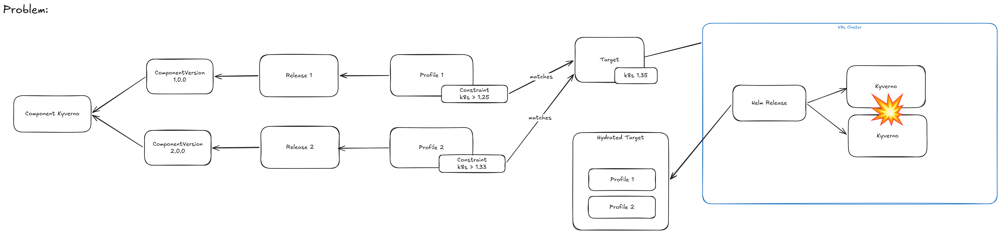
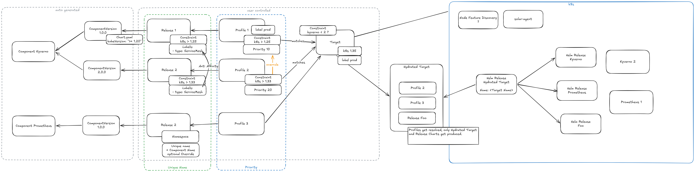

# Unique Release Name

## Context and Problem Statement

As a CPaaS provider we need to manage addons across a wide range of Kubernetes Clusters.

Based on external factors we want to match profiles, e.g.:
- There is a Release for Kyverno V1 and it supports K8s >1.25.
- There is another Release for Kyverno V2 and it supports K8s >1.33.

We now have two profiles matchings our Clusters with K8s version >1.33 and others.

Kyverno should only be rolled out exactly once with higher versions taking precedence and allow in-place upgrades.

In past discussion we envisioned a "unique name" to identify "only once per" releases and profiles, as well as a definable priority for profiles.

## Considered Solutions

## Decision Outcome

- The Unique Name gets defined on a Release based on the component name.
  - can be overridden optionally in case naming scheme changes in a component.
- Releases can define anti-affinity rules based on their labels.
- Releases define which namespace they get deployed to.
  - Releases are always unique in one namespace.
- Profiles have a priority field which decides if multiple releases clash.
  - in case the priority is equal a warning to the user should be issued and the profiles get skipped.
- Profiles get resolved into their releases -> A Hydrated Target Chart only rolls out Release Charts.
  - => renderer will no longer need to support to render profile Charts.
