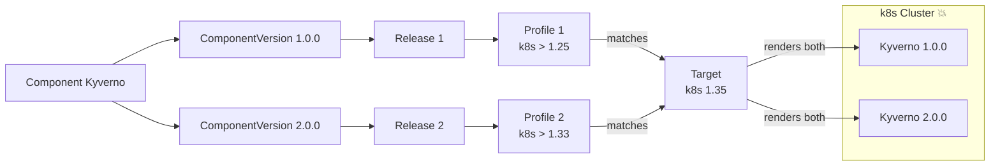
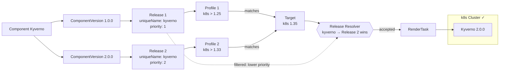
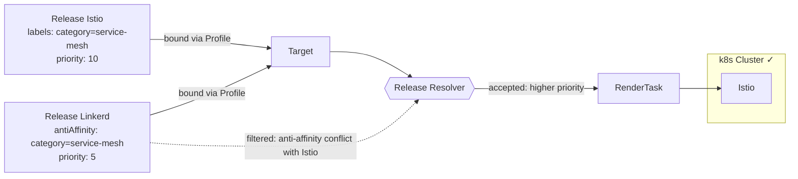

# Unique Release Name

## Context and Problem Statement

As a CPaaS provider we need to manage addons across a wide range of Kubernetes Clusters.

Based on external factors we want to match profiles, e.g.:
- There is a Release for Kyverno V1 and it supports K8s >1.25.
- There is another Release for Kyverno V2 and it supports K8s >1.33.

We now have two profiles matching our Clusters with K8s version >1.33 and others.

Kyverno should only be rolled out exactly once with higher versions taking precedence and allow in-place upgrades.

Without conflict resolution, both profiles match the same Target and both Kyverno releases are deployed — causing a duplicate installation:

## Decision Outcome

- `Release.Spec.UniqueName` is a logical identifier that groups releases representing the same component. When multiple releases share a `uniqueName`, only one is deployed per Target.
    - If not set, the Target controller uses the parent Component name (from the referenced ComponentVersion) as the effective deduplication key at reconcile time. The field itself remains empty in storage.
    - Immutable once set.
- Releases carry a `Priority` field. When multiple releases share the same `uniqueName` on a Target, the one with the highest priority wins.
    - If priorities are equal, the conflict is broken deterministically by the namespace-qualified ReleaseBinding name in ascending alphabetical order.
- Releases can define `AntiAffinity` rules (label selectors). If another Release already accepted for a Target matches the selector — or vice versa — the lower-priority Release is excluded.
- The resolver runs in the Target controller after all ReleaseBindings are collected and before any RenderTask is created.
- The `uniqueName` doubles as the identity of a release within a Target's bootstrap chart: it is the map key under which the release is registered in the bootstrap input (and thus the suffix of the generated FluxCD resource names). The Kubernetes Release object name is **not** suitable here because it is not unique across namespaces — with cross-namespace ReleaseBindings, two namespaces can each define a `my-release`, and keying on the object name would let one silently overwrite the other in the bootstrap. Keying on `uniqueName` is safe because the resolver guarantees it is unique among accepted releases.

## Solution

### Deduplication by priority

Two releases share `uniqueName: kyverno`. The Target controller keeps only the higher-priority one:

### Anti-affinity

A Release can declare that it must not be co-deployed with releases matching a given label selector. The resolver enforces this bidirectionally:

