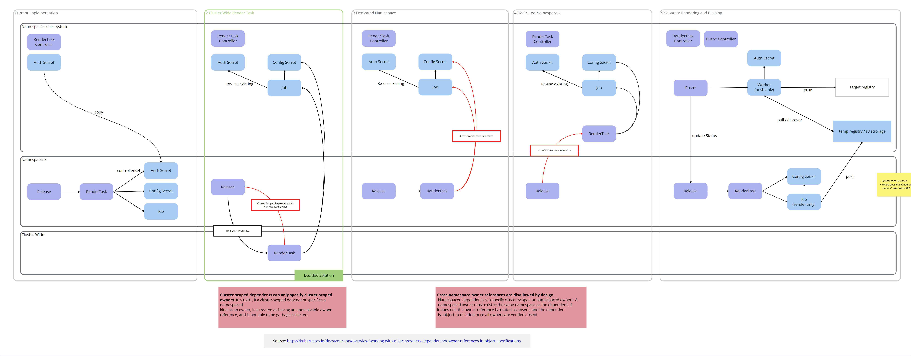

# Move RenderTask Jobs to dedicated Namespace

## Context and Problem Statement

Currently whenever a resource creates a RenderTask (e.g. a Release, a
HydratedTarget) the RenderTask is created in that resource's namespace.

A RenderTask creates a Job which mounts a config Secret which contains the
configuration file for the renderer cli. This Job also needs to mount a secret
with credentials in order to be able to push the rendered chart to the
registry.

Due to Jobs/Pods only being able to mount secrets from the same namespace the
authentication secret also has to be copied to the resource's namespace.
Therefore the current implementation copies the auth secret from the
controller's namespace to the resource's namespace.

Of course this raises a security concern, since the secret is owned by the
solar platform operator and should not be able to be read by a solar user.

## Considered Solutions

We identified 4 alternatives and compared them to the current implementation.
We then had 5 options moving forward:

1. Keep as is
2. Make RenderTask a cluster-wide resource and have its job be deployed in the controller's namespace.
3. Keep Creating RenderTasks besides Releases/HydratedTargets in the same namespace but create job and config secret in the controller's namespace.
4. Always create RenderTasks in the controller's namespace, Job and Secret are local references in that namespace.
5. Split up rendering and pushing to target registry by introducing the concept of a "push worker" similar to discovery.

## Decision Outcome

- We agreed that the current implementation is not desirable because a secret that is only the platform's concern gets copied to a tenant's namespace.
- We decided against Option 5 because of its larger complexity. Deploying another Registry / external Storage is overkill.
- Option 4 was decided against because having a namespaced resource only be deployed to the controller's namespace is unintuitive.
- Option 3 opens more risks for orphaned jobs/secrets and would be incompatible if we ever decide to introduce cluster-wide resources (e.g. ClusterProfile)

Therefore we will be implementing **Option 2** going forward.

### Follow-up Issues

- <https://github.com/opendefensecloud/solution-arsenal/issues/315>
