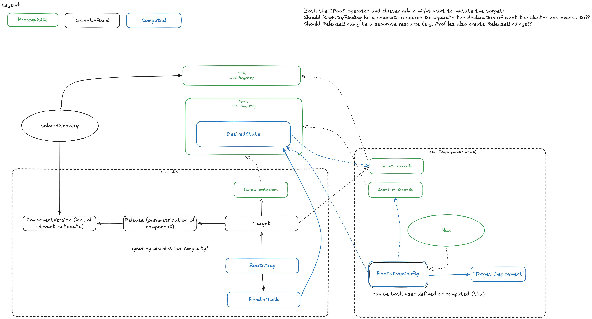

# SolAr Does Not Handle OCI Registry Authentication

## Context and Problem Statement

When evaluating how to implement authorization for OCI registries — ensuring every target has just enough permissions — we encountered significant complexity. The question of how SolAr should manage, distribute, and scope registry credentials across targets, environments, and security boundaries proved to be a deep architectural concern that risks coupling SolAr tightly to authentication infrastructure.

Team discussions converged on a simpler direction: SolAr should stay out of the authentication business entirely and instead require that targets declare their own registry access.

## Decision Drivers

- Keeping SolAr decoupled from authentication infrastructure (different registries, different credential mechanisms, DMZ boundaries)
- Avoiding privilege escalation risks from SolAr distributing or copying registry credentials across namespaces
- Enabling SolAr to work in a variety of environments without prescribing a specific auth strategy
- Aligning with ADR-006 lessons around not copying secrets into tenant namespaces

## Decision Outcome

SolAr does not handle any OCI registry authentication. Instead, credentials and registry access information are provided by the entities that own them.

### Design Principles

1. **Components declare their origin.** A Component/ComponentVersion clearly indicates which OCI registry it originates from. Registry aliases can be specified to handle environments where the same registry is reachable under different names (e.g. across a DMZ boundary).

2. **Targets declare their registry access via RegistryBindings.** A Target advertises which OCI registries it can access through dedicated `RegistryBinding` resources. This includes the credentials for the destination registry where rendered desired state is pushed. See ADR-009 for the binding model.

3. **Rendering is per-target (optimize later).** Each target gets its own rendered output, configured directly on the Target itself. This avoids premature optimization around shared renders. As a later optimization, targets that share the same registry access may be grouped for render deduplication — whether grouping by destination registry alone is sufficient or requires deeper access matching is an open question to be answered when the optimization is implemented.

4. **Rendered output stays granular.** The renderer produces multiple artifacts per target rather than a single monolithic one. This preserves the option for lazy rendering as a future optimization.

5. **Registry access is validated at render time.** When rendering for a target, SolAr checks that the target has access to all required registries. If a target cannot reach a required source registry, the render fails early with a clear error.

6. **Discovery is fully optional.** Catalog population via solar-discovery is not a prerequisite. Components and ComponentVersions can be created through other means (e.g. direct API calls, GitOps, catalog chaining).

### Consequences

**Positive:**

- SolAr remains agnostic to the authentication mechanism (static credentials, workload identity, external secret operators, etc.)
- No credential copying or distribution logic in SolAr controllers
- Clear separation of concerns: the platform operator or cluster maintainer owns registry credentials
- Simpler security model — SolAr never holds credentials it does not need

**Negative:**

- Targets must be configured with registry access information, adding setup effort for the cluster maintainer
- SolAr cannot proactively verify registry connectivity — validation only happens at render time
- Registry alias configuration adds a concept that users need to understand in multi-environment setups
