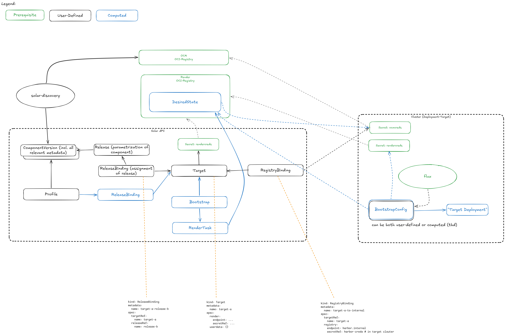

# Split Target Concerns into ReleaseBinding and RegistryBinding

## Context and Problem Statement

Today the `Target` resource conflates several concerns into a single object:

- Identity of the target cluster (registration, status reporting, agent configuration)
- Which registries the target has access to (and the credentials for them)
- Which Releases (or Profiles) should be deployed to it

This single-resource model makes it hard to express the reality of a multi-stakeholder environment. In practice, different user groups own different aspects of a target:

- **Platform Provider** owns part of the target's registry access and are resposible for part of the profiles and releases matching the cluster — they know which auxiliary registries the cluster can reach (DMZ, mirror, internal pull-through cache) and they control the credentials.
- **Platform Provider** owns the registration lifecycle of the target itself.
- **Cluster Admins / Tenants** own what is deployed onto the cluster — they pick releases and profiles from the catalog and assign them to targets.
- **Cluster Admins / Tenants** own the configuration of additional private registries.

Putting all of this on one object forces these groups to share write access to the same resource, which makes RBAC awkward and risks one group accidentally clobbering another's configuration. It also conflicts with ADR-007, which establishes that registry access and credentials should be declared by the entity that owns them rather than by SolAr or by the deployment coordinator.

## Decision Drivers

- Enable distinct RBAC scopes for platform providers vs. tenants
- Align with ADR-007: credentials and registry access live with the entity that owns them
- Keep Target focused on cluster identity and agent lifecycle
- Allow multiple bindings to compose against the same Target without coordinated edits to a single object
- Support workflows where the platform provider provisions registry access ahead of time, before any tenant assigns workloads

## Considered Options

1. **Keep Target monolithic** — continue putting registry access and release assignments on Target itself.
2. **Split into Target + ReleaseBinding + RegistryBinding** — three distinct CRs, each owned by a different stakeholder group.
3. **Split into Target + ReleaseBinding only** — leave registry access on Target; only externalize release assignments.

## Decision Outcome

Chosen option: **Option 2 — Split Target into three resources.**

### Resource Model

#### Target

The Target becomes a focused resource describing the cluster itself:

- Cluster identity and metadata (name, labels, security domain)
- Capacity information (CPU, memory, GPU, storage)
- Agent registration / status fields
- Render configuration (per ADR-007: how this target should be rendered for)

The Target no longer carries registry credentials or release assignments directly.

#### RegistryBinding

A `RegistryBinding` declares that a Target can access a specific OCI registry, and provides the credentials needed to do so. Owned by the **CPaaS/Platform Provider** or **Cluster Maintainer**.

Conceptually:

- References a Target
- Identifies a registry (and any aliases that apply in this environment, see ADR-007)
- References (or contains) the credentials secret for that registry
- Indicates direction: source (pull desired state, pull components) or destination (push rendered output)

Multiple RegistryBindings can apply to the same Target, one per registry the target can reach.

#### ReleaseBinding

A `ReleaseBinding` declares that a Release (or Profile) should be deployed to a Target. Owned by the **Deployment Coordinator** / **Tenant**.

Conceptually:

- References a Target
- References a Release or Profile
- Carries any binding-specific overrides or scheduling constraints

Multiple ReleaseBindings can apply to the same Target, one per workload the tenant wants to deploy.

### Impact on Profiles and HydratedTarget

The way Profiles work will change as part of this split. Rather than being directly referenced from a `HydratedTarget` (or similar bootstrap construct), Profile-related controllers will materialize their effect by **creating ReleaseBindings** for the targeted clusters. The Profile becomes a higher-level grouping/templating concept whose reconciliation output is a set of ReleaseBindings.

A consequence of this is that the **`HydratedTarget` resource (sometimes referred to as the Bootstrap resource) likely becomes obsolete**. Its role — capturing the effective desired state for a target derived from one or more Profiles — is now expressed declaratively as the set of ReleaseBindings that point at the Target. This removes one layer of indirection and aligns the model with the new ownership boundaries.

The exact migration path for existing HydratedTarget consumers is left to a follow-up.

### Interaction with Rendering

When the renderer produces output for a Target, it:

1. Collects all `ReleaseBinding`s pointing at that Target to determine the desired state.
2. Collects all `RegistryBinding`s pointing at that Target to determine reachable registries and credentials.
3. Validates (per ADR-007) that all source registries required by the bound Releases are covered by a RegistryBinding.
4. Renders the desired state and pushes to the destination registry indicated by the corresponding RegistryBinding.

If a required registry has no matching RegistryBinding, rendering fails with a clear error pointing at the missing binding.

### RBAC Model

The split enables clean role separation:

| Resource | Typical Owner |
|----------|---------------|
| Target | Cluster Maintainer |
| RegistryBinding | CPaaS/Platform Provider, Cluster Maintainer |
| ReleaseBinding | Deployment Coordinator (Tenant) |

Each group can be granted write access to only the resource type they own, without exposing the others.

### Consequences

**Positive:**

- Clear ownership boundaries — each stakeholder writes their own resources
- RBAC becomes straightforward: standard Kubernetes Role/RoleBinding per resource type
- Platform providers can provision registry access ahead of tenant onboarding
- Tenants can assign releases without touching credential or registry configuration
- Aligns naturally with ADR-007: SolAr never holds credentials it does not need
- Composable — adding a new release or new registry no longer requires editing the Target

**Negative:**

- Three resources to manage instead of one; users see more objects in `kubectl get`
- The relationship between Target, RegistryBinding, and ReleaseBinding must be discoverable (likely via labels/selectors or owner references) — UI and CLI tooling needs to surface this
- Migration path needed for existing Target objects that currently embed registry access and release assignments
- More controller logic to validate bindings consistently

## Naming

The `*Binding` suffix was chosen to match Kubernetes conventions (`RoleBinding`, `ClusterRoleBinding`) and to clearly signal "this resource links X to Y". Alternative names were considered and should be discussed by the team before finalizing:

| Concept | Proposed | Alternatives |
|---------|----------|--------------|
| Registry access for a Target | `RegistryBinding` | `TargetRegistry`, `RegistryAccess`, `RegistryGrant`, `TargetRegistryAccess` |
| Release assignment to a Target | `ReleaseBinding` | `TargetRelease`, `ReleaseAssignment`, `Deployment`, `TargetReleaseAssignment` |

Trade-offs:

- **`*Binding`** — matches K8s RBAC patterns, neutral; risk of being conflated with RoleBindings in conversation.
- **`Target*`** — emphasizes the Target as the primary axis; reads naturally in `kubectl` listings (`kubectl get targetregistries`); risk of being mistaken for sub-resources of Target.
- **`*Access` / `*Grant`** — emphasizes the authorization aspect (good fit for RegistryBinding given ADR-007), but a less natural fit for releases.
- **`*Assignment`** — verbose but explicit; `Deployment` is too overloaded (clashes with `apps/v1.Deployment`).

The team should pick one consistent suffix across both resources rather than mixing styles.

## Open Questions

- Should bindings live in the same namespace as the Target, or can they be cross-namespace (e.g. a platform-provider namespace holding RegistryBindings that target tenant Targets)? This interacts with ADR-005 (cluster-scoped resources) and the ReferenceGrant spike.
- How are status conditions surfaced — on the binding, on the Target, or both?

### Deferred

- **Selector-based bindings** — whether a `TargetGroup` or label-selector mechanism should let one binding apply to many Targets. **Deferred:** we want a simple working solution first; this is an optimization to revisit once the basic model is in use.
