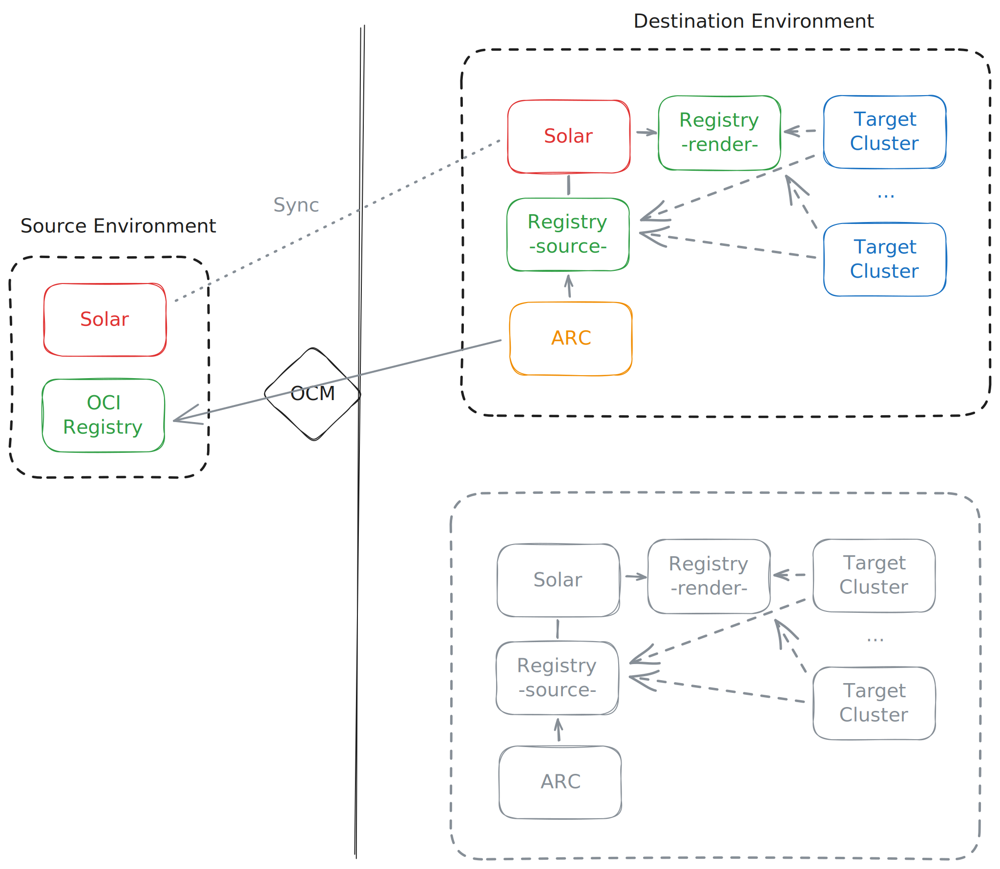

# Solar Catalog Chaining via ARC

## Context and Problem Statement

### Use Cases

All catalog chaining scenarios share the same fundamental topology: a source Solar instance on one side, a security boundary in the middle, and one or more destination Solar instances on the other side. Example scenarios include:

**Air-gapped and classified environments.** Production or classified environments have no direct connection to development networks, so applications must travel through a controlled diode. Without catalog sync, operators on the destination side have no structured view of what arrived or what is deployable.

**Edge and disconnected sites.** Remote infrastructure operates with intermittent or no connectivity. A central Solar instance holds the authoritative catalog, and sync delivers applications to local instances before a site goes offline, so operators can deploy without a live connection.

## Guiding Principles

- **OCM is the packaging format.** Application artifacts (Helm charts, container images, configuration) are packaged as OCM packages and stored in OCI registries. The OCM component descriptor is the authoritative source of metadata describing what a component contains and how to access its resources.
- **Only OCM packages cross boundaries.** No Solar CRDs are transferred. ComponentVersions, Releases, Profiles, and Targets all remain local to each environment. Components and ComponentVersions are derived and created in the destination environment from the transferred OCM package, optionally seeded from deployment defaults embedded in that package.
- **ARC is the transfer layer.** Artifact Conduit (ARC) is the controlled OCI diode across security boundaries, pulling artifacts from source registries to destination registries.
- **Component and ComponentVersion creation is a deliberate curation act.** Not every OCM package in a tracked registry becomes a catalog listing. Registries are infrastructure and are not intended to map 1:1 to the Solar catalog in all cases. In a destination environment, it can be reasonable to say that all OCM packages in a registry become a catalog listing.

### Problem Statement

Chaining Solar catalogs means syncing the catalog of a source Solar instance with a destination Solar instance, where a security boundary separates the two. Chaining therefore requires catalog data to be synced across that boundary. The catalog data is the set of Components and ComponentVersions. These are not transferred directly; the underlying OCM packages are. To transfer an OCM package across the security boundary, Orders must be created in ARC in the destination environment that pull the OCM package from a registry in the source environment to a registry in the destination environment. Once the OCM package exists in the destination registry, the corresponding Component and ComponentVersion must be created in the destination Solar instance.

This breaks down into two problems that are best considered separately:

1. **Pulling OCM packages:** How is the list of OCM packages derived from the Solar catalog in the source environment, and how are the corresponding Orders created in ARC in the destination environment?
1. **Creating Components and ComponentVersions:** How are Components and ComponentVersions created in the destination environment, after the OCM package has been transferred, so that the destination Solar catalog is built up?

## Considered Solutions

### Pulling OCM Packages from the Source Environment

#### Option A-1: Solar Catalog Scan by ARC

ARC (with a dedicated workflow and order) in the destination environment scans the source Solar catalog on a schedule by querying the Solar API. For each catalog item, an Order is created in ARC in the destination environment that pulls the OCM package from the source registry into the destination registry. Any Order without a corresponding catalog item is deleted.

Pros:

- The OCM package list is derived from the single source of truth: the source Solar catalog.

Cons:

- ARC in the destination environment needs permissions to query the source Solar API.
- Tight coupling between Solar and ARC.

#### Option A-2: Solar Catalog Scan by a Standalone Discovery Tool

Like Option A-1, except that a standalone tool (similar to Solar Discovery), rather than ARC, scans the source Solar catalog on a schedule by querying the Solar API. For each catalog item, an Order is created in ARC in the destination environment that pulls the OCM package from the source registry into the destination registry. Any Order without a corresponding catalog item is deleted.

Pros:

- The OCM package list is derived from the single source of truth: the source Solar catalog.
- Looser coupling between Solar and ARC than in Option A-1.
- Separation of concerns.

Cons:

- The discovery tool in the destination environment needs permissions to query the source Solar API.

#### Option B: Solar Catalog Export

The source Solar instance produces a catalog export on a schedule that lists all OCM packages for which catalog entries exist, and pushes the export to the source registry. ARC (with a dedicated workflow and order) or a standalone discovery tool as in Option A-2 (similar to Solar Discovery) reads the export in the destination environment on a schedule and, for each OCM package, creates an Order in ARC in the destination environment that pulls the package from the source registry into the destination registry. Any Order without a corresponding OCM package in the export is deleted.

Pros:

- The OCM package list is derived from the single source of truth.
- No coupling between Solar and ARC.
- No permissions are needed in the destination environment to query the source Solar API.

Cons:

- Producing the export adds overhead, and the more overhead it carries, the harder it is to keep in sync with the actual catalog.
- The export must be signed.

#### Option C: Registry Scan

ARC (with a dedicated workflow and order) or a standalone discovery tool (similar to Solar Discovery, as in Option B) scans the source registry from the destination environment. If not every OCM package in the registry is meant to have a catalog entry, Solar must mark the packages that have a catalog entry — and should therefore be transferred — via a tag or the Referrers API. For each (marked) OCM package, an Order is created in ARC in the destination environment that pulls the package from the source registry into the destination registry. Any Order without a corresponding (marked) OCM package in the source registry is deleted.

Pros:

- No coupling between Solar and ARC.

Cons:

- If marking OCM packages is needed which is assumed to be likely for source environments:
    - Creating and deleting tags or referrer artifacts adds overhead, and the more overhead it carries, the harder it is to keep the registry in sync with the actual catalog.
    - The derived OCM package list is prone to drifting out of sync with the actual catalog when obsolete tags or referrer artifacts are not cleaned up.
    - Tags or referrer artifacts must be signed.

### Creating Components and ComponentVersions in the Destination Environment

After an OCM package is transferred, only Components and ComponentVersions are created, not Releases. An OCM package can carry Release information that serves as a template for creating a Release.

#### Option A: Components and ComponentVersions Creation by ARC

As a final workflow step, ARC in the destination environment creates the Component and ComponentVersion in the destination Solar instance for the OCM package that has been transferred.

Pros:

- The OCM package transfer includes the "import" into Solar, so a package is considered successfully transferred only once a catalog entry actually exists in Solar.

Cons:

- Tight coupling between Solar and ARC.
- ARC needs permissions for the Solar API.

#### Option B: Callback to Solar Discovery by ARC

Like Option A, except that as a final workflow step ARC calls a webhook on Solar Discovery in the destination environment, which then creates the Component and ComponentVersion in the destination Solar instance for the transferred OCM package.

Pros:

- Looser coupling between Solar and ARC than in Option A.
- Separation of concerns.

Cons:

- Transferring an OCM package is decoupled from adding it to the Solar catalog, so a successful transfer does not guarantee that a catalog entry actually exists.

#### Option C: Registry Scan by Solar Discovery

Solar Discovery in the destination environment scans the destination registry. If not every OCM package in the registry is meant to have a Solar catalog entry, the OCM packages that Solar Discovery should consider must be distinguished from those it should not. In that case, ARC marks each transferred OCM package in the destination registry as a final workflow step (via a tag or the Referrers API).

Pros:

- No coupling between Solar and ARC.

Cons:

- If marking OCM packages is needed which is assumed to be not likely for destination environments:
    - The Solar catalog is prone to drifting out of sync with the actual OCM packages in the registry when obsolete tags or referrer artifacts are not cleaned up.
    - Tags or referrer artifacts must be signed.

### OCI URL Re-Mapping

When OCM packages are transferred across security boundaries via ARC, OCI URLs change. URLs within the OCM component descriptor are handled by OCM itself, as it is designed as a transfer format; configuring OCM to use relative paths is an alternative worth considering. Because the Component and ComponentVersion are created on the destination side, no re-mapping is needed for them. Registry references in Helm charts are covered by the Helm value templating support implemented in Solar Discovery and rendered by leveraging ocm-kit. No additional features are needed.

## Decision Outcome

For pulling OCM packages from the source environment, we go with Option A-1: "Solar Catalog Scan by ARC". Reasoning:
- Single source of truth
- Keep it simple and don't introduce new tooling until we know more and need to

For Creating Components and ComponentVersions in the destination environment we go with Option C: "Registry Scan by Solar Discovery" and we assume that all OCM packages in the registry are meant to become a catalog entry, so no OCM package marking needed. Reasoning:
- Keep it simple and don't introduce coupling between ARC and Solar in the destination environment (until we know more and need to)

Out-of-scope and addressed in separate ADRs:
- How we handle catalog chaining between air-gapped environment or if at all.
- How we support garbage collection for the catalog and registry.