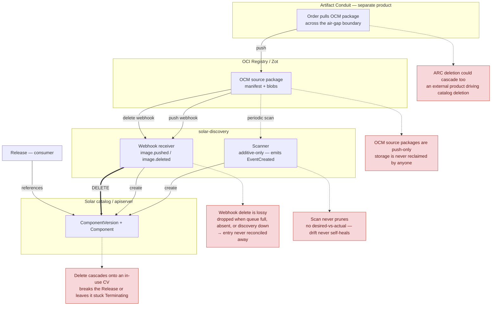
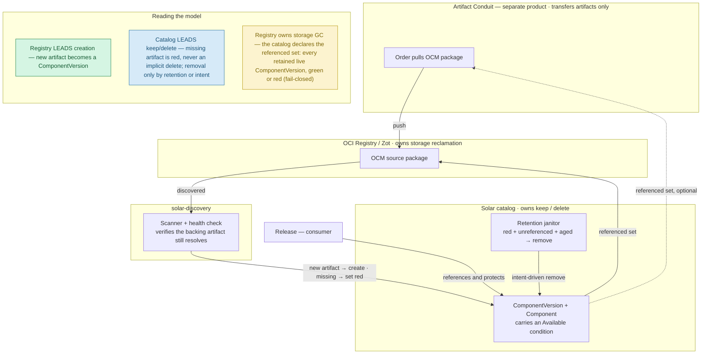

# Garbage Collection for the Solar Catalog and Registry

> **Decision at a glance.** Solar reverses today's default: **catalog deletion is
> intent-driven, not registry-driven.** The registry may *lead creation* — a new
> artifact becomes a ComponentVersion — but it does **not** lead deletion. A backing
> artifact that disappears turns its ComponentVersion **red** (an availability
> status); it is never deleted implicitly. Removal happens only through a retention
> policy or explicit operator action. Storage reclamation is the **registry's** job;
> Solar only declares which artifacts are still referenced. Artifact Conduit (ARC) is
> a **separate product** and never drives catalog deletion.

## Context and Problem Statement

[ADR 013 — Solar Catalog Chaining via ARC](013-catalog-chaining.md) establishes how
OCM packages cross a security boundary and become catalog entries. It defers one
question: *"How we support garbage collection for the catalog and registry."* This
ADR answers it.

Today Solar adds catalog entries reliably but removes them opportunistically, in a
**registry-leading** model where the registry drives both creation *and* deletion.
This is the current model:

*Diagram source: [`img/015-catalog-gc-A-registry-leading.mmd`](img/015-catalog-gc-A-registry-leading.mmd).*

The concrete failures (grounded in code):

- **Additive-only scan.** `pkg/discovery/scanner/registry_scanner.go` emits only
  `EventCreated`; it never diffs against existing entries and never prunes.
- **Lossy webhook deletion.** Removal reacts only to `image.deleted` webhooks
  (`pkg/discovery/webhook/{zot,generic}`), which are dropped when the pipeline
  channel is full, absent when the registry emits no webhooks, and missed when
  discovery is down. `apiwriter.deleteComponentVersion` carries a `FIXME` admitting
  its orphaned-Component cleanup is inferred, not reconciled.
- **Destructive cascade.** A delete event targets a ComponentVersion that a Release
  may reference. The in-use protection finalizers (`pkg/controller/helpers.go`) then
  block the delete, leaving the object stuck `Terminating` — a bad artifact
  masquerading as a deletion.
- **No storage reclamation.** The only registry DELETE path
  (`pkg/ociregistry/deleter.go` `DeleteTag`) untags *rendered charts*. OCM source
  packages are push-only; nothing ever reclaims them. Air-gapped destination
  registries grow without bound.

These are **symptoms of a modelling error**, not five independent bugs.
`ComponentVersion` is being asked to play two roles with opposite lifecycle
semantics at once: a *projection of the registry* (which should mirror the registry,
including disappearance) and an *authoritative, referenceable record* (which must
stay stable under its consumers). The reference-counting and cascade machinery
exists to paper over that conflict. Separating the roles removes most of the
complexity instead of managing it.

## Guiding Principles

Two principles carry the decision; both are named so later ADRs can cite them.

### Creation follows the registry, deletion follows intent

Discovery observes the registry and *reflects* new artifacts into the catalog. The
disappearance of an artifact is a *signal* (health/availability), not an
authorization to delete. Deleting a catalog entry is a deliberate act — operator
intent, or a single retention policy — never an implicit cascade from the registry
or from any other system.

### Storage reclamation belongs to the registry

Solar does not delete blobs or keep bespoke registry-storage bookkeeping. It
declares the **referenced set** — the artifacts backing **every retained live
`ComponentVersion`** (green *or* red-but-not-yet-reaped by the retention janitor),
not only Release-referenced ones — and lets the registry (Zot) reclaim everything
else with its own GC. The set is **fail-closed**: if it cannot be computed or
published completely, the registry retains everything rather than reclaiming against
a partial set, so an artifact is never reclaimed while its catalog entry still
exists.

These principles have a corollary about **product boundaries**: ARC, the OCI
registry, and Solar are distinct products with distinct purposes — transfer,
storage, and catalog lifecycle. They feel strongly cohesive today, which is exactly
what invites cross-product deletion cascades and the resulting complexity. Keeping
each tool to one clear purpose is what stops the complexity from exploding.

## Decision Drivers

- **Convergence and self-healing** without depending on event delivery.
- **Never break a running workload**; honor the existing protection-finalizer chain.
- **Air-gap safety**: no dependence on source-environment reachability.
- **Fail safe**: a failed or partial registry read must never read as "everything is
  gone."
- **Trust boundary**: any signal that authorizes deletion must be trusted/signed
  (see [ADR 014 — Solar Artifact Signing](014-artifact-signing.md#decision-outcome));
  a spoofed or corrupt signal must not evict artifacts.
- **Minimal, well-bounded machinery**; one clear owner per concern.

## Considered Options

### When a backing artifact goes missing

- **Delete the entry (current behaviour).** Removing the image removes the
  ComponentVersion. Rejected: lossy, destructive, cascades onto in-use entries, and
  never converges (the current model above).
- **Mark the entry unavailable (chosen).** A missing artifact sets an availability
  condition (`Available=False`, reason `ArtifactMissing`) — the entry turns red.
  Non-destructive, recoverable (the artifact returns → green), and the *actionable*
  state: it surfaces the problem instead of erasing it, and gives Releases a
  pre-flight `Renderable=False` rather than a deploy-time image-pull error.

### Who owns deletion

- **Registry / webhook-driven (current).** Rejected — see *Creation follows the
  registry, deletion follows intent* above.
- **Intent- and retention-driven (chosen).** Removal happens only via a retention
  janitor (policy: red **and** unreferenced **and** aged out) or an explicit operator
  action. The registry and ARC never trigger catalog deletion.

### Who reclaims registry storage

- **Solar deletes blobs.** Rejected: bespoke bookkeeping, risk of deleting shared
  blobs, and it duplicates a responsibility the registry already owns.
- **Registry reclaims; the catalog declares the referenced set (chosen).** Solar
  untags/declares intent; the registry reclaims blobs with its own GC.

## Decision Outcome

Adopt both guiding principles, realised as the target model:

*Diagram source: [`img/015-catalog-gc-B-catalog-leading.mmd`](img/015-catalog-gc-B-catalog-leading.mmd).*

"GC of the catalog" collapses into four small, single-owner pieces — none of them a
cascade:

1. **Availability reconciliation.** The periodic scan (already running) is extended
   from additive-only to a health check: for each existing ComponentVersion it
   verifies the backing manifest (matched via the `solar.opendefense.cloud/digest`
   label) still resolves, and maintains an `Available` condition. Tri-state and
   fail-safe: `Unknown` on a failed or partial scan; `False` only after N confirmed
   consecutive misses or a grace period; never `False` from a read error. This
   replaces the `apiwriter.go` `FIXME` inferred cleanup.
2. **Admission check.** A new Release may not bind to a ComponentVersion that is
   `Available=False`. This is validation, not deletion.
3. **Retention janitor.** The *only* auto-removal path: a single periodic sweep
   deletes catalog entries that are `Available=False` **and** carry no protection
   finalizer (unreferenced) **and** have been so for a configured age. Each delete is
   **conditional on the `resourceVersion` observed during evaluation** (an
   optimistic-concurrency precondition): if anything changed in between — a Release
   bound, a protection finalizer was added, or the artifact returned (red → green) —
   the precondition conflicts and the sweep **skips and re-evaluates next cycle**
   rather than deleting. This closes the list-then-delete race, so an in-use or
   recovered entry can never be removed. Policy is configurable (for example
   keep-last-N, keep-deployed). This bounds etcd growth without any reactive cascade.
4. **Referenced-set signal.** The referenced set is **every retained live
   `ComponentVersion`** — every entry still present in the catalog, green *or* red —
   not only Release-referenced ones; a red entry the janitor has not yet reaped keeps
   its artifact. Solar publishes this set (untag / keep-list) to the registry, which
   reclaims everything else with its own GC. Solar never deletes blobs. Publication is
   **fail-closed**: a partial or failed computation makes the registry retain, never
   reclaim, so registry GC can never outrun the retention janitor.

**Solar does not cascade deletions from the registry or from ARC.** Webhooks, if
present, may trigger an *early availability re-check* but never a deletion. ARC Order
lifecycle is ARC's concern; a deleted Order changes what appears in the registry,
which Solar observes as availability — nothing more.

**Trust and authority.** In the destination the registry contents are the
authoritative "what exists" signal
([ADR 013, Option C: Registry Scan by Solar Discovery](013-catalog-chaining.md#option-c-registry-scan-by-solar-discovery)),
so availability needs no source connectivity. Any future signed export or marking
that authorizes *removal* must be verified per
[ADR 014](014-artifact-signing.md#decision-outcome) before it may drive the retention
janitor.

**Dependency safety (interim).** Solar cannot yet model inter-ComponentVersion
dependencies — the approach in
[ADR 011, Garbage collection and reference counting](011-component-dependencies.md#garbage-collection-and-reference-counting)
was rejected and moved upstream to ocm-kit. Because the target model never deletes on
"missing" and only reclaims unreferenced, aged entries, it is inherently conservative
and does not risk collecting a shared dependency out from under a consumer. Full
dependency-aware reference counting is a follow-up that will enrich the janitor's
"unreferenced" test.

### Consequences

Positive:

- No running workload is broken; a missing artifact is *visible and recoverable*, not
  silently erased or stuck `Terminating`.
- Convergence without relying on webhook delivery; the health check self-heals.
- Sharply reduced machinery: no cross-system deletion cascade, no reactive prune. The
  cross-namespace reference counting that
  [ADR 011](011-component-dependencies.md#garbage-collection-and-reference-counting)
  dreaded becomes a *nice-to-have* for the janitor, not a correctness requirement.
- Clear product boundaries: the registry owns storage, ARC owns transfer, Solar owns
  catalog lifecycle.

Negative and trade-offs:

- **Reverses an existing default.** Today's webhook-driven delete and inferred cascade
  must be deprecated and removed — non-trivial, and must be called out in release
  notes.
- **Retention is now load-bearing**, not optional: without the janitor, red or stale
  entries accumulate in etcd. Its policy must be defined and defaulted safely.
- Availability latency is bounded by the scan interval plus the confirmation grace.
- Storage is reclaimed only when the registry runs its blob GC; registries must be
  configured accordingly.
- GC stays dependency-blind until the ocm-kit model lands (mitigated by the
  conservative removal rule).

### Confirmation

- An OCM package removed from the registry **without** any delete webhook flips its
  ComponentVersion to `Available=False` within one scan interval plus grace — and does
  **not** delete it.
- An in-use ComponentVersion (referenced by an active Release) is never deleted and
  never stuck `Terminating`; it simply shows red while the artifact is missing.
- A partial or failed registry read yields `Available=Unknown` and removes nothing.
- The retention janitor removes a ComponentVersion only when it is red, unreferenced,
  and aged out; a new Release cannot bind to a red ComponentVersion.
- A delete that loses its `resourceVersion` precondition — because a Release bound, a
  finalizer was added, or the artifact returned between evaluation and deletion — is
  skipped, not forced; the entry survives.
- The registry never reclaims an artifact whose `ComponentVersion` still exists, even
  when the referenced set is computed from a partial or failed scan (fail-closed).
- Integration tests: webhook-loss recovery, transient-read-failure safety,
  artifact-returns recovery (red → green), a finalizer-protected entry staying put,
  and the two janitor races — bind-versus-delete and artifact-return-versus-delete.

## Scope

Decided here: the availability/keep/delete model for the catalog, and the ownership of
registry storage reclamation.

Deferred to follow-up work:

- **Dependency-aware reference counting** — blocked on the upstream ocm-kit dependency
  model (successor to
  [ADR 011](011-component-dependencies.md#garbage-collection-and-reference-counting)).
- **ARC Order lifecycle** — belongs to ARC, a separate product; explicitly *not* a
  Solar catalog-deletion trigger under *Creation follows the registry, deletion follows
  intent*.
- **Detailed retention policy** — the janitor is decided here as the sole reclamation
  path; its concrete knobs (keep-last-N, ages, per-catalog configuration) are a
  follow-up. Also add an explicit exclude to prevent deletion of vital components, based on label,
  namespace, etc.

## More Information

- Diagrams: [`img/015-catalog-gc-A-registry-leading.mmd`](img/015-catalog-gc-A-registry-leading.mmd)
  (current), [`img/015-catalog-gc-B-catalog-leading.mmd`](img/015-catalog-gc-B-catalog-leading.mmd)
  (target).
- [ADR 013 — Solar Catalog Chaining via ARC](013-catalog-chaining.md) — defers this GC
  question; establishes the destination
  [Option C](013-catalog-chaining.md#option-c-registry-scan-by-solar-discovery) model.
- [ADR 011 — Component Dependencies](011-component-dependencies.md) — rejected; its
  [garbage collection and reference counting](011-component-dependencies.md#garbage-collection-and-reference-counting)
  requirements are scoped out here until the ocm-kit model lands.
- [ADR 014 — Solar Artifact Signing](014-artifact-signing.md) — trust model for any
  deletion-authorizing signal.
