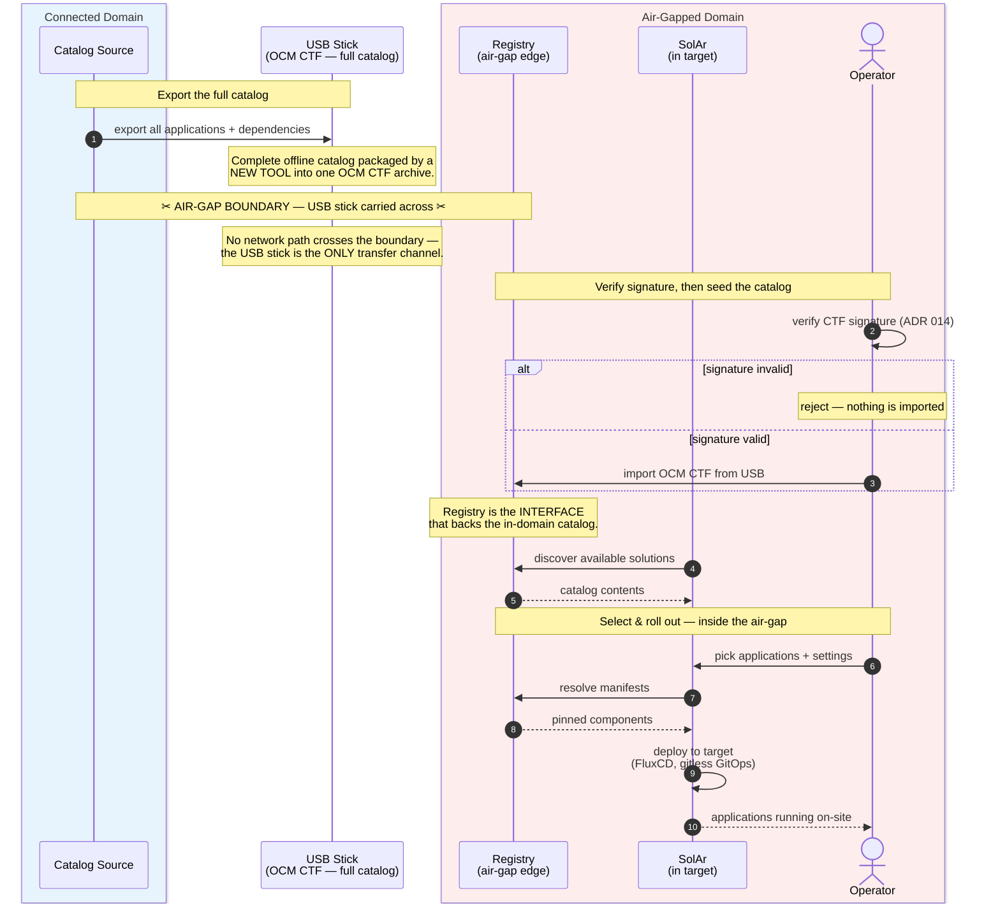
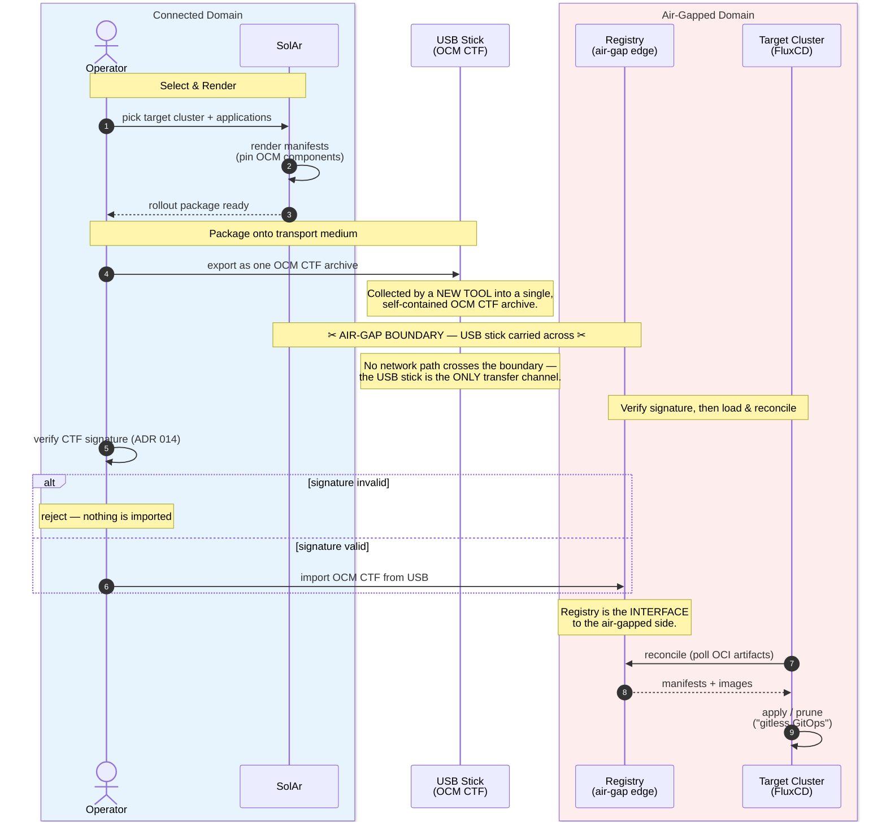

# Air-Gapped Catalog Chaining via Offline OCM Transport

> **Decision at a glance.** For a *fully* air-gapped destination Solar chains its
> catalog **over physical media, not a network**. The transport layer from
> [ADR 013](013-catalog-chaining.md) — ARC, an online OCI diode — is replaced by a
> **self-contained, signed OCM CTF archive** carried across the boundary and imported
> into the destination registry. **Everything downstream of that registry is
> unchanged from ADR 013**: Solar Discovery scans the destination registry and builds
> the catalog. The primary pattern **ships the full catalog** so Solar runs *inside*
> the air-gap and operators select in-domain; a lighter *render-then-transport*
> pattern is also supported.

## Context and Problem Statement

[ADR 013 — Solar Catalog Chaining via ARC](013-catalog-chaining.md) describes chaining
a source Solar catalog to one or more destination Solar instances across a security
boundary. It considered only boundaries that are **connected, at least temporarily**,
and explicitly deferred the disconnected case ("How we handle catalog chaining between
air-gapped environment or if at all"). This ADR (spike #581) answers that.

[ADR 013's decision](013-catalog-chaining.md#decision-outcome) has two independent halves:

1. **Pulling OCM packages source → destination** — via ARC, an *online* OCI diode that
   creates Orders which pull artifacts across the boundary.
2. **Building the destination catalog** — [Option C: Registry Scan by Solar
   Discovery](013-catalog-chaining.md#option-c-registry-scan-by-solar-discovery): Solar
   Discovery scans the *destination registry* and turns every OCM package into a
   Component / ComponentVersion.

In a fully air-gapped environment **half 1 is impossible** — there is no network path
for ARC to pull over. But **half 2 does not care how packages arrived**: the
destination registry is the interface, and Discovery simply scans it. So the problem
reduces to one thing: **replace the online transport with an offline one, and reuse
everything from the destination registry inward.**

[ADR 013's guiding principles](013-catalog-chaining.md#guiding-principles) carry over unchanged and make this clean:

- **OCM is the packaging format**; the OCM component descriptor is the authoritative
  metadata.
- **Only OCM packages cross the boundary** — no Solar CRDs. Components and
  ComponentVersions are derived on the destination side.
- The transfer layer is a **diode**. ADR 013's diode was a network component (ARC);
  here it is **physical** — removable media hand-carried across the boundary. Solar is
  agnostic to which medium is used.

## Decision Drivers

- **No network path** may cross the boundary; the only channel is offline media.
- **Reuse ADR 013** wherever possible — do not re-decide the destination catalog model.
- **Untrusted channel**: physical media can be lost, swapped, or tampered with, so the
  payload must be verifiable on its own (see
  [ADR 014 — Solar Artifact Signing](014-artifact-signing.md#decision-outcome)).
- **Air-gap autonomy**: operators inside the boundary should be able to work without
  any dependency on the source environment.
- **Self-contained payload**: everything needed to deploy (descriptors, charts,
  images) must be present locally; nothing may resolve to an external registry at
  render or deploy time.
- **Incremental build-up**: the catalog grows over time as successive media arrive.

## Considered Options

### Transport across the boundary

- **Online OCI diode (ARC), as in ADR 013.** Not applicable: it requires a network
  path across the boundary, which by definition does not exist in a full air-gap.
- **Offline OCM CTF on physical media (chosen).** `ocm transfer` writes a
  self-contained **Common Transport Format** archive — component descriptors plus every
  referenced resource and image — to a directory/tar. The archive is carried across on
  removable media and imported into the
  destination OCI registry with `ocm transfer`. This preserves every ADR 013 invariant
  (OCM is the format, only OCM packages cross, no Solar CRDs cross); only the carrier
  changes.

### What crosses, and where selection happens

- **Ship the catalog (chosen).** The *full* catalog and its dependency
  closure cross as one CTF. **Solar runs inside the air-gapped target**; Solar Discovery
  scans the destination registry ([ADR 013 Option C](013-catalog-chaining.md#option-c-registry-scan-by-solar-discovery), verbatim) and operators select and
  roll out **in-domain**. This is the "catalog build-up in the air-gap" the spike is
  about, and it maximises air-gap autonomy.
- **Render then transport (alternative).** Selection and rendering happen
  on the *connected* source; only the rendered rollout crosses; the destination is thin
  (registry + FluxCD, no Solar catalog). Smaller payload and central control, but no
  in-domain catalog or selection, and pre-rendered artifacts can go stale before they
  are applied.

## Decision Outcome

Support air-gapped chaining with **offline OCM CTF transport**, and make the
**ship-the-catalog** pattern primary. **For the ship-the-catalog pattern**, everything
from the destination registry inward is ADR 013 unchanged (Solar Discovery builds the
catalog, [Option C](013-catalog-chaining.md#option-c-registry-scan-by-solar-discovery)).
The render-then-transport alternative deliberately omits the catalog — it runs only a
registry and FluxCD, so Option C does not apply there.

*Diagram source: [`img/016-airgap-ship-the-catalog.mmd`](img/016-airgap-ship-the-catalog.mmd).*

How it works, and what changes versus ADR 013:

1. **Export (source).** A tool derives the package set from the source Solar catalog —
   the full catalog plus its dependency closure — and `ocm transfer`s it into a single,
   self-contained CTF archive. *(This replaces [ADR 013's ARC Orders](013-catalog-chaining.md#option-a-1-solar-catalog-scan-by-arc); see "The export /
   import tool" below.)*
2. **Sign (source).** The CTF is signed so the destination can trust it without a live
   connection to the source ([ADR 014](014-artifact-signing.md#decision-outcome)).
3. **Carry across.** The archive crosses on removable media. No network path exists;
   the medium is the only channel.
4. **Verify + import (destination).** The signature is verified, then `ocm transfer`
   loads the archive into the **destination registry** — the interface that backs the
   in-domain catalog.
5. **Build the catalog (destination).** *Unchanged from [ADR 013 Option C](013-catalog-chaining.md#option-c-registry-scan-by-solar-discovery):* Solar
   Discovery scans the destination registry and creates Components / ComponentVersions.
6. **Select and roll out (destination).** Operators select applications and settings in
   the in-domain Solar; rendering happens locally against the target's current state,
   and FluxCD reconciles from the destination registry ("gitless GitOps").

**The export / import tool.** Both scenarios name a "new tool". Its job is thin: on the
source, derive the wanted package set from the Solar catalog and write a signed CTF; on
the destination, verify and import. It wraps `ocm transfer` / ocm-kit rather than
inventing a new format. The exact package-set derivation (full catalog vs. a selected
subset) is the difference between the two scenarios; a detailed tool design is scoped
out below.

**Bootstrapping Solar into the air-gap.** The ship-the-catalog pattern runs Solar itself inside the
boundary, which is a chicken-and-egg: Solar's own images and Helm chart must arrive on
the *first* transport before it can serve a catalog. The initial seed therefore includes
Solar's components (as OCM packages); subsequent transports carry catalog content and
updates.

**Incremental build-up and GC.** OCM CTF transfer is additive: later archives bring new
or updated components, and the destination registry accumulates. This is exactly the
growth that [ADR 015 — Catalog and Registry Garbage Collection](015-catalog-registry-garbage-collection.md)
governs; availability reconciliation and the retention janitor apply to an air-gapped
destination the same as anywhere else.

### Alternative pattern — render then transport

When in-domain selection is not needed, a lighter pattern selects and renders on the
connected source and ships only the rendered rollout; the destination runs just a
registry and FluxCD. ADR 013's destination catalog model
([Option C](013-catalog-chaining.md#option-c-registry-scan-by-solar-discovery)) does
**not** apply here — there is no catalog on the air-gapped side, only reconciliation.

*Diagram source: [`img/016-airgap-render-then-transport.mmd`](img/016-airgap-render-then-transport.mmd).*

Trade-offs versus the primary pattern: smaller payload and central control, but the destination
has no catalog and no in-domain selection, the operator on the connected side must know
in advance what the target should run, and a rendered rollout can go stale between
render and apply. It fits fixed, pre-defined deployments; it does not "build up" a
catalog in the air-gap.

### Effect on ADR 013

[ADR 013](013-catalog-chaining.md) remains the record for the connected case and is not modified. This ADR reuses
its destination model (Option C) verbatim and only substitutes the transport layer for
the air-gapped case. ARC stays a separate product, relevant when a (temporary) network
path exists; it is not required — and not present — in a full air-gap.

### Consequences

Positive:

- Minimal new surface: only the transport changes; the destination catalog model, the
  rendering pipeline, and gitless GitOps are all reused from ADR 013.
- Full air-gap autonomy (ship-the-catalog): operators select and deploy with no dependence on
  the source environment.
- Self-contained and verifiable: a signed CTF needs no live trust path to the source.
- Medium-agnostic: the same signed OCM CTF payload works regardless of which removable
  medium carries it.

Negative and trade-offs:

- **Fat payload (ship-the-catalog):** the full catalog plus dependency closure must be
  transported, and re-transported for updates (CTF transfer is additive, which limits
  this to deltas after the first seed).
- **Bootstrapping:** Solar must be seeded into the air-gap before it can serve a
  catalog.
- **Manual, high-latency channel:** transport cadence is human-driven; there is no
  real-time sync.
- **No feedback to source:** the source cannot observe destination state; any
  reconciliation of "what the destination has" is out of band.
- **Signing is mandatory, not optional:** without a live source, the signature is the
  only trust anchor.

### Confirmation

- A CTF exported on the source and carried across (no network path) imports into the
  destination registry and Solar Discovery builds the expected catalog — proving the
  destination model is reused unchanged.
- Import is rejected when signature verification fails (untrusted-media case).
- In the ship-the-catalog pattern, an operator selects and rolls out an application entirely inside the
  air-gap, with no source connectivity.
- A second, later CTF adds/updates components incrementally without re-seeding from
  scratch.
- Nothing in a deployed workload resolves to an external registry (self-contained
  payload).

## Scope

Decided here: that air-gapped chaining is supported, and that it works by offline
signed OCM CTF transport with the destination model reused from ADR 013, with the
ship-the-catalog pattern as primary.

Out of scope / follow-up:

- **Detailed export/import tool design** — package-set derivation, CTF layout, signing
  workflow, incremental-delta computation.
- **A leaner in-air-gap Solar footprint** ("SolAr light") — deliberately deferred.
- **Registry/catalog GC in the air-gapped destination** — governed by
  [ADR 015](015-catalog-registry-garbage-collection.md); not re-decided here.
- **One-way data-diode boundaries** — a data diode is a controlled *network* path, not
  a full air-gap; it is a different boundary model with its own threat model and belongs
  in a separate ADR, not here.

## More Information

- Diagrams: [`img/016-airgap-ship-the-catalog.mmd`](img/016-airgap-ship-the-catalog.mmd)
  (primary), [`img/016-airgap-render-then-transport.mmd`](img/016-airgap-render-then-transport.mmd)
  (alternative).
- [ADR 013 — Solar Catalog Chaining via ARC](013-catalog-chaining.md) — the connected
  case; its [Option C](013-catalog-chaining.md#option-c-registry-scan-by-solar-discovery)
  destination model is reused here.
- [ADR 014 — Solar Artifact Signing](014-artifact-signing.md) — trust anchor for the
  transported CTF.
- [ADR 015 — Catalog and Registry Garbage Collection](015-catalog-registry-garbage-collection.md)
  — governs the accumulating destination registry.
- [Spike #581](https://github.com/opendefensecloud/solution-arsenal/issues/581);
  decision on whether to support the use case tracked in odd-internal#70.
