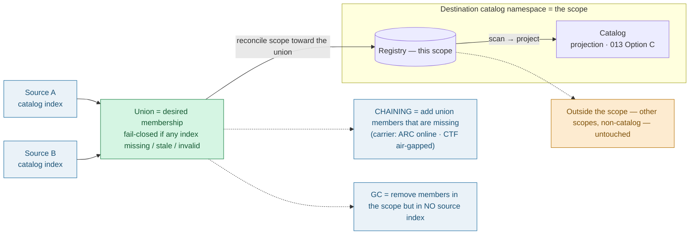

# Catalog Chaining: Catalog-Index Model

> **Decision at a glance.** The source keeps a **small, signed index** of its catalog — its
> **catalog index**: OCM package **digests, not the artifacts** — and each destination reads
> that index, **instead of scanning the source's live Solar API**
> ([ADR 013 Option A-1](013-catalog-chaining.md#option-a-1-solar-catalog-scan-by-arc) →
> [Option B](013-catalog-chaining.md#option-b-solar-catalog-export)). The index is metadata —
> **cheap to keep current and small enough to carry** — so **the same index works online and
> air-gapped**: a carrier (ARC over the network, or a signed CTF on media) reconciles the
> destination registry toward it. Because the catalog is a **projection** of the registry,
> **chaining and garbage collection are the add and remove halves of one reconcile** against
> the **union of the source catalog indexes**, scoped to a destination catalog namespace —
> one mechanism, not two. It covers Components / ComponentVersions only; Releases, Profiles,
> and Targets stay local. (The term "catalog chaining" is kept, though slightly misleading —
> nothing about the *catalog* itself crosses the boundary.)

## Context

Catalog chaining is near-term, and it must serve **two live scenarios**: the connected,
always-online case ([ADR 013](013-catalog-chaining.md)) and the air-gapped case
([ADR 016](016-airgapped-catalog-chaining.md)).

ADR 013 chose
[Option A-1](013-catalog-chaining.md#option-a-1-solar-catalog-scan-by-arc): scan the source
Solar API to derive the package list. The online workflow was made production-ready in
[PR #762](https://github.com/opendefensecloud/solution-arsenal/pull/762) — **merged**
(closes [#747](https://github.com/opendefensecloud/solution-arsenal/issues/747)) —
and it does exactly that: its `query-resources` step reads `components` / `componentversions`
from the source cluster via a mounted kubeconfig. So the online case **landed on Option A**:
it queries the live source catalog, which needs a cross-boundary credential into the source
cluster and works only while connected.

The **air-gapped** case ([ADR 016](016-airgapped-catalog-chaining.md)) *cannot* do this —
there is no network to query the source — so its catalog index must be produced at the source
and travel. Online and air-gapped are therefore heading toward **two different pull
mechanisms for the same job**. This ADR unifies them onto one artifact.

Two facts also changed the trade-off since ADR 013:

- **Signing exists** ([ADR 014](014-artifact-signing.md#decision-outcome)) — a published
  index can be trusted without a live source connection.
- **The same kind of catalog-derived set is already computed** — [ADR 015](015-catalog-registry-garbage-collection.md#storage-reclamation-belongs-to-the-registry)
  computes a *referenced set* for GC (destination-side: what a registry should retain).
  Producing a **catalog index** at the source is the same shape of computation, so it is a
  known quantity, not new machinery. (The two are distinct — see *More Information* — but the
  machinery is proven.)

ADR 013 rejected the published-index approach
([Option B](013-catalog-chaining.md#option-b-solar-catalog-export)) only for "export
overhead" and "must be signed". Both costs are now already paid elsewhere.

One modelling point, stated once: the catalog is **not** transferred — the packages are,
and each Solar re-derives its catalog by scanning its registry
([Option C](013-catalog-chaining.md#option-c-registry-scan-by-solar-discovery)). So the
catalog is a **projection**, and "which packages belong in a registry" is a single
question that both chaining (add) and GC (remove) answer.

## Decision

1. **Pull side:
   [Option A-1 → Option B](013-catalog-chaining.md#option-b-solar-catalog-export).** The
   source publishes a **signed catalog index** — a catalog-derived **index of OCM package
   digests** (metadata, not the artifacts) — to its registry; carriers reconcile each
   destination registry toward it. This drops ARC's dependency on the source Solar API,
   symmetric with the destination's
   [Option C](013-catalog-chaining.md#option-c-registry-scan-by-solar-discovery) registry
   scan.

2. **One index, both scenarios.** The published index is carrier-agnostic:
   - **Online (connected):** an online replicator reads the **source-published catalog
     index** over the network and pulls the missing packages on a schedule — replacing the
     live source-API query the current workflow
     ([#762](https://github.com/opendefensecloud/solution-arsenal/pull/762)) uses, and
     dropping the cross-boundary source-cluster credential.
   - **Air-gapped:** the same signed index is carried offline inside a CTF
     ([ADR 016](016-airgapped-catalog-chaining.md)) and reconciled at the destination.

   Same source artifact, same destination reconcile; only the carrier differs.

3. **Scope and membership.** A catalog index governs one **destination catalog
   namespace** — the scope — never a whole registry: packages outside it (other scopes,
   hand-placed non-catalog artifacts) are never touched. Multiple sources merge into one
   scope, so a scope's desired membership is the **union of the source catalog indexes**
   targeting it. A member is identified by ComponentVersion **name + content fingerprint**
   (the key [#762](https://github.com/opendefensecloud/solution-arsenal/pull/762) already
   dedups on). A ComponentVersion belongs iff it is in *any* source's index — so a package
   two sources both want is retained until *neither* does, **without per-item reference
   counting** (the "count" is just union membership).

4. **Chaining ≡ GC, fail-closed.** Within a scope, replication reconciles **toward** the
   union (chaining = add missing members); GC reconciles **away from** it (remove members
   that are in the scope but in no source index). "Remove" here means reconciling
   **transfer membership** — the OCM package is dropped from the union and stops being
   replicated. It is **not** a direct delete of the Solar `ComponentVersion`, and it does
   **not** by itself make the destination artifact reclaimable: reclaimability stays governed
   by [ADR 015](015-catalog-registry-garbage-collection.md) — an artifact backing any
   retained / in-use ComponentVersion is protected. One mechanism, two directions. Both are
   **fail-closed**: if
   the union is incomplete — any source index missing, stale, or invalid — nothing is
   reclaimed.

5. **What chains.** Components and ComponentVersions only — the Discovery output. Releases,
   Profiles, and Targets are per-environment desired state, authored locally and optionally
   seeded from templates carried in an OCM package; they are never chained
   ([ADR 013](013-catalog-chaining.md#guiding-principles)).

*Diagram source: [`img/017-catalog-index-reconcile.mmd`](img/017-catalog-index-reconcile.mmd).*

## Consequences

Positive:

- **One design across online and air-gapped** — the catalog index unifies
  [ADR 013](013-catalog-chaining.md) and [ADR 016](016-airgapped-catalog-chaining.md);
  only the carrier changes.
- **Cheap because it is metadata — the core advantage over scanning the source's live Solar
  API.** The catalog index lists **digests, not the artifacts**: it scales with the *number*
  of components, not their size, and is content-addressed (recreating it is a no-op when
  membership is unchanged). One small signed index stays current online, travels on a stick
  air-gapped, and drives GC — without ever re-exporting payloads.
- **One mechanism for chaining and GC** instead of two that would drift.
- **No cross-source reference counting** — a package shared by several sources is handled
  by set-union membership within a scope, and GC is bounded to the scope, so other scopes
  and non-catalog artifacts are never at risk. Reuses [#762](https://github.com/opendefensecloud/solution-arsenal/pull/762)'s
  existing name + fingerprint dedup key.
- **No cross-boundary Solar-API credential** — each source publishes its own signed index;
  the replicator only reads registries. This drops the per-source cluster kubeconfig the
  current workflow ([#762](https://github.com/opendefensecloud/solution-arsenal/pull/762))
  needs, while the same index still supports scheduled multi-source syncing.

Negative and trade-offs:

- **Supersedes an accepted decision** ([ADR 013 Option A-1](013-catalog-chaining.md#option-a-1-solar-catalog-scan-by-arc));
  ADR 013 needs a superseding note.
- **Diverges from the merged online implementation
  ([#762](https://github.com/opendefensecloud/solution-arsenal/pull/762)).** It derives what
  to transfer by querying the source Solar API; adopting this ADR moves the online derivation
  to a source-published catalog index — a change to reconcile with the merged workflow,
  **not** a free plan change. Needs the workflow authors' buy-in.
- The source must **compute, publish, and sign** the index on a schedule — the
  [Option B](013-catalog-chaining.md#option-b-solar-catalog-export) cost ADR 013 flagged,
  now justified by reusing [ADR 014](014-artifact-signing.md) and
  [ADR 015](015-catalog-registry-garbage-collection.md). The index can also be slightly
  **stale** (published on a schedule) versus a live API query.

## Scope and follow-up

Decided here: the pull-side change (A-1 → B), the single catalog index spanning chaining
and GC, its use across both online and air-gapped carriers, and the scoped, fail-closed
union-of-sources membership rule (scope = destination catalog namespace).

Out of scope / follow-up:

- **Catalog-index format and publication workflow** — schema, signing, schedule,
  incremental deltas.
- **Online replicator vs. offline carrier** implementation.
- **Reconcile with [PR #762](https://github.com/opendefensecloud/solution-arsenal/pull/762)** —
  migrate the online derivation from source-API query to reading the source-published index.
- **A superseding note on [ADR 013](013-catalog-chaining.md)** for Option A-1.

## More Information

- Diagram: [`img/017-catalog-index-reconcile.mmd`](img/017-catalog-index-reconcile.mmd).
- [ADR 013 — Solar Catalog Chaining via ARC](013-catalog-chaining.md): the online case;
  [Option A-1](013-catalog-chaining.md#option-a-1-solar-catalog-scan-by-arc) is superseded
  by [Option B](013-catalog-chaining.md#option-b-solar-catalog-export);
  [Option C](013-catalog-chaining.md#option-c-registry-scan-by-solar-discovery) is
  retained.
- [ADR 014 — Solar Artifact Signing](014-artifact-signing.md): signs the published index.
- [ADR 015 — Catalog and Registry Garbage Collection](015-catalog-registry-garbage-collection.md):
  its **referenced set** (destination-side: what is in use → storage reclamation) **composes
  with** this ADR's **catalog index** (source-side: what is offered → membership). Related
  layers, not the same set.
- [ADR 016 — Air-Gapped Catalog Chaining](016-airgapped-catalog-chaining.md): one carrier
  of the reconcile.
- [Issue #747](https://github.com/opendefensecloud/solution-arsenal/issues/747) /
  [PR #762](https://github.com/opendefensecloud/solution-arsenal/pull/762) — the production
  online chaining workflow. It currently derives what to transfer by querying the source
  Solar API (Option A); this ADR proposes it converge on the source-published catalog index
  so online and air-gapped share one mechanism.
