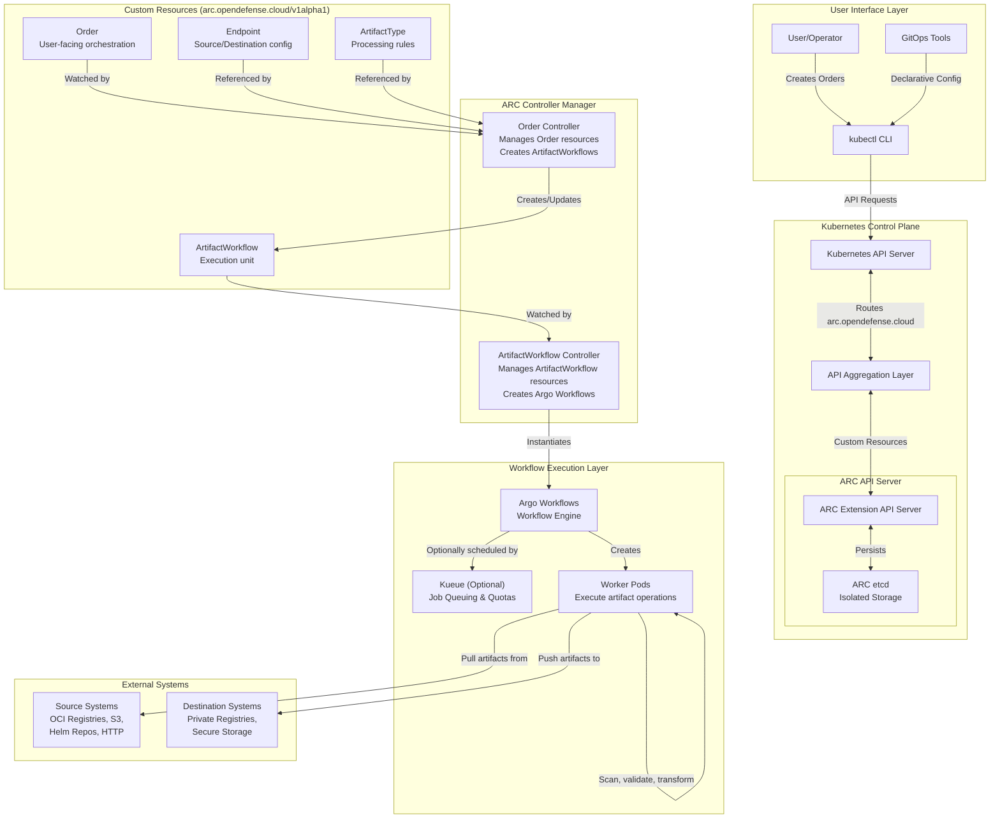
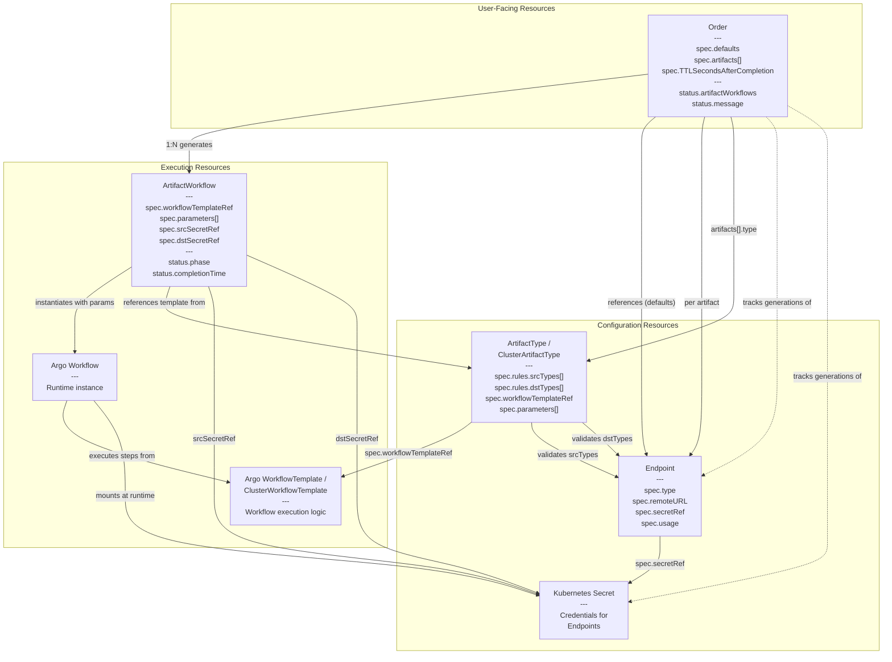
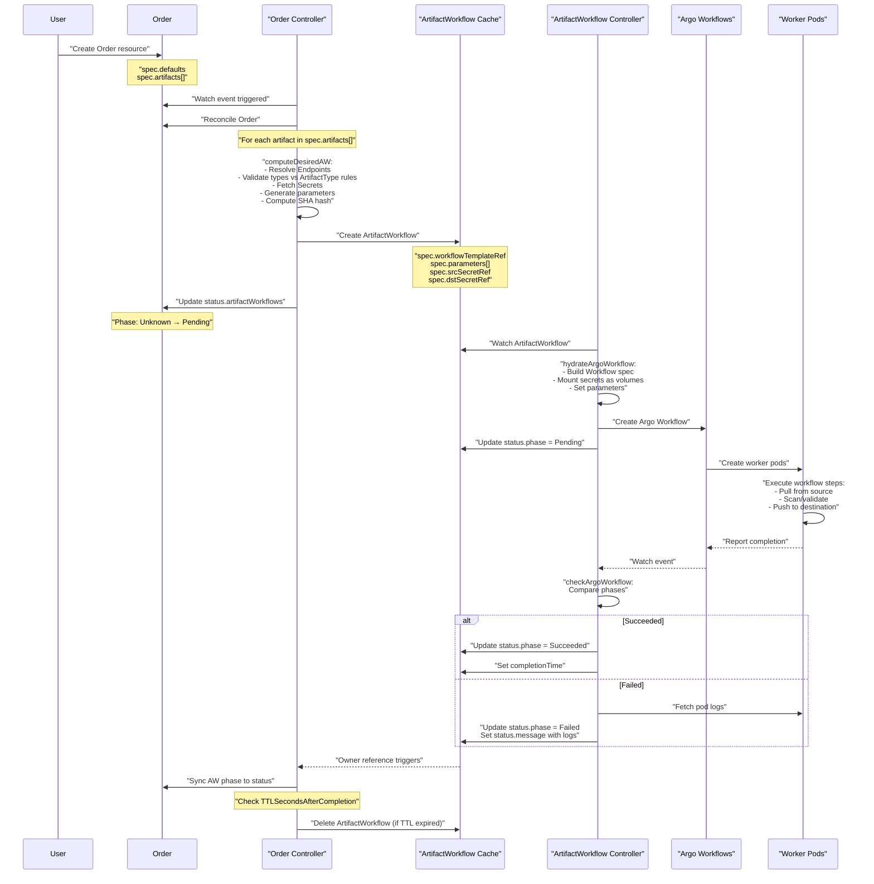

# Architecture

ARC is implemented as a Kubernetes Extension API Server integrated with the Kubernetes API Aggregation Layer. This architectural approach provides several advantages over Custom Resource Definitions (CRDs), including dedicated storage isolation, custom API implementation flexibility, and reduced risk to the hosting cluster's control plane.

**Architecture: ARC System Components and Data Flow**

The system follows a layered architecture where users interact through `kubectl` (or GitOps tools), requests flow through the Kubernetes API aggregation layer to the ARC API Server, and the two-controller pattern orchestrates workflow execution: the Order Controller decomposes high-level Orders into ArtifactWorkflows, and the ArtifactWorkflow Controller instantiates Argo Workflows for execution.

**Key Design Decisions:**

- **Extension API Server architecture** provides dedicated storage isolation in a separate etcd instance
- **Two-controller pattern** separates orchestration (Order) from execution (ArtifactWorkflow)
- **Integration with existing CNCF projects** (Argo Workflows, optionally Kueue) rather than building custom execution engine
- **Declarative, Kubernetes-native API** for GitOps compatibility

## Resource Model and Dependencies

**Key Patterns:**

- **1:N relationship** from Order to ArtifactWorkflow enables parallel processing of multiple artifacts
- **Configuration resources** (Endpoint, ArtifactType) are reusable across multiple Orders
- **Generation tracking** (dashed lines) provides automatic reconciliation on configuration changes
- **Secrets are referenced** but not owned, supporting shared credential management

## Controller Reconciliation Flow

**Status Propagation**: Owner references ensure automatic cleanup and status flows upward: Argo Workflow → ArtifactWorkflow → Order

## Generation Tracking and Idempotency

ARC implements generation tracking to enable automatic reconciliation and idempotent operations:

**Generation Tracking Mechanism:**

| Tracked Resource         | Purpose                                    | Storage Location                         |
| ------------------------ | ------------------------------------------ | ---------------------------------------- |
| **Endpoint generations** | Detect when Endpoint configuration changes | `Order.status.endpointGenerations` (map) |
| **Secret generations**   | Detect when credentials change             | `Order.status.secretGenerations` (map)   |

**Idempotency Benefits:**

- **No duplicate processing**: Same artifact configuration always produces same ArtifactWorkflow name (SHA-256)
- **Automatic updates**: Endpoint/Secret changes trigger new ArtifactWorkflows with different names
- **Race condition prevention**: Generation numbers from Kubernetes API ensure consistent ordering
- **Minimal resource overhead**: Small ArtifactWorkflow resources with externalized configuration

**Example Scenario:**

1. Order created with `srcRef: docker-hub` (generation 1)
2. ArtifactWorkflow created with name `sha256(namespace + artifact + gen1)`
3. Endpoint `docker-hub` updated with new URL (generation 2)
4. Order controller detects generation change
5. New ArtifactWorkflow created with name `sha256(namespace + artifact + gen2)`
6. Old ArtifactWorkflow remains (for historical tracking) or cleaned up by TTL

## Workflow Integration

ARC leverages Argo Workflows for artifact processing execution, minimizing custom code by delegating workflow execution to a proven CNCF project:

**Integration Architecture:**

| Aspect                  | Implementation                                                                  |
| ----------------------- | ------------------------------------------------------------------------------- |
| **Workflow Engine**     | Argo Workflows handles artifact pull, scan, and push operations                 |
| **WorkflowTemplates**   | Define reusable processing logic per artifact type (referenced by ArtifactType) |
| **Decoupling**          | Separates orchestration (Order Controller) from execution (Argo Workflows)      |
| **Scalability**         | Argo's native horizontal scaling handles concurrent processing                  |
| **Flexibility**         | New artifact types via new WorkflowTemplates without modifying core ARC         |
| **Optional Scheduling** | Kueue can be integrated for advanced job queuing, quotas, and fairness          |

**Integration Flow:**

1. `ArtifactType` resource references a WorkflowTemplate name (e.g., `oci-workflow-template`)
2. `ArtifactWorkflowReconciler` creates Argo Workflow instances using that template
3. ArtifactWorkflow parameters are passed to Workflow as `inputs.parameters`
4. Secrets are mounted as volumes in workflow pods (e.g., `/secrets/src`, `/secrets/dst`)
5. Workflow execution is independent of controller lifecycle
6. Status propagates: Argo Workflow → ArtifactWorkflow → Order (via owner references)

**Key Benefits:**

- **No reinventing the wheel**: Leverages Argo's battle-tested workflow engine
- **Focus on domain logic**: ARC focuses on artifact orchestration, not workflow execution
- **Quotas and fairness**: Optional Kueue integration for multi-tenant resource management
- **Declarative workflows**: WorkflowTemplates are Kubernetes resources, GitOps-ready
