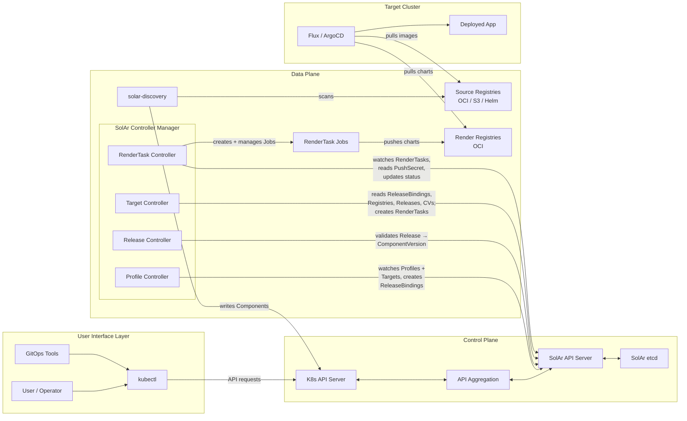
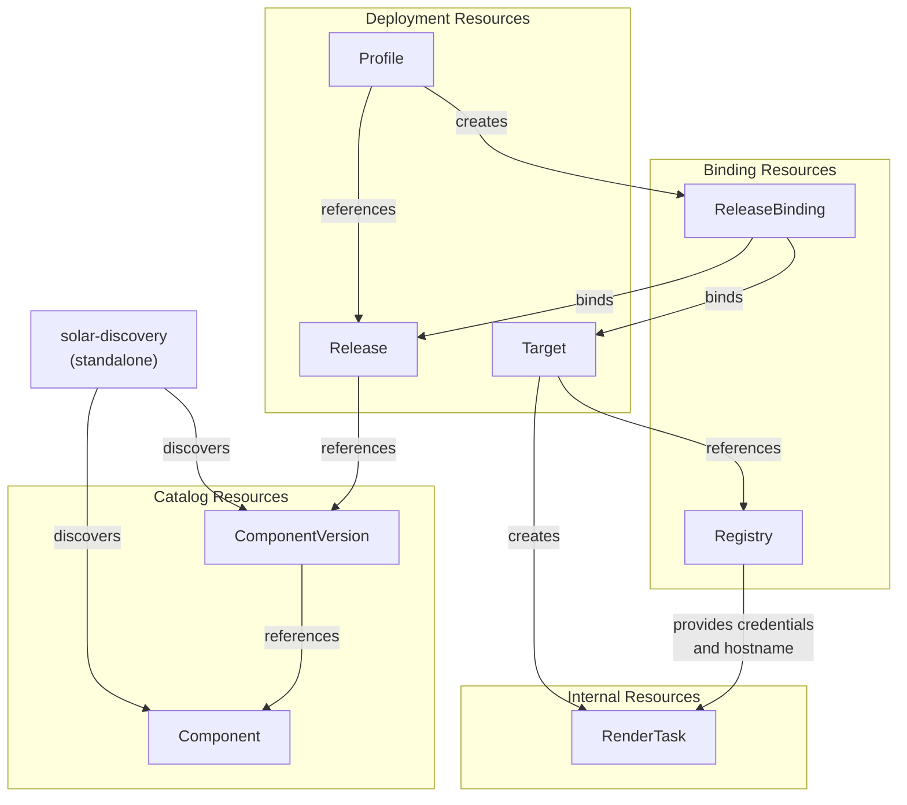

# Architecture

SolAr is implemented as a Kubernetes Extension API Server integrated with the Kubernetes API Aggregation Layer. This architectural approach provides several advantages over Custom Resource Definitions (CRDs), including dedicated storage isolation, custom API implementation flexibility, and reduced risk to the hosting cluster's control plane.

```mermaid
graph LR
    subgraph UI["User Interface Layer"]
        User["User / Operator"]
        Kubectl["kubectl"]
        GitOps["GitOps Tools"]
        User --> Kubectl
        GitOps --> Kubectl
    end

    subgraph CP["Control Plane"]
        K8sAPI["K8s API Server"]
        APIAgg["API Aggregation"]
        SOLARAPI["SolAr API Server"]
        SOLARETCD["SolAr etcd"]
        K8sAPI <--> APIAgg
        APIAgg <--> SOLARAPI
        SOLARAPI <--> SOLARETCD
    end

    subgraph DP["Data Plane"]
        subgraph Controllers["SolAr Controller Manager"]
            TargetCtrl["Target Controller"]
            ReleaseCtrl["Release Controller"]
            ProfileCtrl["Profile Controller"]
            RenderTaskCtrl["RenderTask Controller"]
        end
        Discovery["solar-discovery"]
        RenderJob["RenderTask Jobs"]
        SrcReg["Source Registries<br/>OCI / S3 / Helm"]
        DstReg["Render Registries<br/>OCI"]
    end

    subgraph TC["Target Cluster"]
        Flux["Flux / ArgoCD"]
        App["Deployed App"]
        Flux --> App
    end

    Kubectl -->|"API requests"| K8sAPI

    ProfileCtrl -->|"watches Profiles +<br/>Targets, creates<br/>ReleaseBindings"| SOLARAPI
    ReleaseCtrl -->|"validates Release →<br/>ComponentVersion"| SOLARAPI
    TargetCtrl -->|"reads ReleaseBindings,<br/>Registries, Releases, CVs;<br/>creates RenderTasks"| SOLARAPI
    RenderTaskCtrl -->|"watches RenderTasks,<br/>reads PushSecret,<br/>updates status"| SOLARAPI
    RenderTaskCtrl -->|"creates + manages Jobs"| RenderJob

    Discovery -->|"scans"| SrcReg
    Discovery -->|"writes Components"| K8sAPI
    RenderJob -->|"pushes charts"| DstReg

    Flux -->|"pulls charts"| DstReg
    Flux -->|"pulls images"| SrcReg
```

**Architecture: SolAr System Components and Data Flow**

The system follows a layered architecture where users interact through `kubectl` (or GitOps tools), requests flow through the Kubernetes API aggregation layer to the SolAr API Server. Controllers reconcile the declared resources and drive the rendering pipeline.

**Key Design Decisions:**

- **Extension API Server architecture** provides dedicated storage isolation in a separate etcd instance
- **Declarative, Kubernetes-native API** for GitOps compatibility

## Resource Model and Dependencies

```mermaid
graph TB
    subgraph "Catalog Resources"
        Component["Component"]
        ComponentVersion["ComponentVersion"]
    end

    subgraph "Deployment Resources"
        Release["Release"]
        Target["Target"]
        Profile["Profile"]
    end

    subgraph "Binding Resources"
        ReleaseBinding["ReleaseBinding"]
        Registry["Registry"]
    end

    subgraph "Internal Resources"
        RenderTask["RenderTask"]
    end

    SolArDiscovery["solar-discovery<br/>(standalone)"] -->|"discovers"| ComponentVersion
    SolArDiscovery -->|"discovers"| Component

    ComponentVersion -->|"references"| Component
    Release -->|"references"| ComponentVersion

    Profile -->|"references"| Release
    Profile -->|"creates"| ReleaseBinding

    ReleaseBinding -->|"binds"| Release
    ReleaseBinding -->|"binds"| Target

    Target -->|"references"| Registry
    Target -->|"creates"| RenderTask

    Registry -->|"provides credentials<br/>and hostname"| RenderTask
```

### Resource Roles

- **Component / ComponentVersion** — catalog entries discovered from OCI registries by solar-discovery.
- **Release** — declares which ComponentVersion to deploy and with what configuration.
- **Target** — represents a deployment target (cluster). References a Registry via `renderRegistryRef` for pushing rendered charts.
- **Registry** — stores OCI registry hostname and push credentials (`solarSecretRef`).
- **ReleaseBinding** — declares that a Release should be deployed to a Target. Created manually or automatically by the Profile controller.
- **Profile** — matches Targets by label selector and automatically creates ReleaseBindings for a given Release.
- **RenderTask** — internal resource created by the Target controller to drive chart rendering jobs.

## Controllers

- [Rendering pipeline](./rendering-pipeline.md) — how Targets, Releases, and RenderTasks produce deployable Helm charts
- [Release controller](./release_controller.md) — validates Release → ComponentVersion references
- [Profile controller](./profile_controller.md) — automates ReleaseBinding creation via label selectors
- [Target controller](./target_controller.md) — orchestrates the rendering pipeline per target cluster
- [RenderTask controller](./rendertask_controller.md) — lifecycle of individual RenderTask resources

## Discovery

- [Discovery pipeline](./discovery_pipeline.md) — how solar-discovery scans OCI registries and writes ComponentVersions
