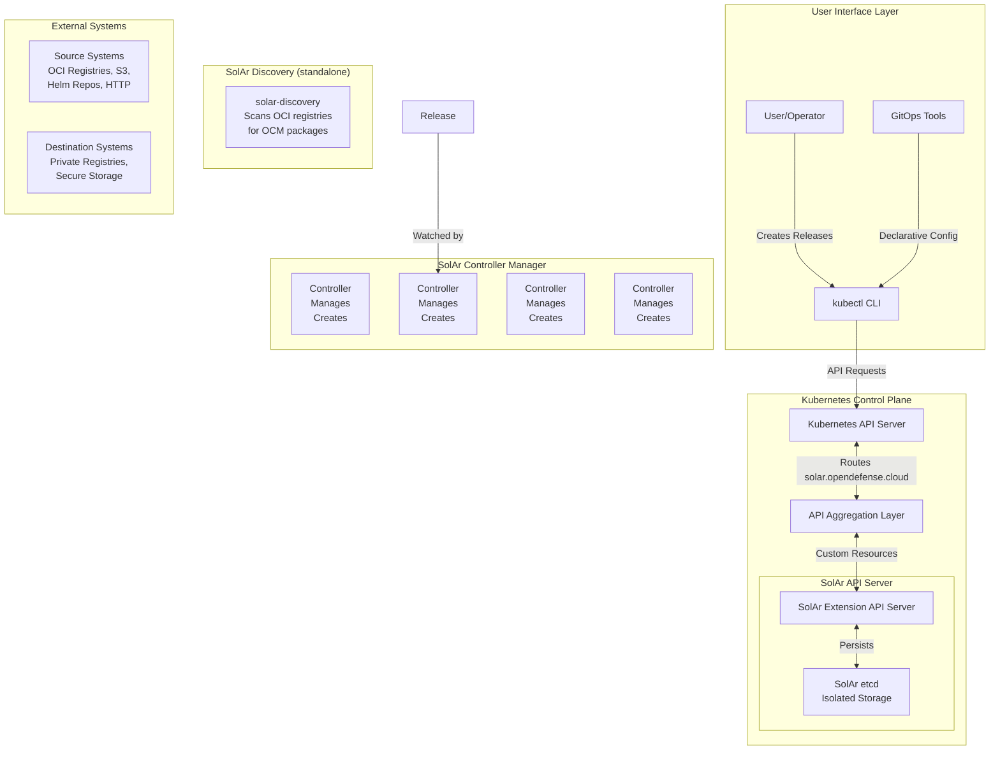
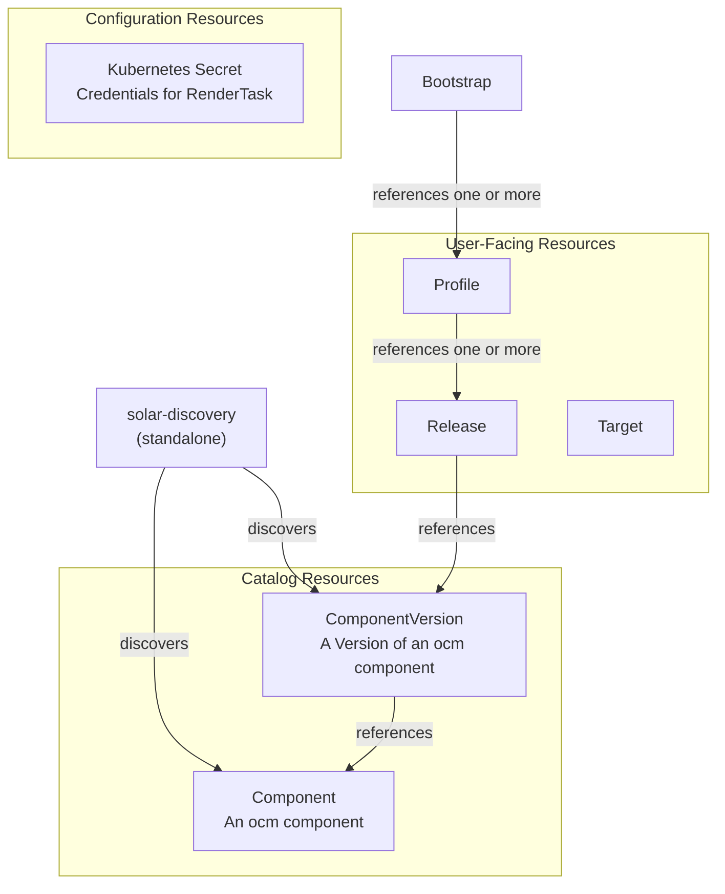

# Architecture

SolAr is implemented as a Kubernetes Extension API Server integrated with the Kubernetes API Aggregation Layer. This architectural approach provides several advantages over Custom Resource Definitions (CRDs), including dedicated storage isolation, custom API implementation flexibility, and reduced risk to the hosting cluster's control plane.

```mermaid
graph TB
    subgraph "User Interface Layer"
        User["User/Operator"]
        Kubectl["kubectl CLI"]
        GitOps["GitOps Tools"]
    end

    subgraph "Kubernetes Control Plane"
        K8sAPI["Kubernetes API Server"]
        APIAgg["API Aggregation Layer"]

        subgraph "SolAr API Server"
            SOLARAPI["SolAr Extension API Server"]
            SOLARETCD["SolAr etcd<br/>Isolated Storage"]
        end
    end

    subgraph "SolAr Controller Manager"
        TargetCtrl["Controller<br/>Manages<br/>Creates"]
        ReleaseCtrl["Controller<br/>Manages<br/>Creates"]
        BootstrapCtrl["Controller<br/>Manages<br/>Creates"]
        RenderTaskCtrl["Controller<br/>Manages<br/>Creates"]
    end

    subgraph "SolAr Discovery (standalone)"
        Discovery["solar-discovery<br/>Scans OCI registries<br/>for OCM packages"]
    end

    subgraph "External Systems"
        SrcReg["Source Systems<br/>OCI Registries, S3,<br/>Helm Repos, HTTP"]
        DstReg["Destination Systems<br/>Private Registries,<br/>Secure Storage"]
    end

    User -->|"Creates Releases"| Kubectl
    GitOps -->|"Declarative Config"| Kubectl
    Kubectl -->|"API Requests"| K8sAPI

    K8sAPI <-->|"Routes solar.opendefense.cloud"| APIAgg
    APIAgg <-->|"Custom Resources"| SOLARAPI
    SOLARAPI <-->|"Persists"| SOLARETCD

    Release -->|"Watched by"| ReleaseCtrl
```

**Architecture: SolAr System Components and Data Flow**

The system follows a layered architecture where users interact through `kubectl` (or GitOps tools), requests flow through the Kubernetes API aggregation layer to the SolAr API Server.

**Key Design Decisions:**

- **Extension API Server architecture** provides dedicated storage isolation in a separate etcd instance
- **Declarative, Kubernetes-native API** for GitOps compatibility

## Resource Model and Dependencies

```mermaid
graph TB
    subgraph "User-Facing Resources"
        Release["Release"]
        Profile["Profile"]
        Target["Target"]
    end

    subgraph "Catalog Resources"
        Component["Component<br/>An ocm component"]
        ComponentVersion["ComponentVersion<br/>A Version of an ocm component"]
    end

    subgraph "Configuration Resources"
        Secret["Kubernetes Secret<br/>Credentials for RenderTask"]
    end

    SolArDiscovery["solar-discovery<br/>(standalone)"] --> |"discovers"| ComponentVersion
    SolArDiscovery --> |"discovers"| Component

    ComponentVersion --> |"references"| Component

    Release -->|"references"| ComponentVersion

    Profile -->|"references one or more"| Release

    Bootstrap -->|"references one or more"| Profile
```

## Controllers

[RenderTask controller](./rendertask_controller.md)
