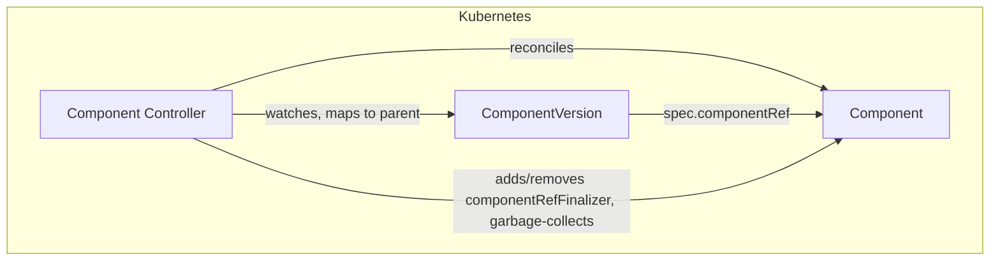
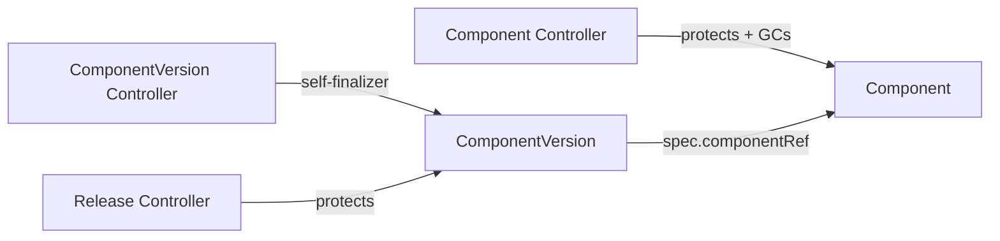

# Component Controller Documentation

## Overview

The Component controller owns the `Component` lifecycle. It keeps the deletion-protection finalizer in sync with the live `ComponentVersion`s that reference a Component, and garbage-collects the Component once its last live ComponentVersion is gone. Reconciles are serialized per Component, so the count-then-act decision cannot interleave with itself for the same object.

## Architecture

## Finalizers

| Finalizer | On resource | Purpose |
|---|---|---|
| `solar.opendefense.cloud/component-ref` | Component | Prevents deletion of the Component while any live ComponentVersion references it |

## Reconcile Behavior

On every reconcile the controller counts the live (non-terminating) ComponentVersions referencing the Component:

- **live > 0** — ensure the protection finalizer is present. Deleting the Component (e.g. via `kubectl delete component`) is blocked until the last live ComponentVersion is gone.
- **live == 0** — garbage-collect, but only when the protection finalizer is present. The finalizer means a live ComponentVersion was observed at some point; a Component without it was either just created by discovery (its first version not yet visible) or created manually, and neither is deleted.

The GC path re-reads the Component and re-counts the ComponentVersions straight from the API server (bypassing the informer cache) before acting, then deletes the Component first and strips the finalizer second. If the process crashes between the two steps, a later reconcile finds zero live versions with the finalizer still present and completes the removal.

On startup the informer initial sync enqueues all Components, which also sweeps historical orphans (Components carrying the finalizer with no remaining versions).

### Accepted residual

A ComponentVersion created in the instant between the authoritative checks and the finalizer strip briefly loses its parent: the Component is removed under a live reference and the next discovery event re-creates it via the apiwriter's `ensureComponent`. This is inherent to poll-then-act without cross-resource transactions; the window sits behind two direct API-server reads and is accepted.

## Watch Triggers

The Component controller is triggered when:

- A `Component` resource is created, updated, or deleted.
- A `ComponentVersion` resource is created, updated, or deleted — the event is mapped to the parent Component via `spec.componentRef.name`.

## Relationship to Other Controllers

The [ComponentVersion controller](componentversion_controller.md) manages only the ComponentVersion's self-finalizer; the discovery pipeline's [APIWriter](discovery_pipeline.md) only creates and deletes ComponentVersions. Both rely on this controller for the parent Component's protection and cleanup.
