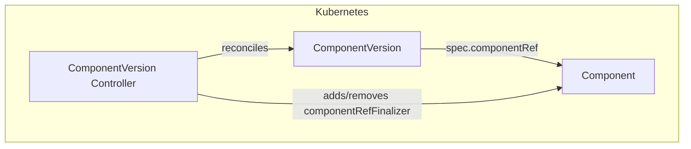
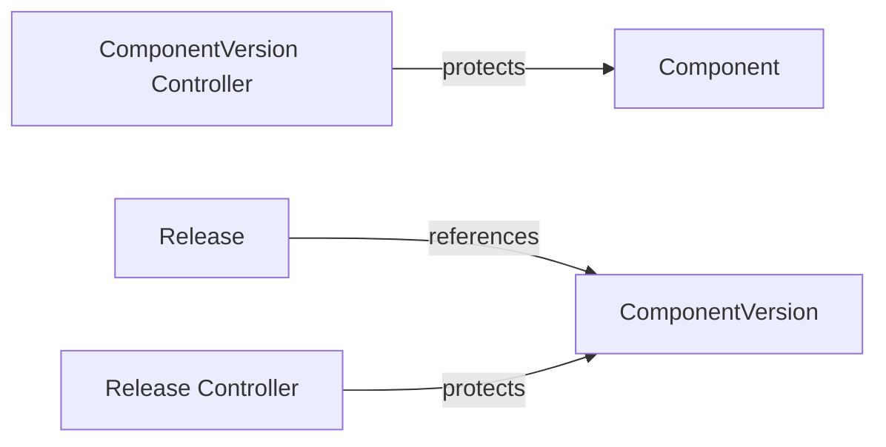

# ComponentVersion Controller Documentation

## Overview

The ComponentVersion controller manages the deletion-protection finalizer on the `Component` referenced by each `ComponentVersion`. It prevents a Component from being deleted while one or more ComponentVersions still reference it.

## Architecture

## Finalizers

| Finalizer | On resource | Purpose |
|---|---|---|
| `solar.opendefense.cloud/componentversion-finalizer` | ComponentVersion | Allows the controller to observe deletion and run cleanup logic before the object is garbage-collected |
| `solar.opendefense.cloud/component-ref` | Component | Prevents deletion of the referenced Component while any ComponentVersion references it |

On deletion, the controller:

1. Checks whether any other active ComponentVersion in the same namespace still references the same Component.
2. If none remain, removes `solar.opendefense.cloud/component-ref` from the Component.
3. Removes `solar.opendefense.cloud/componentversion-finalizer` from the ComponentVersion, allowing it to be garbage-collected.

## Watch Triggers

The ComponentVersion controller is triggered when:

- A `ComponentVersion` resource is created, updated, or deleted.

## Relationship to Other Controllers

ComponentVersions are themselves protected from deletion by the Release controller — a ComponentVersion cannot be deleted while a Release references it. Once the last Release is removed, the ComponentVersion can be deleted, which in turn unblocks Component deletion if no other ComponentVersions exist.
