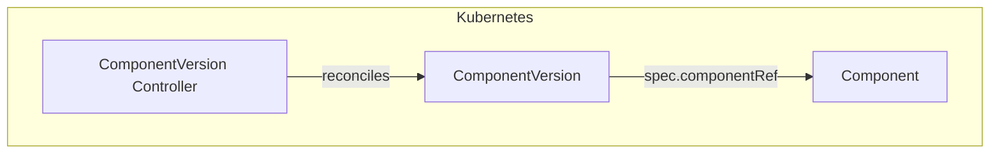
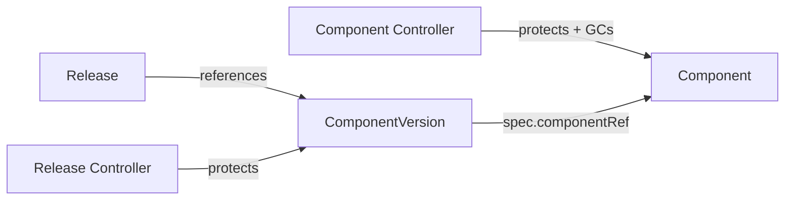

# ComponentVersion Controller Documentation

## Overview

The ComponentVersion controller manages the self-finalizer on each `ComponentVersion` so its deletion is observable by other controllers. Deletion protection and garbage collection of the parent `Component` are owned by the [Component controller](component_controller.md).

## Architecture

```mermaid
flowchart TD
    subgraph Kubernetes
        Ctrl[ComponentVersion Controller]
        CV[ComponentVersion]
        Comp[Component]
    end

    Ctrl -->|reconciles| CV
    CV -->|spec.componentRef| Comp
```

## Finalizers

| Finalizer | On resource | Purpose |
|---|---|---|
| `solar.opendefense.cloud/componentversion-finalizer` | ComponentVersion | Allows controllers to observe deletion before the object is garbage-collected |

The `solar.opendefense.cloud/component-ref` protection finalizer on the parent `Component` is managed exclusively by the [Component controller](component_controller.md).

On deletion, the controller removes `solar.opendefense.cloud/componentversion-finalizer` from the ComponentVersion, allowing it to be garbage-collected. The Component controller observes the disappearance via its ComponentVersion watch and re-evaluates the parent.

## Watch Triggers

The ComponentVersion controller is triggered when:

- A `ComponentVersion` resource is created, updated, or deleted.

## Relationship to Other Controllers

```mermaid
flowchart LR
    CompCtrl[Component Controller] -->|protects + GCs| Component
    ComponentVersion -->|spec.componentRef| Component
    Release -->|references| ComponentVersion
    ReleaseCtrl[Release Controller] -->|protects| ComponentVersion
```

ComponentVersions are themselves protected from deletion by the Release controller — a ComponentVersion cannot be deleted while a Release references it. Once the last Release is removed, the ComponentVersion can be deleted, which in turn lets the Component controller garbage-collect the parent Component if no other ComponentVersions exist.
