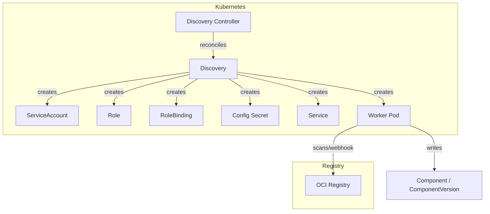
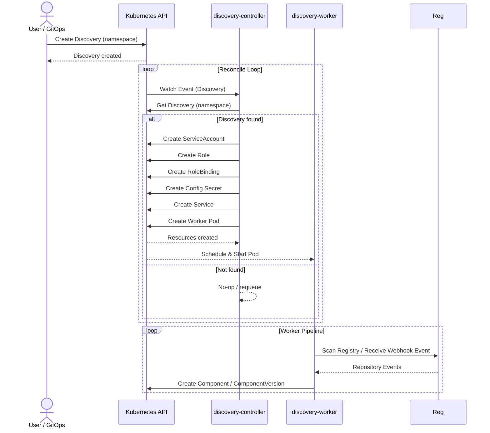
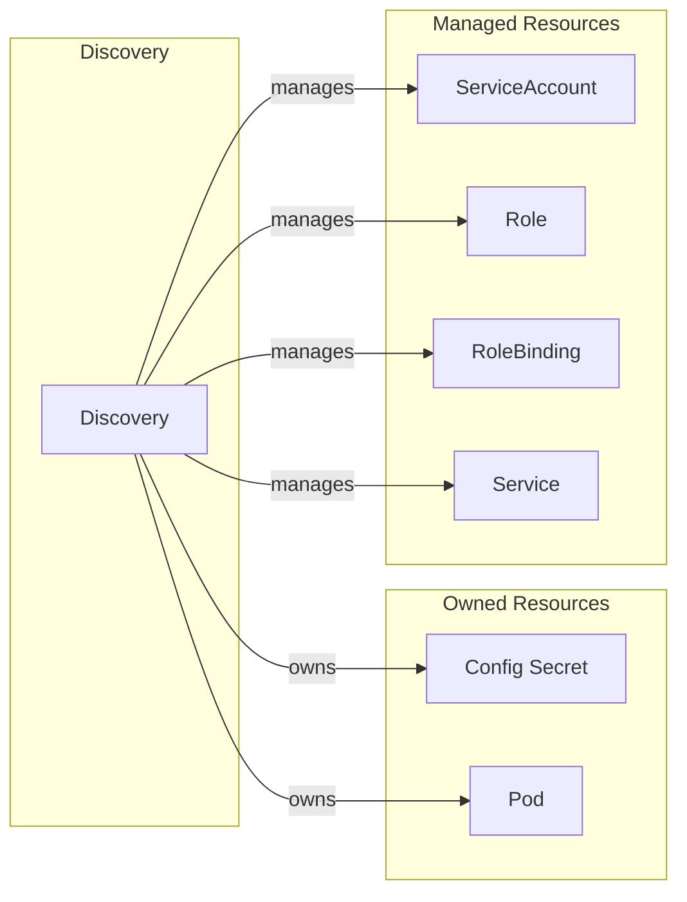

# Discovery Controller Documentation

## Overview

The Discovery controller manages the lifecycle of `Discovery` custom resources in SolAr. It creates and manages a Pod that executes the discovery worker, along with associated Kubernetes resources for RBAC, networking, and configuration.

## Architecture

## Reconcile Loop

## Resource Owner References

Pod and Config Secret are registered as owned resources in the controller manager (watch triggers reconcile; deleted via GC on Discovery deletion). ServiceAccount, Role, RoleBinding, and Service are created and updated by the controller but are not registered as owned resources.

| Resource        | Name Pattern                    | Namespace  |
| --------------- | --------------                  | ----------- |
| ServiceAccount  | `discovery-<discovery-name>`   | Inherited  |
| Role            | `solar-discovery-worker`        | Inherited  |
| RoleBinding     | `solar-discovery-worker`        | Inherited  |
| Config Secret   | `discovery-<discovery-name>`    | Inherited  |
| Service         | `discovery-<discovery-name>`    | Inherited  |
| Pod             | `discovery-<discovery-name>`    | Inherited  |

## Status Conditions

The controller updates the Discovery status with the following fields:

| Field           | Description                                          |
| --------------- | --------------------------------------------------- |
| `PodGeneration` | Tracks the generation of the Discovery spec for pod rollout detection |

## Cleanup Behavior

- **On deletion**: Deletes Pod, Service, Secret, Role, and RoleBinding, then removes finalizer; owned Pod and Secret are also garbage collected by Kubernetes via owner references
- **On spec change**: Deletes Pod, Service, Secret, Role, and RoleBinding, then recreates them; Role, RoleBinding, Secret, and Service are updated in-place if they already exist

## Controller Configuration

Configuration of the controller is managed by the controller manager. The Discovery controller can be configured with the following parameters:

| Parameter       | Type        | Description                           |
| ---             | ---         | ---                                   |
| `WorkerImage`   | `string`    | Image to be used for the worker Pod    |
| `WorkerCommand` | `string`    | Command for the worker Pod             |
| `WorkerArgs`    | `[]string`  | Additional args for the worker Pod     |
| `WatchNamespace`| `string`    | (Test only) Restrict reconciliation to this namespace |
