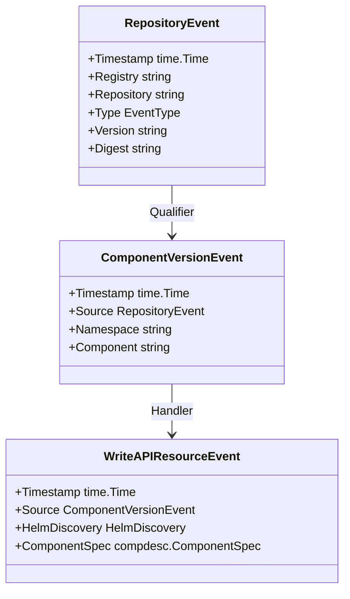
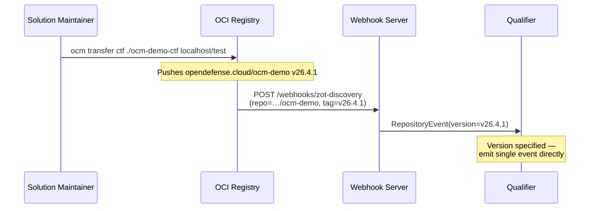
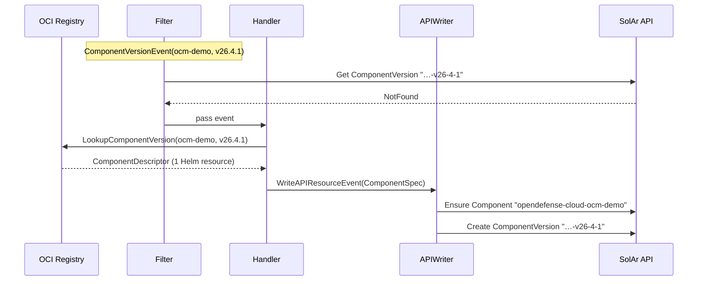
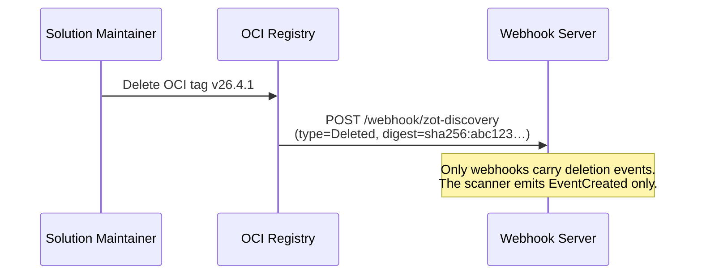
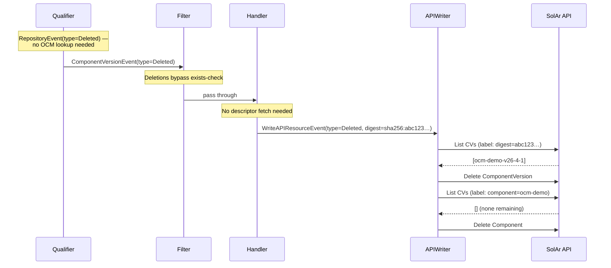

# Discovery Pipeline Documentation

## Overview

The SolAr discovery pipeline (`solar-discovery`) is a standalone component that continuously scans OCI registries for OCM (Open Component Model) packages and writes the discovered components into the SolAr API as `Component` and `ComponentVersion` resources.

The pipeline is composed of a chain of typed, channel-connected stages. Each stage runs as a goroutine pool (`Runner`) that reads from an input channel, processes events, and publishes results to an output channel. This makes the pipeline fully asynchronous, back-pressure-aware, and easy to test by swapping individual processors.

## Pipeline Stages

### Stage Descriptions

| Stage           | Input                    | Output                   | Responsibility                                                                 |
| --------------- | ------------------------ | ------------------------ | ------------------------------------------------------------------------------ |
| RegistryScanner | –                        | `RepositoryEvent`        | Periodically scans or receives webhook calls for repository changes            |
| Qualifier       | `RepositoryEvent`        | `ComponentVersionEvent`  | Resolves repository name to namespace + component, looks up all versions via OCM |
| Filter          | `ComponentVersionEvent`  | `ComponentVersionEvent`  | Drops events for ComponentVersions that already exist in the cluster           |
| Handler         | `ComponentVersionEvent`  | `WriteAPIResourceEvent`  | Fetches the OCM component descriptor and builds the API resource payload       |
| APIWriter       | `WriteAPIResourceEvent`  | –                        | Creates, updates, or deletes `Component` and `ComponentVersion` resources      |

## Event Types

## Registry Scanner

The `RegistryScanner` scans a single OCI registry on a configurable interval (default 30 s). It lists all repositories via the ORAS library and emits a `RepositoryEvent` for each one. Concurrent scans are prevented by a mutex — if a scan is still running when the next tick fires, the tick is skipped.

OCI registries can also push change notifications via webhooks. The `WebhookServer` accepts HTTP POST requests on configured paths and converts them directly into `RepositoryEvent`s, bypassing the polling interval.

## Qualifier

The Qualifier resolves a raw `RepositoryEvent` (registry + repository path) into one or more `ComponentVersionEvent`s by:

1. Splitting the repository path into `namespace/component` segments.
2. If the event already carries a specific version (e.g. from a webhook), emitting a single event for that version.
3. Otherwise, looking up all versions of the component in the OCM repository and emitting one event per version.

## Filter

The Filter prevents duplicate work. For `EventCreated` events it checks whether the corresponding `ComponentVersion` already exists in the SolAr API. If it does, the event is silently dropped. All other event types (update, delete) pass through unconditionally.

## Handler

The Handler fetches the full OCM component descriptor for the component version and determines how to represent it as a SolAr API resource. It uses a pluggable handler registry keyed by `HandlerType`:

| HandlerType | Trigger condition                                  | Produces                                  |
| ----------- | -------------------------------------------------- | ----------------------------------------- |
| `helm`      | Component descriptor contains exactly 1 Helm chart | `ComponentVersion` with Helm resource     |

Components with zero or more than one Helm chart are not yet handled and produce an error.

## APIWriter

The APIWriter translates `WriteAPIResourceEvent`s into Kubernetes API calls against the SolAr extension API:

- **Create / Update**: calls `ensureComponent` (idempotent upsert of the `Component` parent resource) and then creates or patches the `ComponentVersion`.
- **Delete**: deletes the `ComponentVersion` and, if no more versions exist, the `Component`.

Labels `solar.opendefense.cloud/component` and `solar.opendefense.cloud/digest` are set on `ComponentVersion` resources for indexing and deduplication.

## Runner: Shared Concurrency Primitive

All pipeline stages are backed by the generic `Runner[InputEvent, OutputEvent]` type from `pkg/discovery`. Each Runner runs as a single goroutine that:

- Reads events from its input channel in a single goroutine loop.
- Calls `Processor.Process(ctx, event)` to produce zero or more output events.
- Publishes output events to its output channel.
- Supports optional **rate limiting** (`rate.Limiter`) to throttle API calls.
- Supports optional **exponential backoff** for transient errors (e.g. registry 429s).
- Can be stopped gracefully: `Stop()` closes the stop channel and waits for the in-flight event to finish.

## Sequence Diagrams

### Webhook: Registry pushes a change notification

#### 1 — Event ingestion

#### 2 — Filter, resolve & write

### Component version deleted from registry (with Component cascade)

#### 1 — Deletion event

#### 2 — Pipeline passthrough & cascade delete

## Configuration

The discovery pipeline is configured via the `solar-discovery` binary flags and a registry configuration file. Per-registry settings include:

| Setting          | Description                                             |
| ---------------- | ------------------------------------------------------- |
| `scanInterval`   | Polling interval for registry scans (0 = webhook only)  |
| `webhookPath`    | HTTP path to register for push notifications (optional) |
| `credentials`    | Username/password for authenticated registries          |
| `plainHTTP`      | Whether to use plain HTTP instead of HTTPS              |

