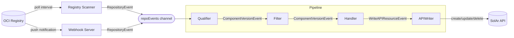
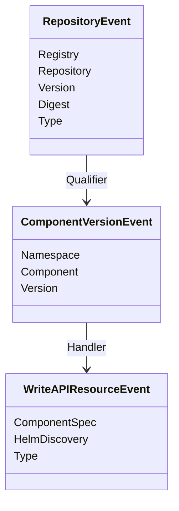
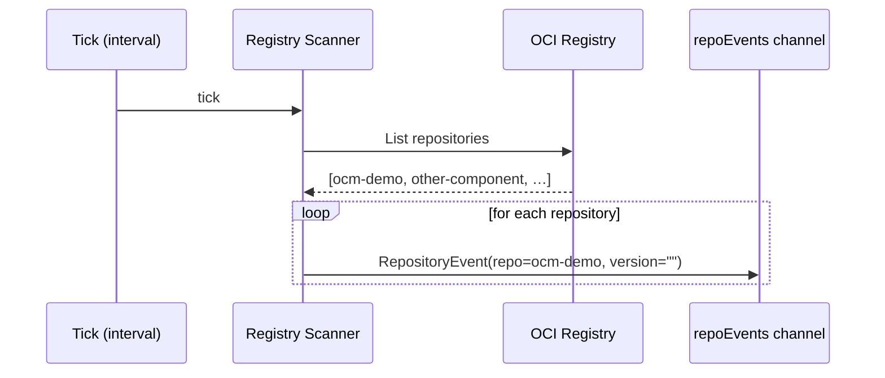
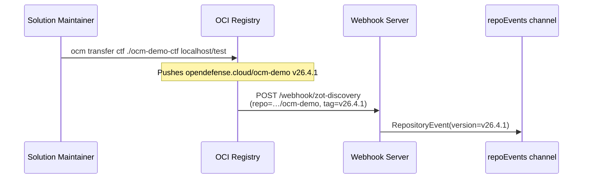
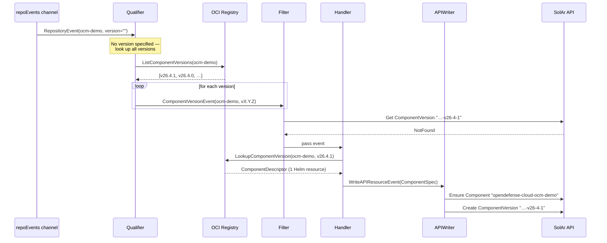
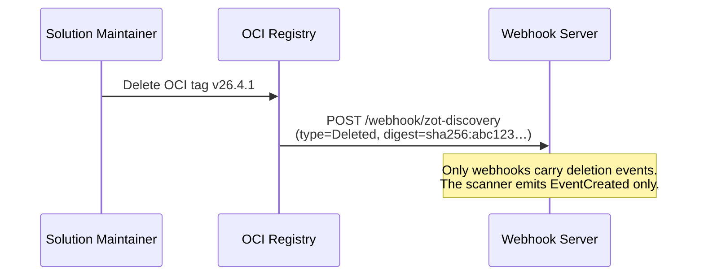
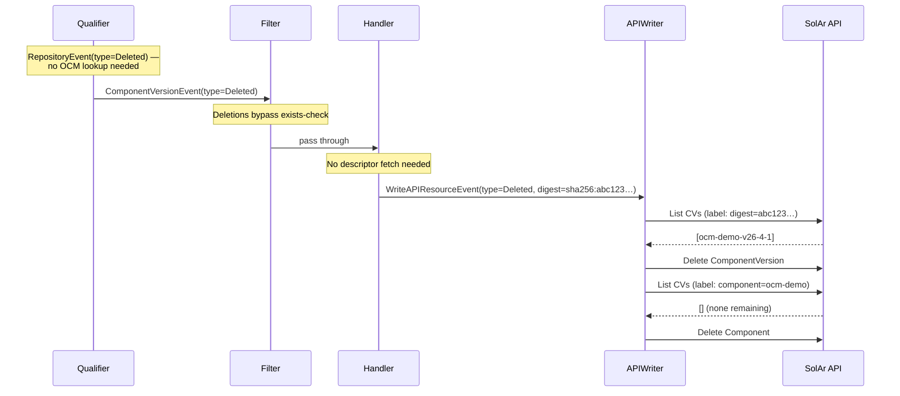

# Discovery Pipeline Documentation

## Overview

The SolAr discovery pipeline (`solar-discovery`) is a standalone component that discovers OCM (Open Component Model) packages in OCI registries and writes them into the SolAr API as `Component` and `ComponentVersion` resources.

Discovery is triggered in two ways: by periodically scanning a registry for all repositories, or by receiving push notifications from the registry via webhook. These modes can be used together or independently (`scanInterval: 0` disables polling).

The pipeline is composed of a chain of channel-connected stages. Each stage processes events from its input channel and publishes results to its output channel, making the pipeline fully asynchronous and back-pressure-aware.

## Pipeline Stages

### Event Sources

| Source          | Output            | Responsibility                                                          |
| --------------- | ----------------- | ----------------------------------------------------------------------- |
| RegistryScanner | `RepositoryEvent` | Periodically scans all repositories in an OCI registry                  |
| WebhookServer   | `RepositoryEvent` | Accepts push notifications from OCI registries and emits events directly |

### Pipeline Stages

| Stage     | Input                   | Output                  | Responsibility                                                                   |
| --------- | ----------------------- | ----------------------- | -------------------------------------------------------------------------------- |
| Qualifier | `RepositoryEvent`       | `ComponentVersionEvent` | Resolves repository name to namespace + component, looks up all versions via OCM |
| Filter    | `ComponentVersionEvent` | `ComponentVersionEvent` | Drops events for ComponentVersions that already exist in the cluster             |
| Handler   | `ComponentVersionEvent` | `WriteAPIResourceEvent` | Fetches the OCM component descriptor and builds the API resource payload         |
| APIWriter | `WriteAPIResourceEvent` | –                       | Creates, updates, or deletes `Component` and `ComponentVersion` resources        |

## Event Types

## Registry Scanner

The `RegistryScanner` scans a single OCI registry on a configurable interval (`ScanInterval`, default 24 h). It lists all repositories via the ORAS library and emits a `RepositoryEvent` for each one. Concurrent scans are prevented by a mutex — if a scan is still running when the next tick fires, the tick is skipped.

OCI registries can also push change notifications via webhooks. The `WebhookServer` accepts HTTP POST requests on configured paths and converts them directly into `RepositoryEvent`s, bypassing the polling interval.

## Qualifier

The Qualifier resolves a raw `RepositoryEvent` (registry + repository path) into one or more `ComponentVersionEvent`s by:

1. Splitting the repository path into `namespace/component` segments.
2. If the event already carries a specific version (e.g. from a webhook), emitting a single event for that version.
3. Otherwise, looking up all versions of the component in the OCM repository and emitting one event per version.

## Filter

The Filter prevents duplicate work. For `EventCreated` events it checks whether the corresponding `ComponentVersion` already exists in the SolAr API. If it does, the event is silently dropped. All other event types (update, delete) pass through unconditionally.

## Handler

The Handler fetches the OCM component descriptor for a component version and builds the `ComponentVersion` payload. Currently handles components that contain exactly one Helm chart resource. Components with zero or more than one Helm chart are not yet supported.

## APIWriter

The APIWriter creates, updates, or deletes `Component` and `ComponentVersion` resources in the SolAr API. On deletion, if no more versions of a component remain, the parent `Component` resource is also deleted.

## Sequence Diagrams

### Scanner: Periodic poll discovers changes

### Webhook: Registry pushes a change notification

### Shared pipeline: qualify, filter & write

Once a `RepositoryEvent` is on the channel, both the scanner and webhook paths converge into this shared pipeline starting with the Qualifier.

### Component version deleted from registry (with Component cascade)

#### Pipeline passthrough & cascade delete

## Configuration

The discovery pipeline is configured via the `solar-discovery` binary flags and a registry configuration file. Per-registry settings include:

| Setting          | Description                                             |
| ---------------- | ------------------------------------------------------- |
| `scanInterval`   | Polling interval for registry scans (0 = webhook only)  |
| `webhookPath`    | HTTP path to register for push notifications (optional) |
| `credentials`    | Username/password for authenticated registries          |
| `plainHTTP`      | Whether to use plain HTTP instead of HTTPS              |

