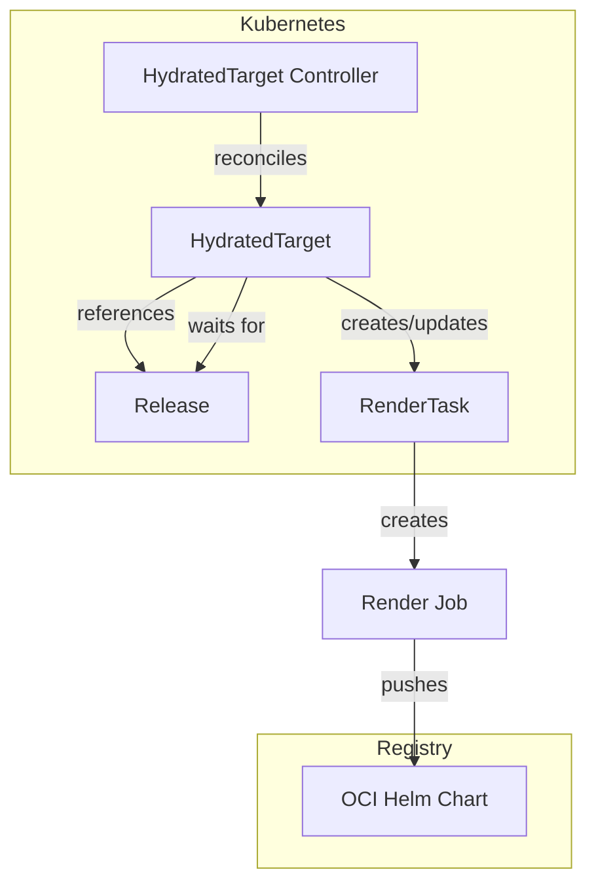
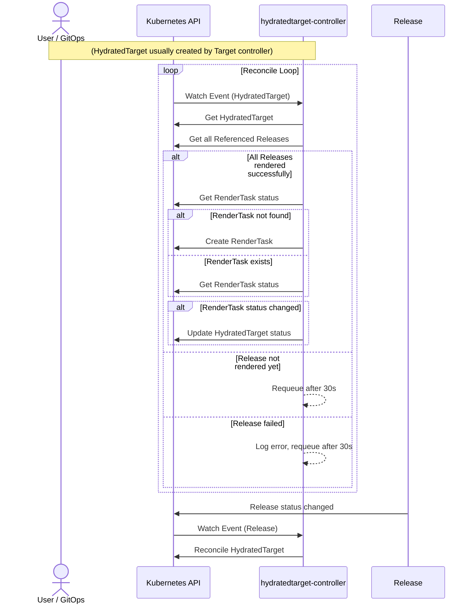
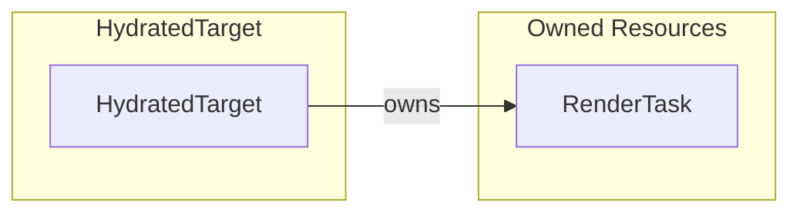
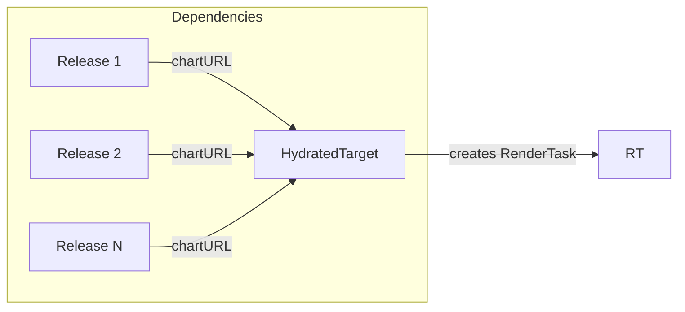
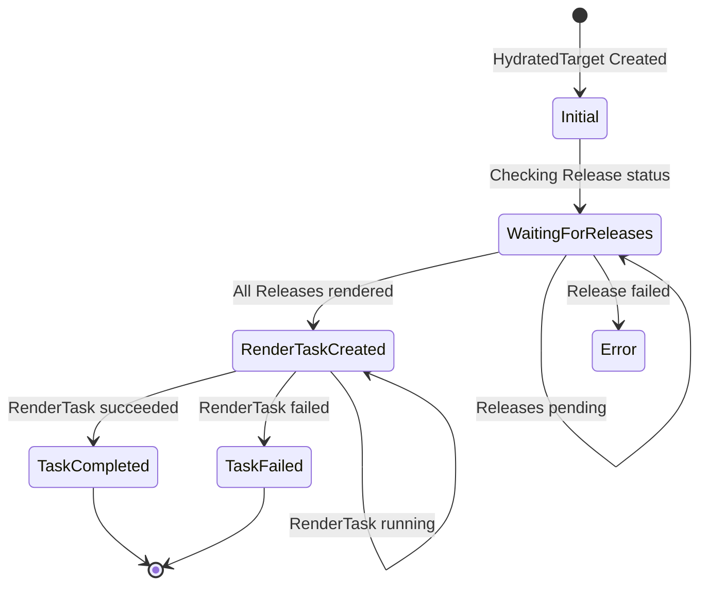

# HydratedTarget Controller Documentation

## Overview

The HydratedTarget controller manages the lifecycle of `HydratedTarget` custom resources in SolAr. It creates and manages a `RenderTask` that triggers the rendering of a composite Helm chart combining multiple Release charts.

## Architecture

## Reconcile Loop

## Resource Owner References

| Resource   | Name Pattern                               | Namespace  |
| ---------- | --------------                             | ----------- |
| RenderTask | `ht-<hydratedtarget-name>-<generation>`     | Inherited  |

## Dependency Chain

The HydratedTarget waits for all referenced Releases to be successfully rendered before creating its own RenderTask:

This creates a dependency chain:
1. ComponentVersion discovered → Release can render
2. Release rendered → HydratedTarget can render

## Status Conditions

The controller updates the HydratedTarget status with the following conditions:

| Condition           | Status   | Reason       | Description                      |
| -----------         | -------- | --------     | -------------------------------- |
| `TaskCompleted`     | `True`   | TaskCompleted| RenderTask completed successfully |
| `TaskFailed`        | `True`   | TaskFailed   | RenderTask failed                |

The HydratedTarget status also tracks:
- `ChartURL`: The URL of the rendered composite Helm chart in the OCI registry
- `RenderTaskRef`: Reference to the created RenderTask

## Cleanup Behavior

- **On deletion**: Deletes the associated RenderTask (with background propagation), then removes finalizer
- **On successful render**: HydratedTarget remains as-is (immutable once succeeded)
- **On failed render**: HydratedTarget remains with failed status; new RenderTask created on next spec change (new generation)

## Controller Configuration

Configuration of the controller is managed by the controller manager. The HydratedTarget controller can be configured with the following parameters:

| Parameter        | Type        | Description                                        |
| ---              | ---         | ---                                                |
| `WatchNamespace` | `string`    | (Test only) Restrict reconciliation to this namespace |
