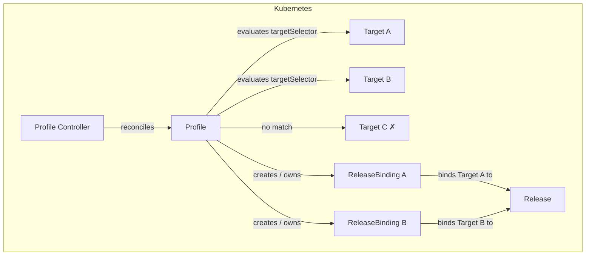
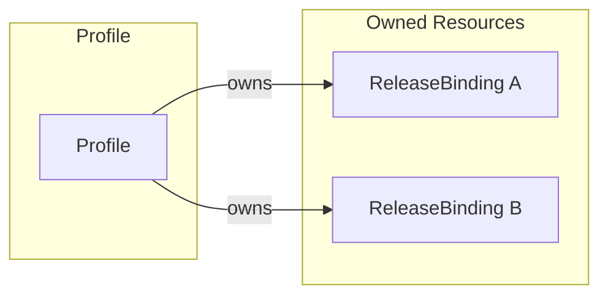
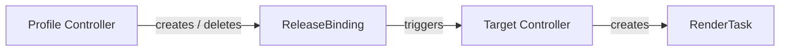

# Profile Controller Documentation

## Overview

The Profile controller manages the lifecycle of `Profile` custom resources in SolAr. It evaluates each Profile's `targetSelector` label selector against all Targets in the same namespace and creates or deletes `ReleaseBinding` resources accordingly.

A Profile is the mechanism for automated, fleet-wide rollouts: rather than manually binding each Target to a Release, an operator defines a Profile that continuously keeps the binding set in sync with the set of matching Targets.

## Architecture



## Resource Owner References



ReleaseBindings are created with an owner reference to the Profile. Kubernetes garbage-collects them automatically when the Profile is deleted.

## Status Fields

| Field              | Description                                      |
| ------------------ | ------------------------------------------------ |
| `matchedTargets`   | Number of Targets currently matched by the selector |

## Watch Triggers

The Profile controller is triggered when:

- A `Profile` resource is created, updated, or deleted.
- A `ReleaseBinding` owned by the Profile changes (via `Owns`).
- A `Target` in the same namespace changes — the controller re-evaluates all Profiles whose selector might match the changed Target.

## ReleaseBinding Naming

ReleaseBindings are created with `generateName` using the pattern:

```
<profile-name>-<target-name>-<random-suffix>
```

Names are truncated to 57 characters before the suffix to stay within the 63-character Kubernetes label value limit.

## Relationship to Other Controllers



Deleting a Profile cascades into:
1. Kubernetes GC removes owned ReleaseBindings.
2. Target controller notices the missing bindings and stops managing the corresponding RenderTasks.

