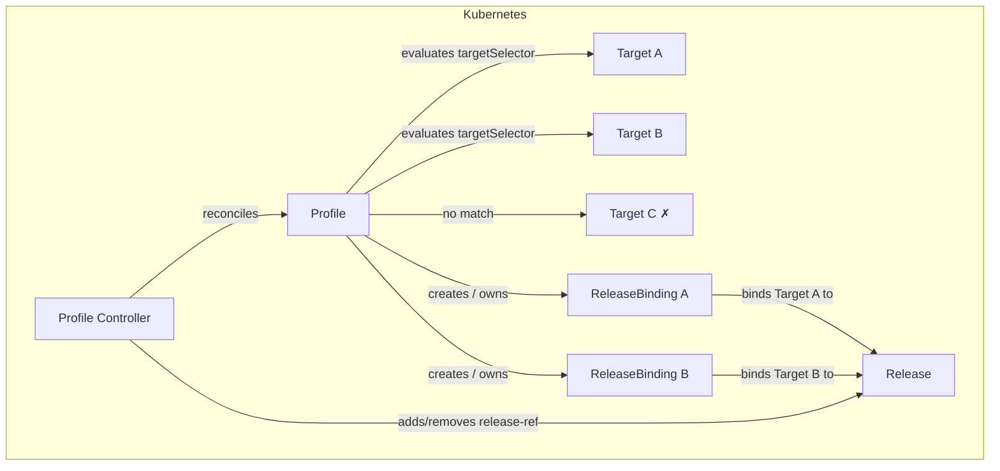
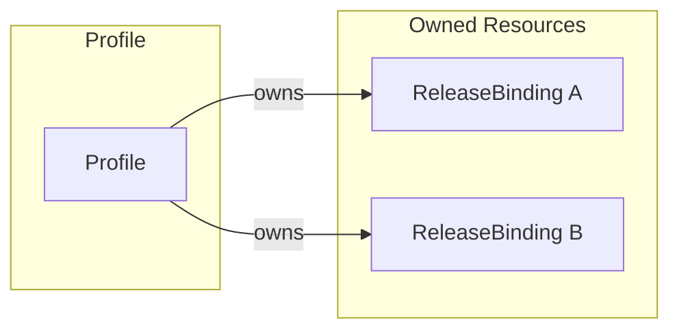
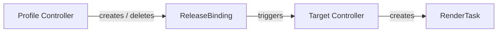

# Profile Controller Documentation

## Overview

The Profile controller manages the lifecycle of `Profile` custom resources in SolAr. It evaluates each Profile's `targetSelector` label selector against Targets in the same namespace and, when a `ReferenceGrant` permits it, against Targets in other namespaces as well. It creates or deletes `ReleaseBinding` resources accordingly.

A Profile is the mechanism for automated, fleet-wide rollouts: rather than manually binding each Target to a Release, an operator defines a Profile that continuously keeps the binding set in sync with the set of matching Targets.

`ReleaseBinding` resources are always created in the **Profile's namespace**. When the matched Target lives in a different namespace, the binding carries `spec.targetNamespace` pointing to the Target's namespace. The Target controller discovers these cross-namespace bindings using the same `ReferenceGrant`. See [ReferenceGrants](../user-guide/reference-grants.md) for details.

## Architecture



## Finalizers

The Profile controller manages two finalizers:

| Finalizer | On resource | Purpose |
|---|---|---|
| `solar.opendefense.cloud/profile-finalizer` | Profile | Allows the controller to observe deletion and run cleanup logic before the object is garbage-collected |
| `solar.opendefense.cloud/release-ref` | Release | Prevents deletion of the referenced Release while any Profile or ReleaseBinding references it |

On deletion, the controller follows this sequence to ensure the Release is never left unprotected while bindings that reference it still exist:

1. Explicitly deletes any owned ReleaseBindings that have not yet been deleted.
2. Blocks (returns without removing finalizers) until every owned ReleaseBinding is fully gone from the API. The `Owns()` watch re-triggers the reconcile as each binding is removed.
3. Once all owned bindings are gone, checks whether any other active Profile or ReleaseBinding still references the same Release.
4. If none remain, removes `solar.opendefense.cloud/release-ref` from the Release.
5. Removes `solar.opendefense.cloud/profile-finalizer` from the Profile, allowing it to be garbage-collected.

Note: `solar.opendefense.cloud/release-ref` is a shared finalizer — both the Profile controller and the ReleaseBinding controller place it on a Release. The reference count check always considers both Profiles and ReleaseBindings before removing it.

### Operational risk: Profile stuck in Terminating

Because the Profile controller explicitly waits for every owned ReleaseBinding to be fully removed from the API before proceeding, a permanently stuck ReleaseBinding will block Profile deletion indefinitely. This can happen if the ReleaseBinding controller has a bug that prevents it from removing `solar.opendefense.cloud/releasebinding-finalizer` from a binding that has already been marked for deletion.

There is no automatic timeout or retry limit — the `Owns()` watch only re-triggers the Profile reconcile when a binding *changes*, so a binding that never changes will leave the Profile waiting forever with no further events.

**Escape hatch:** manually remove the stuck finalizer with kubectl:

```bash
kubectl patch releasebinding <name> -n <namespace> \
  -p '{"metadata":{"finalizers":[]}}' --type=merge
```

This unblocks the Profile controller on the next reconcile triggered by the binding's deletion.

## Resource Owner References



ReleaseBindings are created with an owner reference to the Profile. Kubernetes garbage-collects them automatically when the Profile is deleted.

## Status Fields

| Field              | Description                                      |
| ------------------ | ------------------------------------------------ |
| `matchedTargets`   | Number of Targets currently matched by the selector |

## Watch Triggers

The Profile controller is triggered when:

- A `Profile` resource is created, updated, or deleted.
- A `ReleaseBinding` owned by the Profile changes (via `Owns`).
- A `Target` in the same namespace changes — the controller re-evaluates all Profiles whose selector might match the changed Target.
- A `Target` in another namespace changes — if a `ReferenceGrant` in that namespace permits the Profile's namespace to access Targets there, the controller re-evaluates matching Profiles.
- A `ReferenceGrant` changes — the controller re-evaluates all Profiles in namespaces listed in the grant's `from` entries.

## ReleaseBinding Naming

ReleaseBindings are created with `generateName` using the pattern:

```text
<profile-name>-<target-name>-<random-suffix>
```

Names are truncated to 57 characters before the suffix to stay within the 63-character Kubernetes label value limit.

## Deletion Behavior

> **Warning:** Deleting a Profile is a destructive, cascading operation.

The Profile controller explicitly deletes all owned ReleaseBindings as part of its deletion path. There is no grace period or confirmation step.

To remove a Profile without triggering undeployment, first remove or relabel all matching Targets so the Profile controller reconciles and removes the ReleaseBindings itself, then delete the Profile once it has no owned bindings.

## Relationship to Other Controllers



Deleting a Profile cascades into:

1. Profile controller explicitly deletes all owned ReleaseBindings and waits for them to be fully removed.
2. Target controller notices the missing bindings and stops managing the corresponding RenderTasks.

