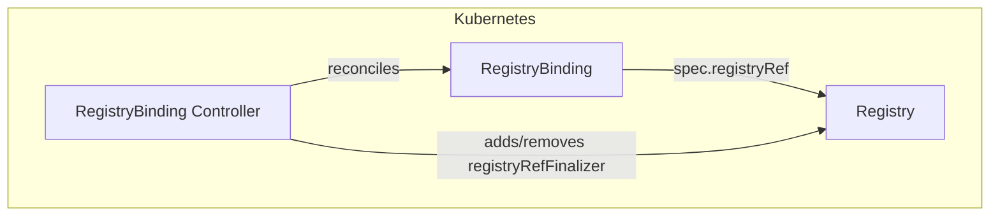
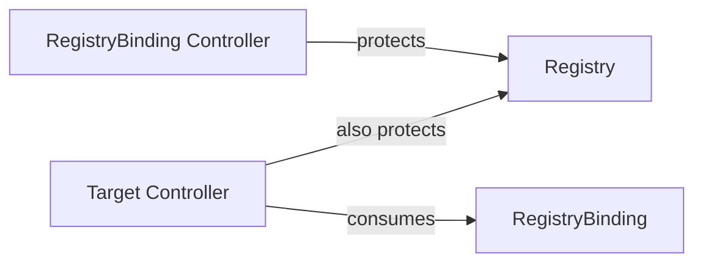

# RegistryBinding Controller Documentation

## Overview

The RegistryBinding controller manages the deletion-protection finalizer on the `Registry` referenced by each `RegistryBinding`. It ensures that a Registry cannot be deleted while any active RegistryBinding or Target still references it.

This controller complements the Target controller's registry protection: the Target controller places `solar.opendefense.cloud/registry-ref` on a Registry when it processes a Target, but RegistryBindings (which also reference registries for pull-credential resolution) are handled here.

## Architecture

## Finalizers

| Finalizer | On resource | Purpose |
|---|---|---|
| `solar.opendefense.cloud/registrybinding-finalizer` | RegistryBinding | Allows the controller to observe deletion and run cleanup logic before the object is garbage-collected |
| `solar.opendefense.cloud/registry-ref` | Registry | Prevents deletion of the referenced Registry while any Target or RegistryBinding references it |

On deletion, the controller:

1. Checks whether any other active Target (across all namespaces) or RegistryBinding still references the same Registry.
2. If none remain, removes `solar.opendefense.cloud/registry-ref` from the Registry.
3. Removes `solar.opendefense.cloud/registrybinding-finalizer` from the RegistryBinding, allowing it to be garbage-collected.

`solar.opendefense.cloud/registry-ref` is a shared finalizer: both this controller and the Target controller place it on a Registry. The reference count check always considers both Targets and RegistryBindings before removing it.

## Watch Triggers

The RegistryBinding controller is triggered when:

- A `RegistryBinding` resource is created, updated, or deleted.

## Relationship to Other Controllers

