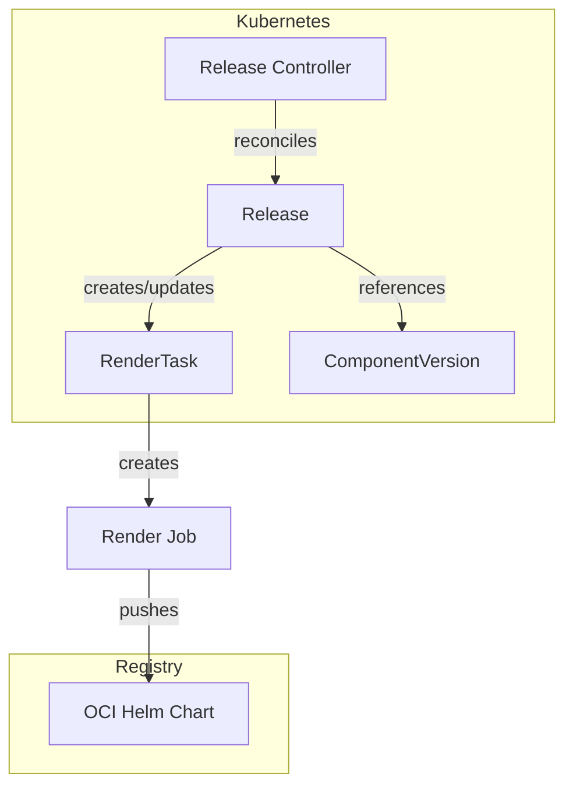
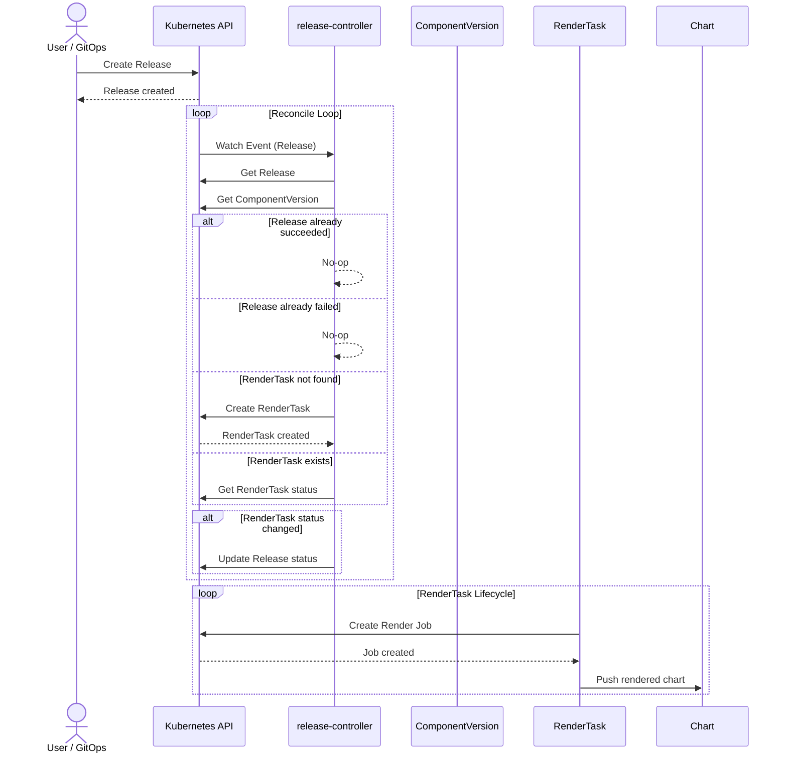
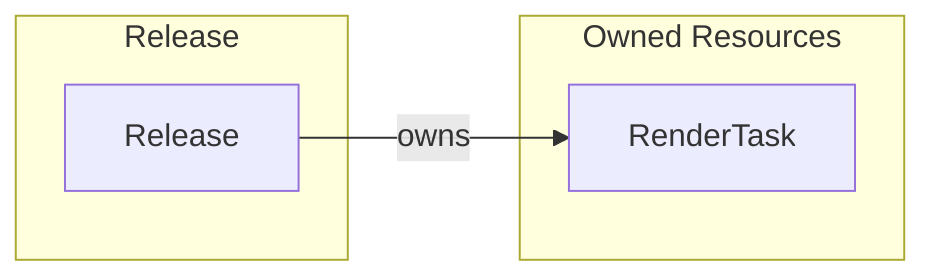
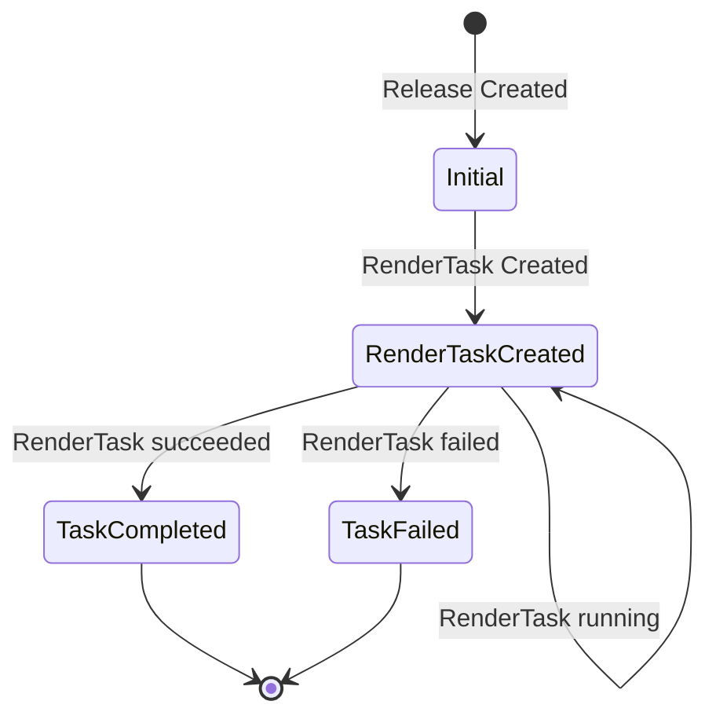

# Release Controller Documentation

## Overview

The Release controller manages the lifecycle of `Release` custom resources in SolAr. It creates and manages a `RenderTask` that triggers the rendering of a Helm chart from a ComponentVersion.

## Architecture

## Reconcile Loop

## Resource Owner References

| Resource   | Name Pattern                          | Namespace  |
| ---------- | --------------                        | ----------- |
| RenderTask | `release-<release-name>-<generation>` | Inherited  |

## Status Conditions

The controller updates the Release status with the following conditions:

| Condition           | Status   | Reason       | Description                     |
| -----------         | -------- | --------     | ------------------------------- |
| `TaskCompleted`     | `True`   | TaskCompleted| RenderTask completed successfully|
| `TaskFailed`        | `True`   | TaskFailed   | RenderTask failed               |

The Release status also tracks:
- `ChartURL`: The URL of the rendered Helm chart in the OCI registry
- `RenderTaskRef`: Reference to the created RenderTask

## Cleanup Behavior

- **On deletion**: Deletes the associated RenderTask (with background propagation), then removes finalizer
- **On successful render**: Release remains as-is (immutable once succeeded)
- **On failed render**: Release remains with failed status; new RenderTask created on next spec change (new generation)

## Controller Configuration

Configuration of the controller is managed by the controller manager. The Release controller can be configured with the following parameters:

| Parameter        | Type        | Description                                        |
| ---              | ---         | ---                                                |
| `WatchNamespace` | `string`    | (Test only) Restrict reconciliation to this namespace |
