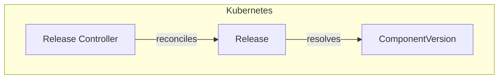
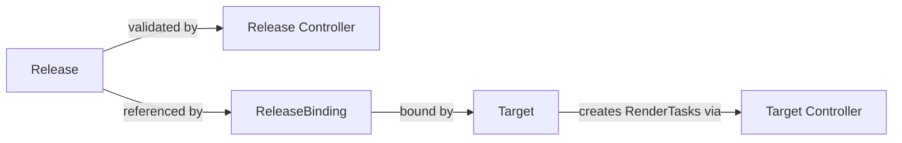

# Release Controller Documentation

## Overview

The Release controller manages the lifecycle of `Release` custom resources in SolAr. Its primary responsibility is to validate that a Release's referenced `ComponentVersion` exists and to reflect the resolution status via status conditions.

The Release controller does **not** trigger rendering — that is handled by the Target controller once a Release is bound to a Target via a `ReleaseBinding`.

## Architecture

## Status Conditions

| Condition                    | Status  | Reason      | Description                          |
| ---------------------------- | ------- | ----------- | ------------------------------------ |
| `ComponentVersionResolved`   | `True`  | `Resolved`  | ComponentVersion exists              |
| `ComponentVersionResolved`   | `False` | `NotFound`  | ComponentVersion does not exist      |

## Watch Triggers

The Release controller is triggered when:

- A `Release` resource is created, updated, or deleted.

It does **not** watch `ComponentVersion` directly — if the ComponentVersion appears later, the Release will be reconciled again only when a change to the Release itself triggers a new reconcile. For production use, external signals (e.g. re-applying the Release) are required if a ComponentVersion is created after the Release.

## Relationship to Other Controllers

The Release controller is intentionally minimal. Rendering logic is delegated to the Target controller:

