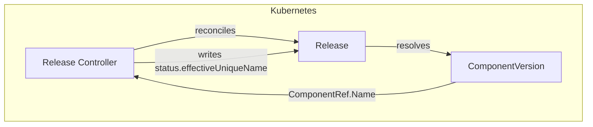
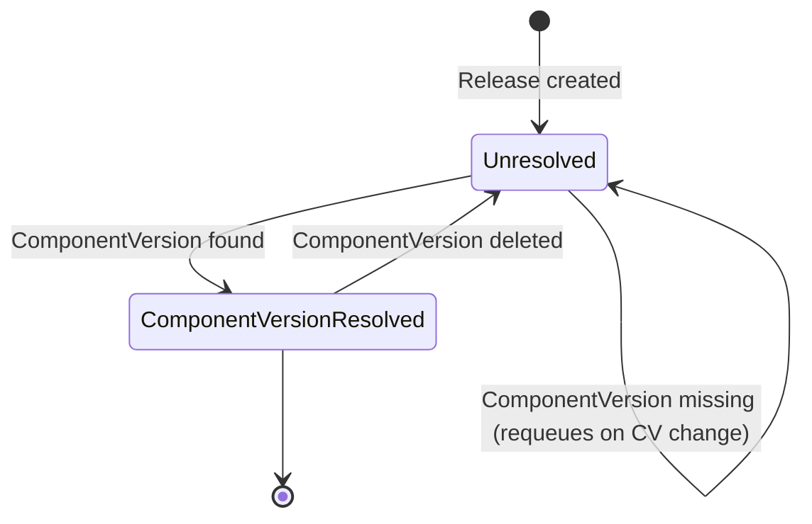
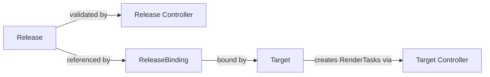

# Release Controller Documentation

## Overview

The Release controller manages the lifecycle of `Release` custom resources in SolAr. Its primary responsibility is to validate that a Release's referenced `ComponentVersion` exists and to reflect the resolution status via status conditions.

Once the ComponentVersion is resolved, the controller also writes `status.effectiveUniqueName` — the deduplication key the Target controller will use for this Release. This equals `spec.uniqueName` when set, or the parent Component name derived from the ComponentVersion otherwise.

The Release controller does **not** trigger rendering — that is handled by the Target controller once a Release is bound to a Target via a `ReleaseBinding`.

## Architecture

## Status Conditions

| Condition                    | Status  | Reason      | Description                          |
| ---------------------------- | ------- | ----------- | ------------------------------------ |
| `ComponentVersionResolved`   | `True`  | `Resolved`  | ComponentVersion exists              |
| `ComponentVersionResolved`   | `False` | `NotFound`  | ComponentVersion does not exist      |
| `ComponentVersionResolved`   | `False` | `NotGranted`| Cross-namespace access not permitted by ReferenceGrant |

## Status Fields

| Field                    | Description                                                                                 |
| ------------------------ | ------------------------------------------------------------------------------------------- |
| `effectiveUniqueName`    | The deduplication key used by the Target controller. Equals `spec.uniqueName` when set, otherwise the parent Component name from the referenced ComponentVersion. `spec.uniqueName` itself is not modified — this field exists purely for operator visibility. |

## Watch Triggers

The Release controller is triggered when:

- A `Release` resource is created, updated, or deleted.
- A `ComponentVersion` that is referenced by one or more Releases changes.
- A `ReferenceGrant` that covers a cross-namespace ComponentVersion reference changes.

## Relationship to Other Controllers

The Release controller is intentionally minimal. Rendering logic is delegated to the Target controller:

