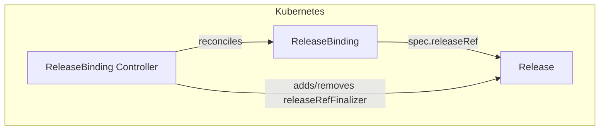
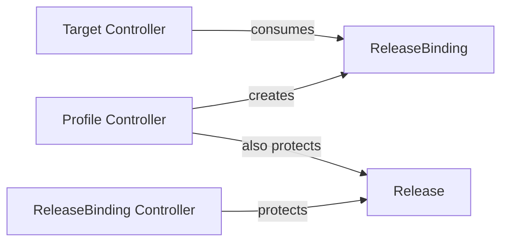

# ReleaseBinding Controller Documentation

## Overview

The ReleaseBinding controller manages the deletion-protection finalizer on the `Release` referenced by each `ReleaseBinding`. It ensures that a Release cannot be deleted while any active binding (Profile-created or manually created) still references it.

This controller complements the Profile controller's release protection: the Profile controller places `solar.opendefense.cloud/release-ref` on a Release when it processes a Profile, but manually created ReleaseBindings (those without a Profile owner) are handled here.

## Architecture

## Finalizers

| Finalizer | On resource | Purpose |
|---|---|---|
| `solar.opendefense.cloud/releasebinding-finalizer` | ReleaseBinding | Allows the controller to observe deletion and run cleanup logic before the object is garbage-collected |
| `solar.opendefense.cloud/release-ref` | Release | Prevents deletion of the referenced Release while any Profile or ReleaseBinding references it |

On deletion, the controller:

1. Checks whether any other active Profile or ReleaseBinding still references the same Release.
2. If none remain, removes `solar.opendefense.cloud/release-ref` from the Release.
3. Removes `solar.opendefense.cloud/releasebinding-finalizer` from the ReleaseBinding, allowing it to be garbage-collected.

`solar.opendefense.cloud/release-ref` is a shared finalizer: both this controller and the Profile controller place it on a Release. The reference count check always considers both Profiles and ReleaseBindings before removing it. ReleaseBindings owned by a Profile that is itself being deleted are excluded from the active count.

There is one additional guard: if a Profile is in the process of deletion but still holds `solar.opendefense.cloud/profile-finalizer`, the ReleaseBinding controller skips removing `release-ref` entirely and defers to the Profile controller. The Profile controller removes `release-ref` only after all its owned ReleaseBindings are fully gone from the API, which closes the window where the Release could otherwise become deletable while active bindings still existed.

## Watch Triggers

The ReleaseBinding controller is triggered when:

- A `ReleaseBinding` resource is created, updated, or deleted.

## Relationship to Other Controllers

