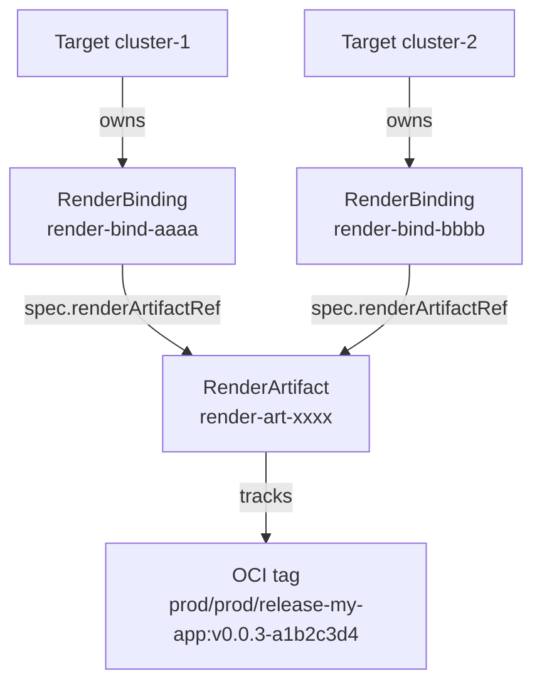
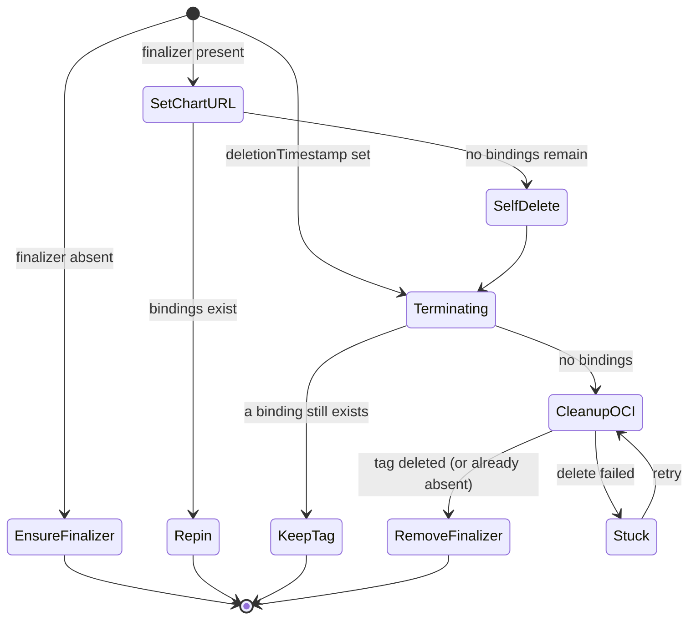
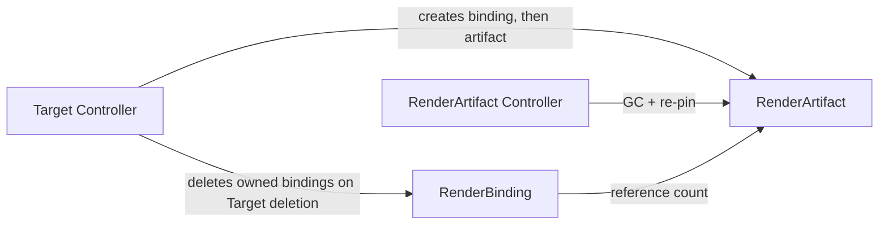

# RenderArtifact Controller Documentation

## Overview

The RenderArtifact controller owns the lifecycle of pushed OCI artifacts. A `RenderArtifact` records the coordinates of a chart that a RenderTask successfully pushed to a render registry; a `RenderBinding` records that one consumer — currently always a `Target` — still needs that artifact.

Together they form a reference count. The controller:

1. Populates `status.chartURL` from the artifact's push coordinates.
2. Keeps `spec.registryRef` pinned to a Registry that a surviving RenderBinding still names.
3. Deletes the OCI tag from the registry once the last RenderBinding referencing the artifact is gone, then removes its own finalizer so the object can be garbage-collected.

Without this reference count, deleting one Target would delete OCI tags that another Target is still deploying from.

## Why Artifacts Are Shared

Release chart paths are scoped by target namespace and release namespace, not by target name (see [Registry Layout](./rendering-pipeline.md#registry-layout)). Two Targets in the same namespace bound to the same Release therefore render to the *same* OCI coordinates — provided they also resolve the same render Registry and the same pull secrets, since `baseURL` comes from the Target's `renderRegistryRef` and the tag carries a hash of the pull-secret names resolved from the Target's own RegistryBindings. When all of that matches, each Target still creates its own RenderTask, but the renderer skips the push when the chart already exists, so both Targets end up depending on one tag in the registry.

Bootstrap charts are the exception: their repository path is `<namespace>/bootstrap-<targetName>`, so a bootstrap artifact is per-Target by construction and always has exactly one binding.

For the release case above, the RenderArtifact name is derived from the coordinates rather than from the Target, so the two Targets converge on the same object:

| Object | Name | Derived from |
|---|---|---|
| `RenderArtifact` | `render-art-<hash>` | `namespace/baseURL/repository/tag` |
| `RenderBinding` | `render-bind-<hash>` | `<artifactName>/Target/<targetName>` |

`<hash>` is the first 8 hex characters of the SHA-256 of the input string. `namespace` is the Target's namespace, which is also where the RenderTask, the RenderArtifact, and the RenderBinding all live. Two Targets sharing coordinates share one `render-art-*` object and hold one `render-bind-*` object each.

## Creation

The Target controller creates both objects after a RenderTask reports success, for release and bootstrap RenderTasks alike. The **RenderBinding is created before the RenderArtifact** — the reverse order would leave a window in which an artifact exists with no binding, which this controller reads as garbage and deletes.

If the RenderArtifact a Target wants to bind to is already terminating, `ensureRenderBinding` refuses and the Target requeues instead. A binding created between the controller's "still bound?" check and the tag deletion would otherwise lose its tag.

## Reconcile Flow

When no bindings remain, the controller deletes the RenderArtifact itself; its own finalizer then intercepts that deletion and performs the OCI cleanup. Both the "no bindings" check and the terminating-path re-check confirm against the API server via `APIReader` rather than the cache, because a stale cache would delete a tag that a concurrently created binding still needs.

## Finalizer and OCI Cleanup

| Finalizer | On resource | Purpose |
|---|---|---|
| `solar.opendefense.cloud/render-artifact-finalizer` | RenderArtifact | Holds the object open so the OCI tag can be deleted before the object disappears |

Cleanup failures are deliberately *not* swallowed. The controller returns the error, which keeps the finalizer in place and leaves the object visible in a terminating state, and it records both a status condition and a Warning event so the cause is discoverable with `kubectl describe`.

| Condition | Status | Reason | Meaning |
|---|---|---|---|
| `OCICleanup` | `False` | `AuthFailed` | Registry, ReferenceGrant, or push Secret could not be resolved |
| `OCICleanup` | `False` | `DeleteFailed` | The registry rejected the tag deletion |

| Event | Type | When |
|---|---|---|
| `OCICleanupSucceeded` | Normal | Tag deleted |
| `OCICleanupSkipped` | Normal | Object is terminating but a RenderBinding still references it |
| `OCICleanupFailed` | Warning | Auth resolution or tag deletion failed |

A tag that is already absent (registry returns `404`) counts as success. Tag deletion is given a 30-second timeout.

A stuck RenderArtifact does not resolve itself and does not time out. Because the reconcile returns an error, controller-runtime retries it with its default exponential backoff, so fixing the underlying cause — restoring the Registry or its Secret, repairing the ReferenceGrant, making the registry reachable — is enough for the next retry to complete the cleanup and let the object go. `kubectl describe renderartifact <name>` shows the `OCICleanup` condition and the `OCICleanupFailed` events explaining which of those it is. Removing the finalizer by hand also releases the object, at the cost of leaving the tag orphaned in the registry.

## Credential Re-pinning

`RenderArtifact.spec.registryRef` names the Registry whose credentials delete the tag. Because the artifact outlives any single Target, that reference has to keep pointing at a Registry some *surviving* consumer still uses.

Each RenderBinding snapshots the Registry its owner currently resolves. On every RenderBinding event the controller re-pins the artifact's `registryRef` from the surviving bindings, choosing the lowest binding name among those that carry a reference so repeated reconciles converge instead of flapping. Bindings without a reference are skipped rather than pinning `nil` over a working one — a stale-but-valid reference can still delete the tag, `nil` cannot.

Neither RenderArtifact nor RenderBinding stores Secret data or the `plainHTTP` flag. Both are read live from the referenced Registry at use time, so rotating a Registry's credentials or transport settings never goes stale on the artifact.

## Cross-Namespace Access

When `spec.registryRef.namespace` points outside the artifact's own namespace, a `ReferenceGrant` in the Registry's namespace must allow it, with `from[].kind: RenderArtifact`, `from[].namespace` set to the artifact's namespace, and `to[].kind: Registry`.

The Target's own grant is deliberately not accepted. `registryRef` is meant to be controller-owned, but the API does not enforce that, so honouring the Target's grant would let anyone who can write a RenderArtifact borrow the Target's credentials. See [Reference Grants](../user-guide/reference-grants.md).

As a second check, the artifact's `spec.baseURL` must match the Registry's `spec.hostname`. A Registry Secret may hold credentials for several hosts, and the grant authorises use of the Registry, not use of its credentials against an arbitrary host. Artifacts created by the Target controller always satisfy this.

## Watch Triggers

| Watched Resource | Mapping |
|---|---|
| `RenderArtifact` | Direct reconcile |
| `RenderBinding` | Reconcile the RenderArtifact named in `spec.renderArtifactRef`, in the binding's namespace |

The RenderBinding watch is what makes garbage collection prompt: deleting a Target deletes its RenderBindings, each deletion enqueues the artifact, and the artifact deletes itself once the last one is gone.

## Relationship to Other Controllers

