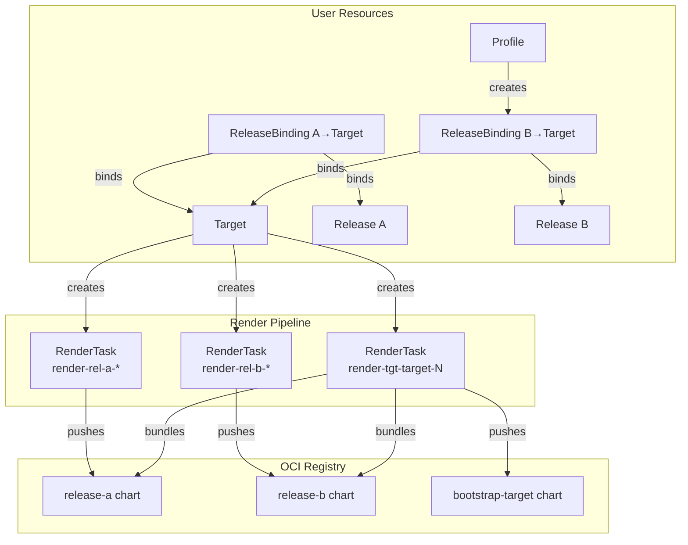
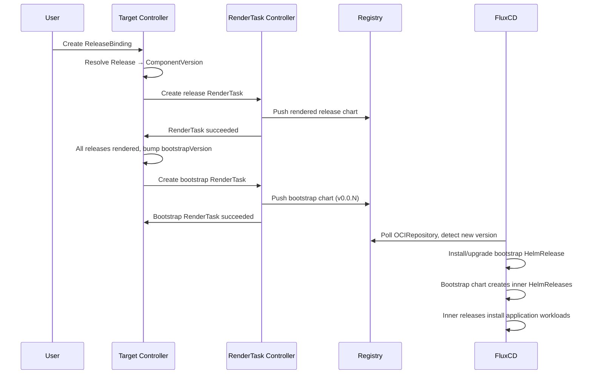

# Rendering Pipeline

This document describes how SolAr renders Helm charts for deployment targets and how the resulting FluxCD resources relate to each other.

## Overview

When a Target has ReleaseBindings (created manually or via Profiles), the Target controller orchestrates a two-stage rendering pipeline:

1. **Release rendering** — each bound Release is rendered into a standalone Helm chart and pushed to the render registry.
2. **Bootstrap rendering** — all rendered release charts are bundled into a single bootstrap Helm chart per target, which FluxCD installs on the target cluster.



## Stage 1: Release RenderTasks

For each ReleaseBinding on a Target, the Target controller creates a per-release RenderTask scoped to that target. The RenderTask name is deterministic: `render-rel-<release-name>-<hash>`, where the hash is derived from the release name, target name, and release generation. Since RenderTask is a namespaced resource, each target in a namespace gets its own release RenderTask.

When multiple Targets in the same namespace share the same render Registry and reference the same Release, they each create a separate RenderTask, but the renderer job handles deduplication at the artifact level — it skips rendering if the chart already exists in the registry.

The renderer container produces a Helm chart that wraps the original OCM component's entrypoint chart. The rendered chart template contains:

- A FluxCD **OCIRepository** pointing to the original chart in the source registry
- A FluxCD **HelmRelease** that installs the chart from that OCIRepository

This is the **inner release** — a HelmRelease managed by the bootstrap chart (see Stage 2).

## Stage 2: Bootstrap RenderTask

Once all release RenderTasks have succeeded, the Target controller creates a bootstrap RenderTask (`render-tgt-<target>-<version>`). This bundles all rendered release charts into a single bootstrap Helm chart.

The bootstrap chart template iterates over all releases and creates, for each one:

- A FluxCD **OCIRepository** pointing to the rendered release chart in the render registry
- A FluxCD **HelmRelease** that installs the rendered release chart

These are the **inner HelmReleases** — they are managed by the **outer HelmRelease** (the bootstrap itself).

### Bootstrap Versioning

The bootstrap chart version is `v0.0.<bootstrapVersion>`, where `bootstrapVersion` is a counter stored in `target.status.bootstrapVersion`. It is incremented each time the set of bound releases changes (e.g. a Profile creates a new ReleaseBinding). This ensures a new chart version is pushed to the registry whenever the bootstrap content changes.

## HelmRelease Hierarchy

When FluxCD installs the bootstrap chart on a target cluster, the result is a three-level hierarchy:

```
Outer HelmRelease (solar-bootstrap)
  └── Bootstrap chart (bootstrap-<target>)
        ├── Inner HelmRelease (solar-bootstrap-<release-a>)
        │     └── Release chart (release-<release-a>)
        │           └── Innermost HelmRelease
        │                 └── Original application chart (e.g. demo)
        └── Inner HelmRelease (solar-bootstrap-<release-b>)
              └── Release chart (release-<release-b>)
                    └── Innermost HelmRelease
                          └── Original application chart
```

| Level | Resource | Created By | Purpose |
|-------|----------|-----------|---------|
| Outer | HelmRelease `solar-bootstrap` | User / GitOps | Installs the bootstrap chart from the render registry |
| Inner | HelmRelease `solar-bootstrap-<release>` | Bootstrap chart template | Installs each rendered release chart |
| Innermost | HelmRelease `<bootstrap>-<component>` | Release chart template | Installs the original application chart from the source registry |

### Name Truncation

Inner HelmRelease names are constructed as `<bootstrap-release-name>-<release-key>`. Since Kubernetes object names are limited to 253 characters (and Helm release names to 53), names exceeding 53 characters are truncated and suffixed with a short SHA-256 hash to preserve uniqueness.

## Data Flow: From ReleaseBinding to Deployment



## Registry Layout

For a target `cluster-1` in namespace `prod` with two releases, the render registry contains:

```
<registry-hostname>/
  prod/
    release-my-app-release           # Rendered release chart (v0.0.0)
    release-monitoring-release       # Rendered release chart (v0.0.0)
    bootstrap-cluster-1              # Bootstrap chart (v0.0.0, v0.0.1, ...)
```

## Profiles and Indirect Binding

Profiles automate ReleaseBinding creation. A Profile references a Release and a target label selector. The Profile controller watches for matching Targets and creates ReleaseBindings with owner references back to the Profile.

When a Profile creates a new ReleaseBinding for a Target that already has a bootstrap chart, the Target controller detects the changed release set, increments `bootstrapVersion`, and triggers a new bootstrap render that includes the additional release.
