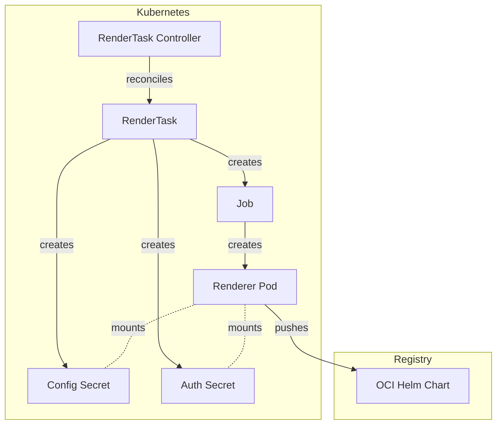
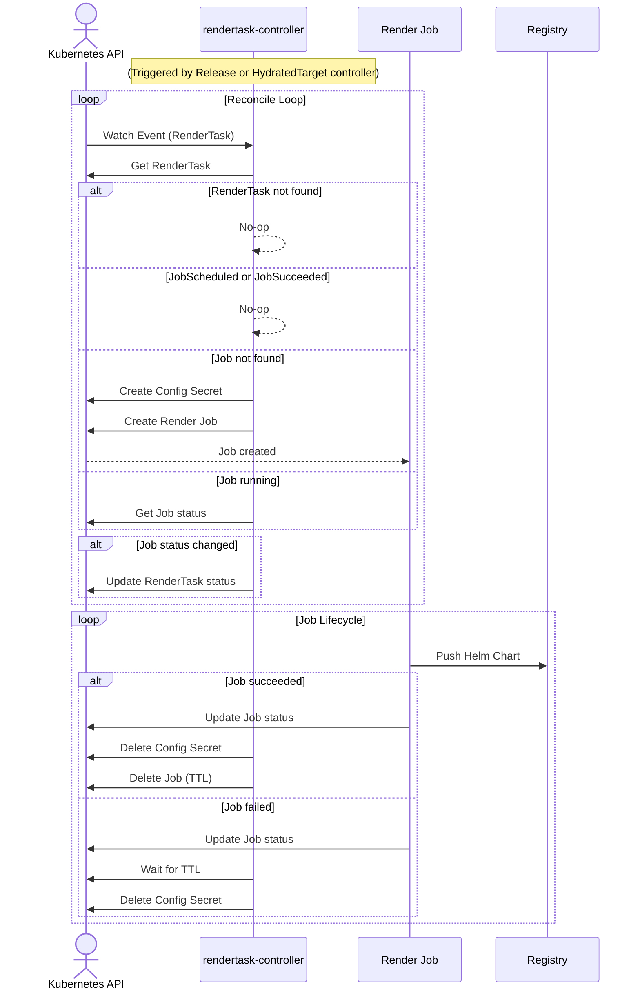
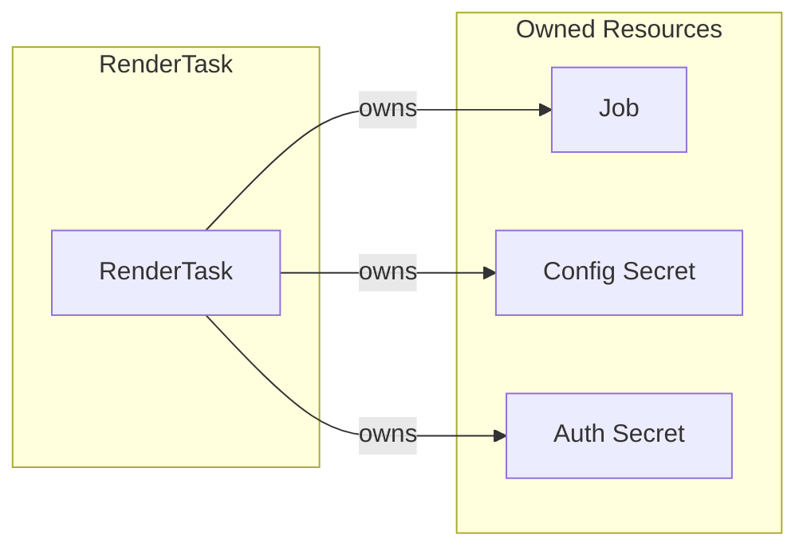
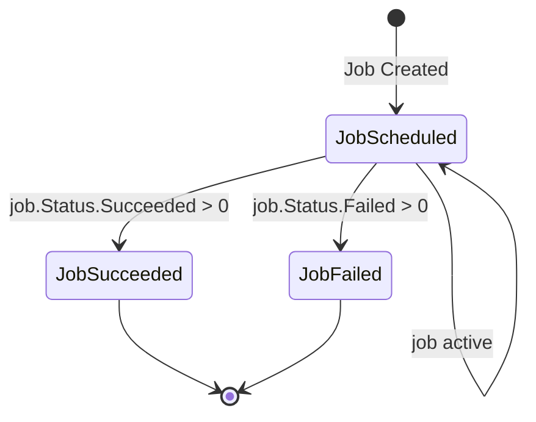

# RenderTask Controller Documentation

## Overview

The RenderTask controller manages the lifecycle of `RenderTask` custom
resources in SolAr. It creates and manages a Kubernetes Job that executes the
renderer container, along with associated Secrets for configuration and
authentication.

A RenderTask is immutable once created.

## Architecture

## Reconcile Loop

## Resource Owner References

## Status Conditions

The controller updates the RenderTask status with the following conditions:

| Condition      | Status   | Reason                     |
| -----------    | -------- | --------                   |
| `JobScheduled` | `True`   | Job is running (active)    |
| `JobScheduled` | `False`  | Job does not exist         |
| `JobSucceeded` | `True`   | Job completed successfully |
| `JobFailed`    | `True`   | Job failed                 |

## Resource Naming Convention

| Resource     | Name Pattern               | Namespace   |
| ----------   | --------------             | ----------- |
| RenderJob    | `render-<rendertask-name>` | Inherited   |
| ConfigSecret | `render-<rendertask-name>` | Inherited   |
| AuthSecret   | `auth-<rendertask-name>`   | Inherited   |

## Cleanup Behavior

- **On successful completion**: Deletes Job, config Secret, and auth Secret
- **On deletion**: Deletes Job, config Secret, and auth Secret, then removes finalizer
- **TTL**: Job has `TTLSecondsAfterFinished: 3600` (1 hour) as fallback cleanup

## Controller Configuration

Configuration of the controller is managed by the controller manager. The
RenderTask controller can be configured with the following parameters:

| Parameter         | Type                      | Description
| ---               | ---                       | ---
| `RendererImage`   | `string`                  | Image to be used for the render Job / Pod
| `RendererCommand` | `string`                  | Command for the render Job / Pod
| `RendererArgs`    | `[]string`                | Additional args for the render Job / Pod
| `BaseURL`         | `string`                  | URL of the registry to which rendered charts get pushed to
| `PushSecretRef`   | `*corev1.SecretReference` | (Optional) Reference to a secret containing credentials for the registry

If PushSecretRef is set, the controller copies the secret to the Job's
Namespace so it can be mounted by the Pod. The secret gets cleaned up together
with the other RenderTask Resources.
