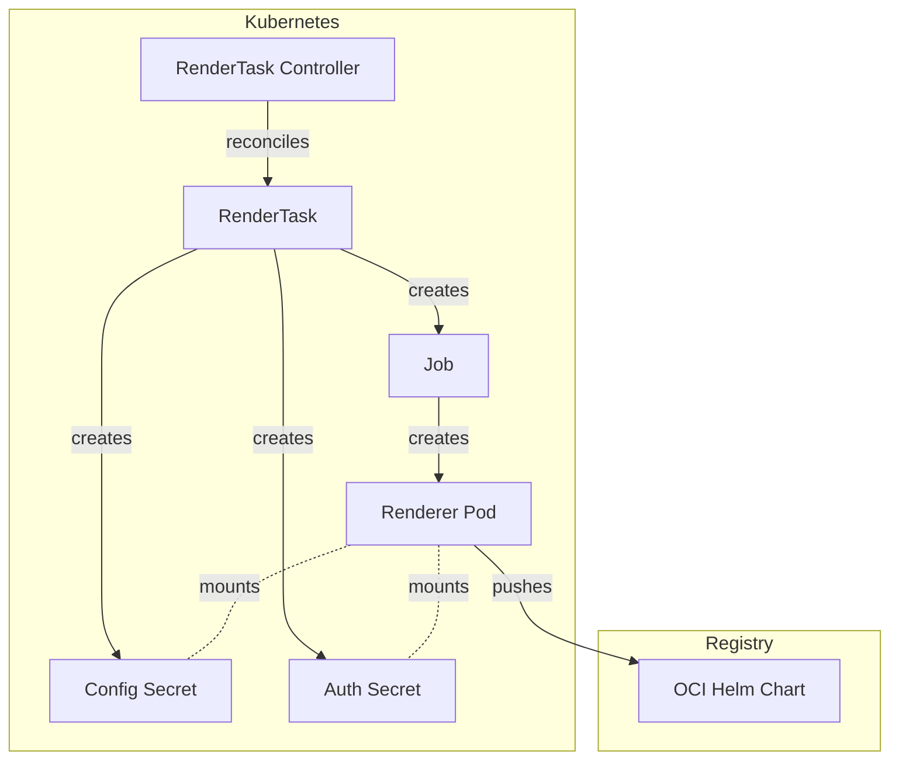
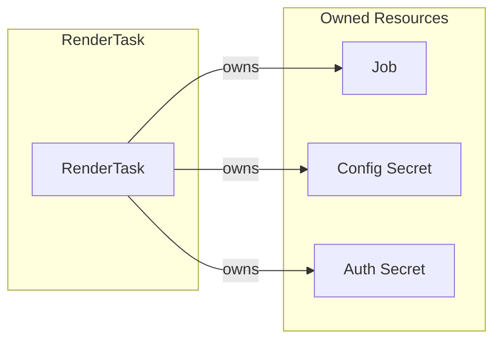
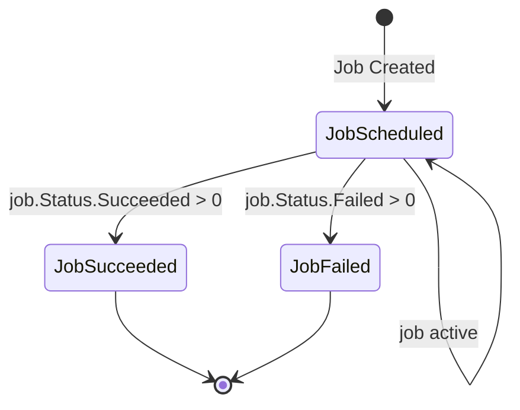

# RenderTask Controller Documentation

## Overview

The RenderTask controller manages the lifecycle of `RenderTask` custom
resources in SolAr. It creates and manages a Kubernetes Job that executes the
renderer container, along with associated Secrets for configuration and
authentication.

A RenderTask is immutable once created.

## Architecture

## Resource Owner References

## Status Conditions

The controller updates the RenderTask status with the following conditions:

| Condition      | Status   | Reason                     |
| -----------    | -------- | --------                   |
| `JobScheduled` | `True`   | Job is running (active)    |
| `JobScheduled` | `False`  | Job does not exist         |
| `JobSucceeded` | `True`   | Job completed successfully |
| `JobFailed`    | `True`   | Job failed                 |

## Resource Naming Convention

| Resource     | Name Pattern               | Namespace   |
| ----------   | --------------             | ----------- |
| RenderJob    | `render-<rendertask-name>` | Inherited   |
| ConfigSecret | `render-<rendertask-name>` | Inherited   |
| AuthSecret   | `auth-<rendertask-name>`   | Inherited   |

## Cleanup Behavior

- **On successful completion**: Deletes Job, config Secret, and auth Secret
- **On deletion**: Deletes Job, config Secret, and auth Secret, then removes finalizer
- **TTL**: Job has `TTLSecondsAfterFinished: 3600` (1 hour) as fallback cleanup

## Controller Configuration

Configuration of the controller is managed by the controller manager. The
RenderTask controller can be configured with the following parameters:

| Parameter         | Type       | Description                                  |
| ---               | ---        | ---                                          |
| `RendererImage`   | `string`   | Image to be used for the render Job / Pod    |
| `RendererCommand` | `string`   | Command for the render Job / Pod             |
| `RendererArgs`    | `[]string` | Additional args for the render Job / Pod     |

## Per-Task Registry Credentials

Each RenderTask carries its own `baseURL` and `secretRef`, which are
resolved by the Target controller from the Target's `renderRegistryRef`:

1. The Target references a **Registry** resource via `spec.renderRegistryRef`.
2. The Registry provides the OCI hostname (`spec.hostname`) and a secret
   reference (`spec.solarSecretRef`) containing push credentials.
3. When creating a RenderTask, the Target controller sets these values on the
   RenderTask spec so the renderer Job can authenticate to the registry.

If `secretRef` is set on the RenderTask, the controller copies the
referenced secret into the RenderTask's namespace so it can be mounted by the
renderer Pod. The copied secret is cleaned up together with the other
RenderTask resources.
