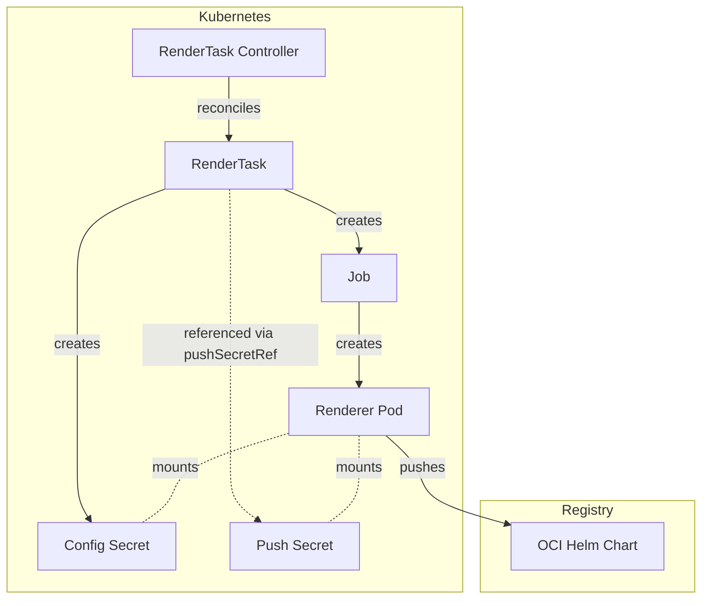
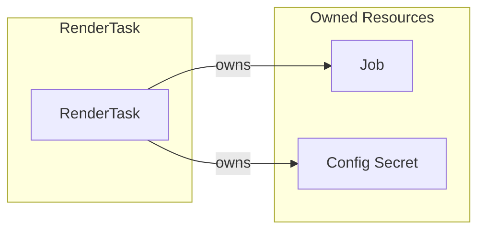
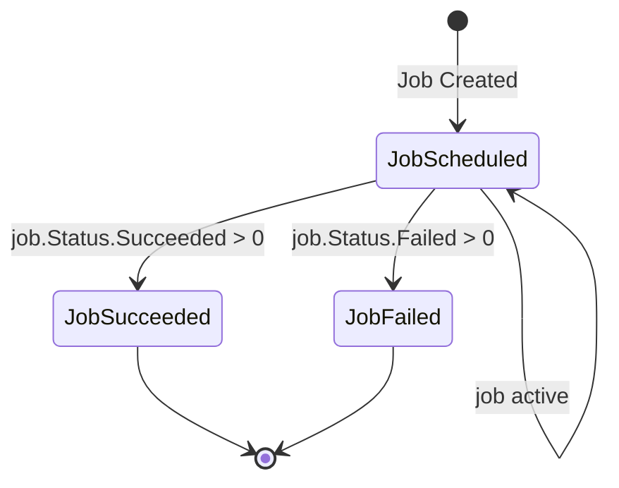

# RenderTask Controller Documentation

## Overview

The RenderTask controller manages the lifecycle of `RenderTask` custom
resources in SolAr. It creates and manages a Kubernetes Job that executes the
renderer container, along with a configuration Secret.

A RenderTask is immutable once created.

## Architecture

## Resource Owner References

## Status Conditions

The controller updates the RenderTask status with the following conditions:

| Condition      | Status   | Reason                     |
| -----------    | -------- | --------                   |
| `JobScheduled` | `True`   | Job is running (active)    |
| `JobScheduled` | `False`  | Job does not exist         |
| `JobSucceeded` | `True`   | Job completed successfully |
| `JobFailed`    | `True`   | Job failed                 |

## Resource Naming Convention

| Resource     | Name Pattern               | Namespace   |
| ----------   | --------------             | ----------- |
| RenderJob    | `render-<rendertask-name>` | Inherited   |
| ConfigSecret | `render-<rendertask-name>` | Inherited   |

## Cleanup Behavior

- **On successful completion**: Deletes Job and config Secret.
- **On deletion**: Owned resources (Job and config Secret) are garbage-collected by Kubernetes via owner references.
- **On failure**: Config Secret is deleted after `spec.failedJobTTL` (default 1 hour). The Job is removed by Kubernetes via `TTLSecondsAfterFinished`.

## Controller Configuration

Configuration of the controller is managed by the controller manager. The
RenderTask controller can be configured with the following parameters:

| Parameter         | Type       | Description                                  |
| ---               | ---        | ---                                          |
| `RendererImage`   | `string`   | Image to be used for the render Job / Pod    |
| `RendererCommand` | `string`   | Command for the render Job / Pod             |
| `RendererArgs`    | `[]string` | Additional args for the render Job / Pod     |

## Per-Task Registry Credentials

Each RenderTask carries its own `baseURL` and `pushSecretRef`, which are
resolved by the Target controller from the Target's `renderRegistryRef`:

1. The Target references a **Registry** resource via `spec.renderRegistryRef`.
2. The Registry provides the OCI hostname (`spec.hostname`) and a secret
   reference (`spec.solarSecretRef`) containing push credentials.
3. When creating a RenderTask, the Target controller sets these values on the
   RenderTask spec so the renderer Job can authenticate to the registry.

If `pushSecretRef` is set on the RenderTask, the controller mounts the
referenced secret directly into the renderer Pod. The push secret is managed
externally and is not owned by the RenderTask.
