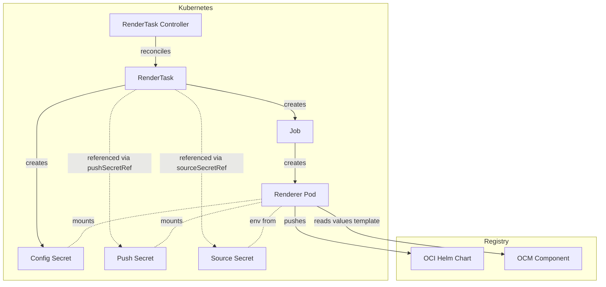
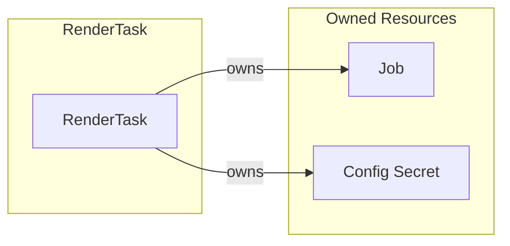
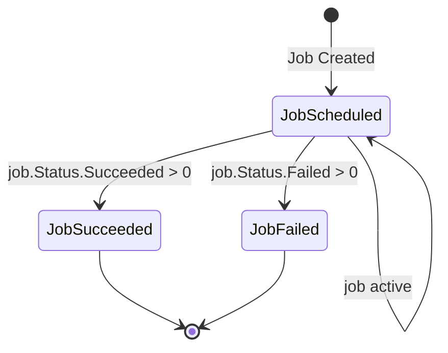

# RenderTask Controller Documentation

## Overview

The RenderTask controller manages the lifecycle of `RenderTask` custom
resources in SolAr. It creates and manages a Kubernetes Job that executes the
renderer container, along with a configuration Secret.

A RenderTask is immutable once created.

## Architecture

```mermaid
flowchart TD
    subgraph Kubernetes
        Ctrl[RenderTask Controller]
        RT[RenderTask]
        J[Job]
        J -->|creates| Renderer[Renderer Pod]
        CS[Config Secret]
        PS[Push Secret]
        SS[Source Secret]
    end

    subgraph Registry
        Chart[OCI Helm Chart]
        Comp[OCM Component]
    end

    Ctrl -->|reconciles| RT

    RT -->|creates| CS
    RT -->|creates| J
    RT -.->|referenced via pushSecretRef| PS
    RT -.->|referenced via sourceSecretRef| SS

    Renderer -->|pushes| Chart
    Renderer -->|reads values template| Comp

    Renderer -.-|mounts| CS
    Renderer -.-|mounts| PS
    Renderer -.-|env from| SS
```

## Resource Owner References

```mermaid
flowchart LR
    subgraph RenderTask
        RT[RenderTask]
    end

    subgraph Owned Resources
        JS[Job]
        CS[Config Secret]
    end

    RT -->|owns| JS
    RT -->|owns| CS
```

## Status Conditions

The controller updates the RenderTask status with the following conditions:

```mermaid
stateDiagram-v2
    [*] --> JobScheduled: Job Created
    JobScheduled --> JobSucceeded: job.Status.Succeeded > 0
    JobScheduled --> JobFailed: job.Status.Failed > 0
    JobScheduled --> JobScheduled: job active
    JobSucceeded --> [*]
    JobFailed --> [*]
```

| Condition      | Status  | Reason                     |
| -------------- | ------- | -------------------------- |
| `JobScheduled` | `True`  | Job is running (active)    |
| `JobScheduled` | `False` | Job does not exist         |
| `JobSucceeded` | `True`  | Job completed successfully |
| `JobFailed`    | `True`  | Job failed                 |

## Resource Naming Convention

| Resource     | Name Pattern               | Namespace |
| ------------ | -------------------------- | --------- |
| RenderJob    | `render-<rendertask-name>` | Inherited |
| ConfigSecret | `render-<rendertask-name>` | Inherited |

## Cleanup Behavior

- **On successful completion**: Deletes Job and config Secret.
- **On deletion**: Owned resources (Job and config Secret) are garbage-collected by Kubernetes via owner references.
- **On failure**: Config Secret is deleted after `spec.failedJobTTL` (default 1 hour). The Job is removed by Kubernetes via `TTLSecondsAfterFinished`.

## Controller Configuration

Configuration of the controller is managed by the controller manager. The
RenderTask controller can be configured with the following parameters:

| Parameter                  | Type       | Description                                                                                    |
| -------------------------- | ---------- | ---------------------------------------------------------------------------------------------- |
| `RendererImage`            | `string`   | Image to be used for the render Job / Pod                                                      |
| `RendererCommand`          | `string`   | Command for the render Job / Pod                                                               |
| `RendererArgs`             | `[]string` | Additional args for the render Job / Pod                                                       |
| `RendererCAConfigMap`      | `string`   | ConfigMap name carrying a CA bundle mounted into the render Pod for registry connections       |
| `RendererImagePullSecrets` | `[]string` | Image pull Secret names attached to the render Pod (must exist in each RenderTask's namespace) |

## Per-Task Registry Credentials

A render Job talks to two registries, and each gets its own credentials on
the RenderTask spec.

### Push credentials (`pushSecretRef`)

Each RenderTask carries its own `baseURL` and `pushSecretRef`, which are
resolved by the Target controller from the Target's `renderRegistryRef`:

1. The Target references a **Registry** resource via `spec.renderRegistryRef`.
2. The Registry provides the OCI hostname (`spec.hostname`) and a secret
   reference (`spec.solarSecretRef`) containing push credentials.
3. When creating a RenderTask, the Target controller sets these values on the
   RenderTask spec so the renderer Job can authenticate to the registry.

If `pushSecretRef` is set on the RenderTask, the controller mounts the
referenced secret directly into the renderer Pod. The push secret is managed
externally and is not owned by the RenderTask.

### Source credentials (`sourceSecretRef`)

The renderer also reads the OCM component itself, to fetch and render the
component's [helm values template](../user-guide/helm-values-templating.md).
That source registry is frequently not the push registry.

The Target controller resolves it by matching the Component's
`spec.registry` hostname against the Registry resources in the component's
namespace, and copies that Registry's `spec.solarSecretRef` onto the
RenderTask as `sourceSecretRef`. A source registry with no matching
Registry resource is read anonymously.

Both shapes a `solarSecretRef` can take are handled, mirroring the push path:
Basic-auth selection is by key rather than Secret type, because the discovery
worker consumes `solarSecretRef` the same way and existing credentials are a mix
of `kubernetes.io/basic-auth` and `Opaque`. Keys present but empty are treated as
absent. The docker config is mounted at its own path so it cannot collide with
the push secret's, which commonly belongs to a different registry.

A Secret matching neither shape leaves the renderer on anonymous access. There is
no implicit fallback: SolAr never applies OCM's default config handlers, so
`~/.docker/config.json` is not consulted unless passed explicitly.

Only secret _names_ are stored on the RenderTask. Credential material never
goes into `RendererConfig`, because that struct is inlined into
`RenderTaskSpec` and would end up readable by anyone with RenderTask read
access.
