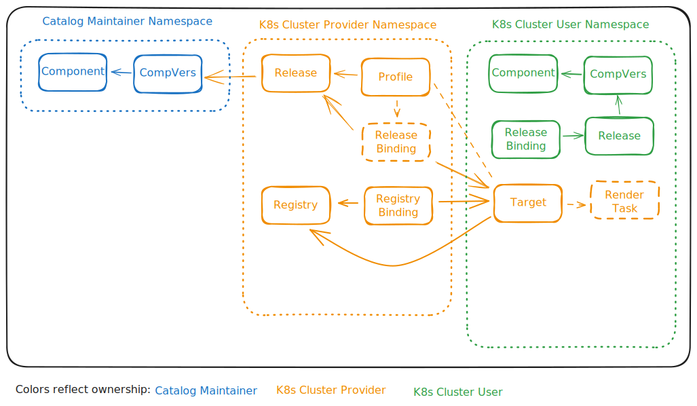

# Roles

The roles serve as a blueprint for the intended usage scenario of Solar. These definitions are not rigid constraints; users can adapt, combine, or customize permissions in the boundaries set by Solar.

## Description

| Role                     | Primary Goal                                                       | Cardinality | Uses Solar API? |
| ---                      | ---                                                                | ---         | --- |
| Catalog Maintainer       | Maintain OCM components catalog.                                   | Many        | yes |
| K8s Cluster Provider     | Ensure baseline compliance and tooling across a fleet of clusters. | Singleton   | yes |
| K8s Cluster User         | Deploy their specific business applications on their clusters.     | Many        | yes |
| Solar Operator           | Ensure system health and maintain global config.  (Solar)          | Singleton   | yes |
|                          |                                                                    |             |     |
| Source Registry Operator | Ensure system health and maintain global config. (Source Registry) | Many        | no  |
| Deploy Registry Operator | Ensure system health and maintain global config. (Deploy Registry) | Many        | no  |
| App Provider             | Provide deployable apps.                                           | Many        | no  |

## Permissions

| Resource Type    | Namespace            |  Catalog Maintainer | K8s Cluster Provider | K8s Cluster User |
| ---              | ---                  | ---                | ---                  | ---              |
| Component        | Catalog Maintainer   | CRUD               | R                    | R                |
| Component        | K8s Cluster Provider | -                  | CRUD                 | -                |
| Component        | K8s Cluster User     | -                  | -                    | CRUD             |
| ComponentVersion | Catalog Maintainer   | CRUD               | R                    | R                |
| ComponentVersion | K8s Cluster Provider | -                  | CRUD                 | -                |
| ComponentVersion | K8s Cluster User     | -                  | -                    | CRUD             |
| Target           | Catalog Maintainer   | -                  | -                    | -                |
| Target           | K8s Cluster Provider | -                  | -                    | -                |
| Target           | K8s Cluster User     | -                  | CRUD                 | RU               |
| Release          | Catalog Maintainer   | -                  | -                    | -                |
| Release          | K8s Cluster Provider | -                  | CRUD                 | -                |
| Release          | K8s Cluster User     | -                  | -                    | CRUD             |
| Profile          | Catalog Maintainer   | -                  | -                    | -                |
| Profile          | K8s Cluster Provider | -                  | CRUD                 | -                |
| Profile          | K8s Cluster User     | -                  | -                    | CRUD             |
| ReleaseBinding   | Catalog Maintainer   | -                  | -                    | -                |
| ReleaseBinding   | K8s Cluster Provider | -                  | CRUD                 | -                |
| ReleaseBinding   | K8s Cluster User     | -                  | -                    | CRUD             |
| Registry         | Catalog Maintainer   | -                  | -                    | -                |
| Registry         | K8s Cluster Provider | -                  | CRUD                 | -                |
| Registry         | K8s Cluster User     | -                  | -                    | CRUD             |
| RegistryBinding  | Catalog Maintainer   | -                  | -                    | -                |
| RegistryBinding  | K8s Cluster Provider | -                  | CRUD                 | -                |
| RegistryBinding  | K8s Cluster User     | -                  | -                    | CRUD             |

## Cross-Namespace Dependencies
- Releases in the namespace of a K8s cluster provider or K8s cluster user can reference ComponentVersions in the namespace of a catalog maintainer.
- ReleaseBindings in the namespace of a K8s cluster provider can reference a Target in the namespace of a K8s cluster user.
- RegistryBindings in the namespace of a K8s cluster provider can reference a Target in the namespace of a K8s cluster user.
- Targets in the namespace of a K8s cluster user can reference a Registry in the namespace of a K8s cluster provider.
- Profiles in the namespace of a K8s cluster provider must be able to match Targets in the namespace of a K8s cluster user.  

The diagram shows an example of Solar resources and its dependencies. It doesn't cover all variations.

