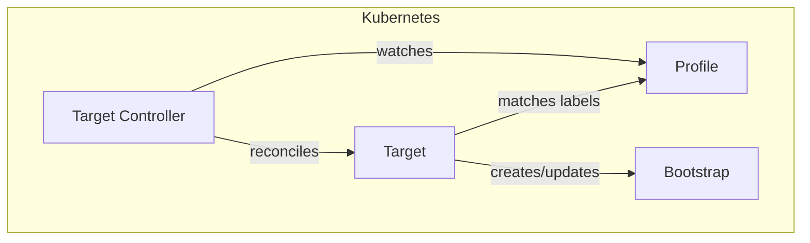
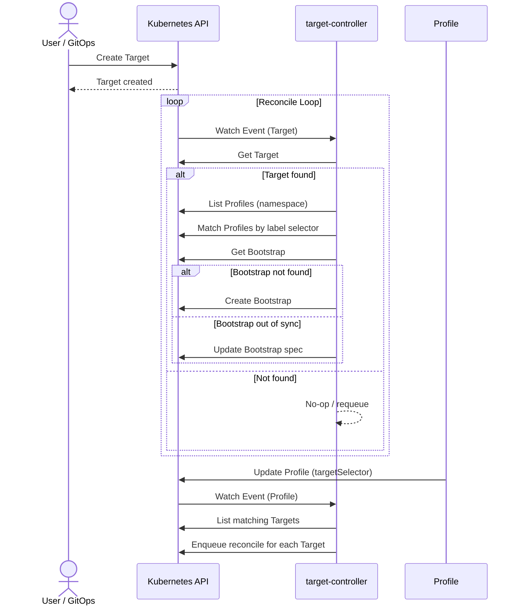
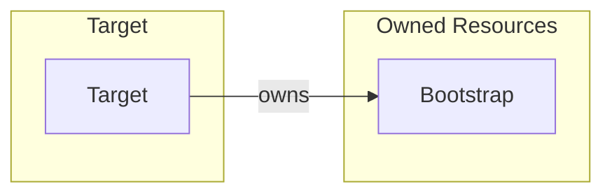
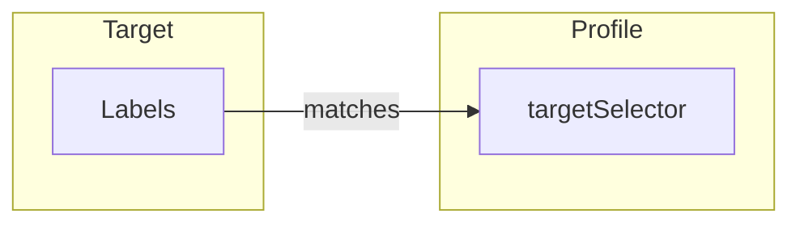

# Target Controller Documentation

## Overview

The Target controller manages the lifecycle of `Target` custom resources in SolAr. It creates and manages a `Bootstrap` resource that combines the Target's releases with matching Profiles based on label selectors.

## Architecture

## Reconcile Loop

## Resource Owner References

| Resource       | Name Pattern             | Namespace  |
| -------------- | --------------          | ----------- |
| Bootstrap | `<target-name>`         | Inherited  |

## Profile Matching Logic

The controller matches Targets to Profiles using Kubernetes label selectors:

- A Profile's `targetSelector` field defines a label selector
- When a Profile is created or updated, all matching Targets trigger reconciliation
- The matched Profiles are stored in the Bootstrap's `spec.profiles` field

## Cleanup Behavior

- **On Target deletion**: Deletes the associated Bootstrap, then removes finalizer
- **On Profile `targetSelector` change**: Updates all affected Bootstraps to reflect new profile matches

## Controller Configuration

Configuration of the controller is managed by the controller manager. The Target controller can be configured with the following parameters:

| Parameter        | Type        | Description                                        |
| ---              | ---         | ---                                                |
| `WatchNamespace` | `string`    | (Test only) Restrict reconciliation to this namespace |
