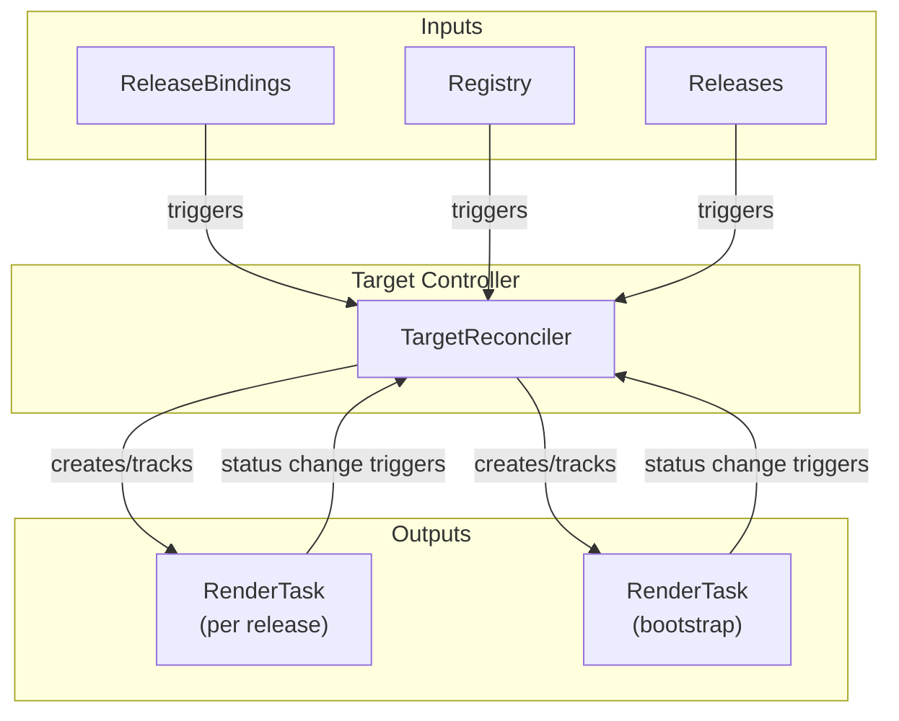
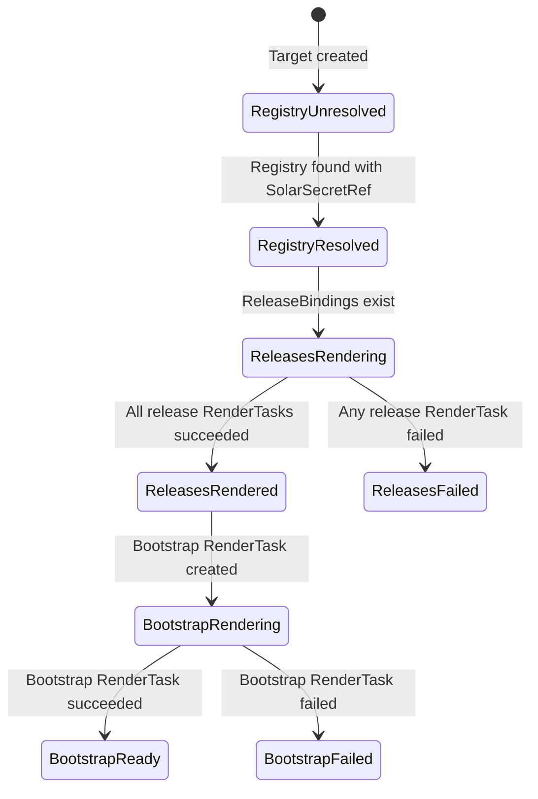
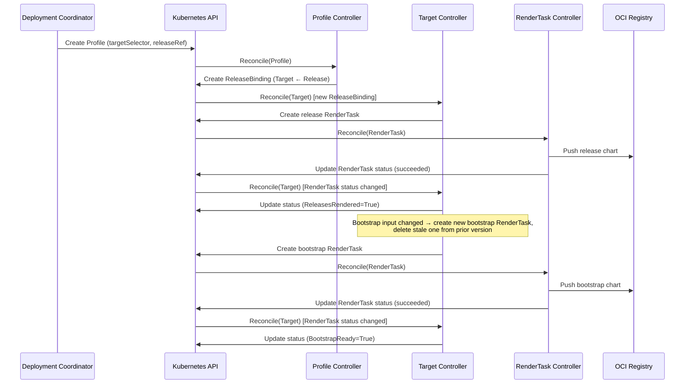
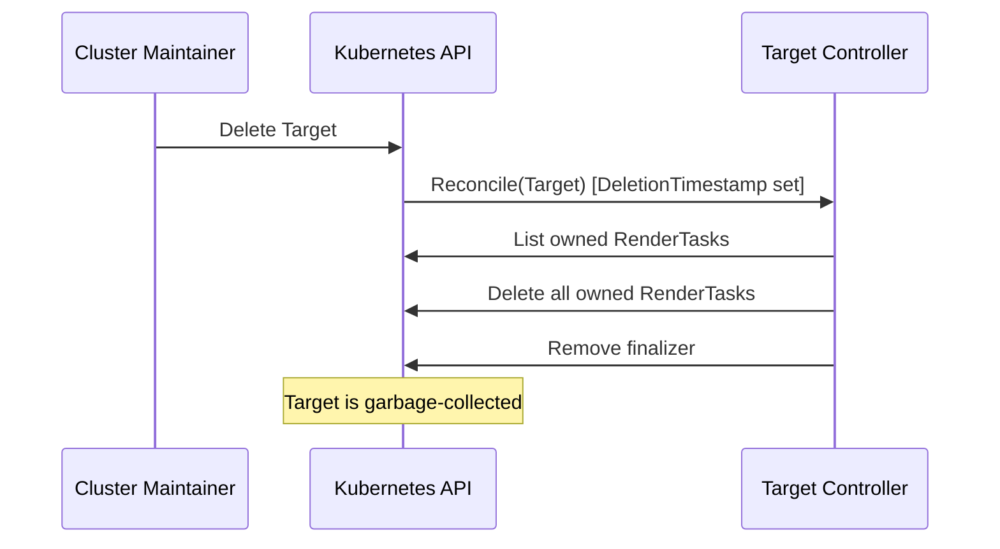
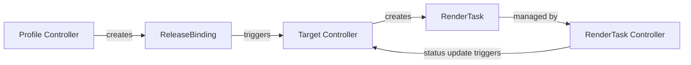

# Target Controller Documentation

## Overview

The Target controller is the central orchestrator of the SolAr rendering pipeline. It manages the lifecycle of `Target` custom resources and drives the two-stage rendering pipeline that produces deployable Helm charts for each target cluster.

For each Target, the controller:

1. Resolves the render `Registry` referenced by `spec.renderRegistryRef`.
2. Collects all `ReleaseBinding` resources that reference the Target.
3. Creates a per-release `RenderTask` for each bound Release (Stage 1).
4. Once all release RenderTasks succeed, creates a bootstrap `RenderTask` that bundles all rendered release charts (Stage 2).
5. Manages cleanup of stale RenderTasks when the release set changes.

See [Rendering Pipeline](./rendering-pipeline.md) for a detailed description of the two-stage pipeline.

## Architecture

## Status Conditions

| Condition            | Status  | Reason                  | Description                                          |
| -------------------- | ------- | ----------------------- | ---------------------------------------------------- |
| `RegistryResolved`   | `True`  | `Resolved`              | Registry found and has `solarSecretRef`              |
| `RegistryResolved`   | `False` | `NotFound`              | Registry resource not found                          |
| `RegistryResolved`   | `False` | `MissingSolarSecretRef` | Registry exists but lacks push credentials           |
| `ReleasesRendered`   | `True`  | `AllRendered`           | All release RenderTasks completed successfully       |
| `ReleasesRendered`   | `False` | `NoBindings`            | No ReleaseBindings found for this Target             |
| `ReleasesRendered`   | `False` | `Pending`               | Waiting for release RenderTasks to complete          |
| `ReleasesRendered`   | `False` | `MissingDependencies`   | One or more Releases or ComponentVersions not found  |
| `ReleasesRendered`   | `False` | `ReleaseFailed`         | At least one release RenderTask failed               |
| `BootstrapReady`     | `True`  | `Ready`                 | Bootstrap RenderTask succeeded; `ChartURL` populated |
| `BootstrapReady`     | `False` | `Failed`                | Bootstrap RenderTask failed                          |

## Finalizer

The Target controller adds the finalizer `solar.opendefense.cloud/target-finalizer` to every Target. On deletion, it:

1. Deletes all RenderTasks owned by the Target.
2. Removes the finalizer to allow the Target to be garbage-collected.

## RenderTask Naming

| RenderTask type | Name pattern                            |
| --------------- | --------------------------------------- |
| Release         | `render-rel-<release-name>-<hash>`      |
| Bootstrap       | `render-tgt-<target-name>-<version>`    |

## Bootstrap Versioning

The bootstrap chart version is incremented whenever the set of bound releases or their resolved content changes, ensuring a new chart is pushed whenever the desired state changes. Stale RenderTasks from prior versions are cleaned up after the current bootstrap succeeds.

## Watch Triggers

| Watched Resource  | Mapping                                           |
| ----------------- | ------------------------------------------------- |
| `Target`          | Direct reconcile of the Target                    |
| `ReleaseBinding`  | Reconcile the Target referenced by the binding    |
| `RenderTask`      | Reconcile the owning Target (status change only)  |
| `Registry`        | Reconcile all Targets that reference the Registry |
| `Release`         | Reconcile all Targets bound to the Release        |

## Sequence Diagrams

### New Release added via Profile (triggers bootstrap re-render)

### Target deletion

## Relationship to Other Controllers

