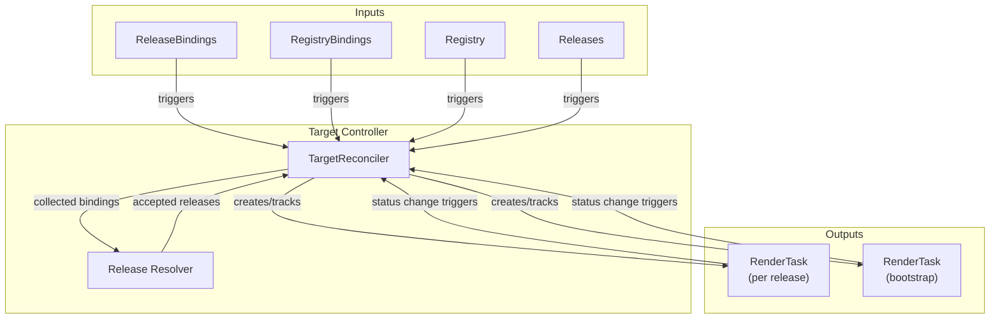
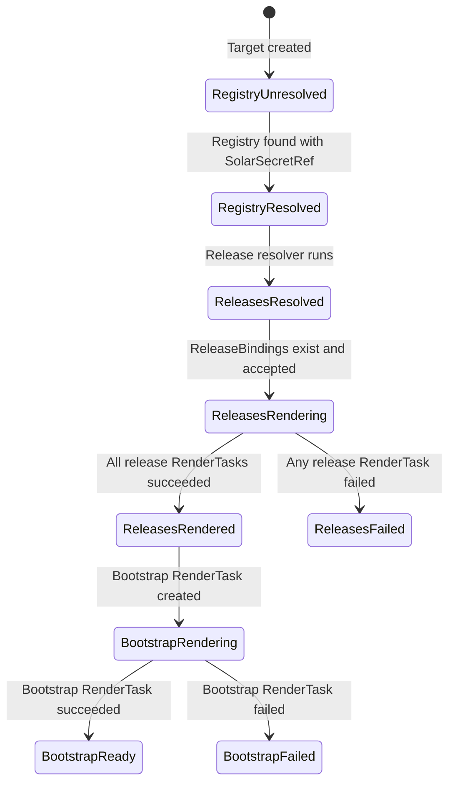
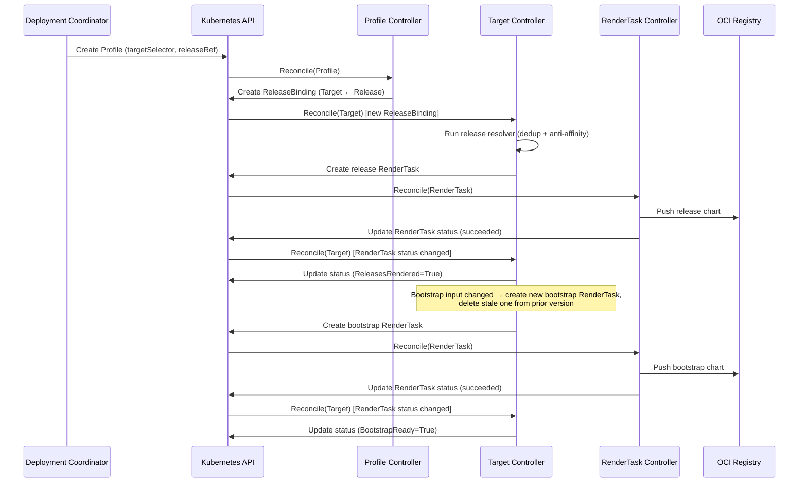
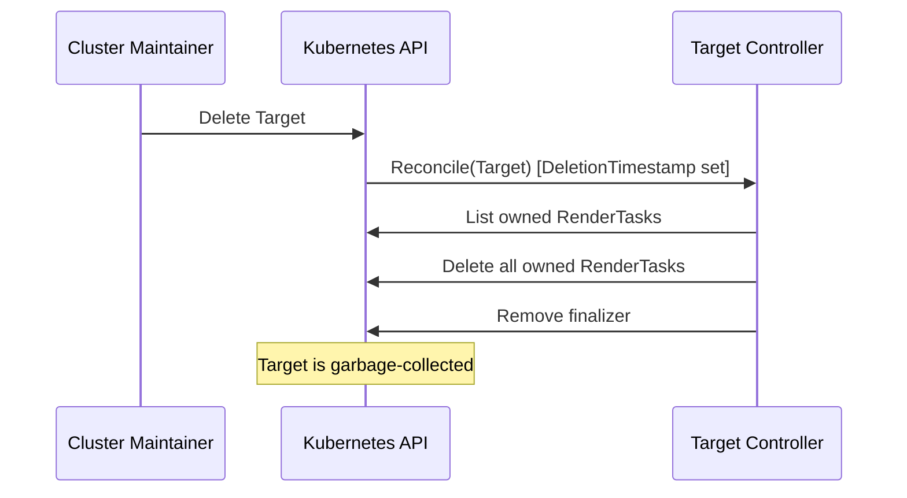
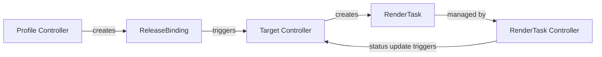

# Target Controller Documentation

## Overview

The Target controller is the central orchestrator of the SolAr rendering pipeline. It manages the lifecycle of `Target` custom resources and drives the two-stage rendering pipeline that produces deployable Helm charts for each target cluster.

For each Target, the controller:

1. Resolves the render `Registry` referenced by `spec.renderRegistryRef`.
2. Builds a pull-secret lookup by listing all `RegistryBinding` resources for the Target, resolving each bound Registry, and mapping `hostname` to `targetPullSecretName`. See [ADR 010](./adrs/010-registry-credentials.md).
3. Collects all `ReleaseBinding` resources that reference the Target.
4. Runs the release resolver to deduplicate releases by `uniqueName` (highest priority wins) and enforce anti-affinity rules. Sets the `ReleasesResolved` condition.
5. Creates a per-release `RenderTask` for each accepted Release (Stage 1). Each resource's `PullSecretName` is populated from the pull-secret lookup by matching the resource's repository host.
6. Once all release RenderTasks succeed, creates a bootstrap `RenderTask` that bundles all rendered release charts (Stage 2). Bootstrap releases use the render registry's `targetPullSecretName`.
7. Manages cleanup of stale RenderTasks when the release set changes.

See [Rendering Pipeline](./rendering-pipeline.md) for a detailed description of the two-stage pipeline.
See [ADR 004](./adrs/004-Unique-Release-Name.md) for the motivation and design of the release resolver.

## Architecture

## Status Conditions

| Condition            | Status  | Reason                       | Description                                                         |
| -------------------- | ------- | ---------------------------- | ------------------------------------------------------------------- |
| `RegistryResolved`   | `True`  | `Resolved`                   | Registry found and has `solarSecretRef`                             |
| `RegistryResolved`   | `False` | `NotFound`                   | Registry resource not found                                         |
| `RegistryResolved`   | `False` | `MissingSolarSecretRef`      | Registry exists but lacks push credentials                          |
| `ReleasesResolved`   | `True`  | `NoConflicts`                | All bound releases accepted; no deduplication or anti-affinity needed |
| `ReleasesResolved`   | `True`  | `Resolved`                   | Some releases were filtered; message lists filtered bindings         |
| `ReleasesResolved`   | `False` | `NoReleaseBindings`          | No ReleaseBindings found for this Target                            |
| `ReleasesRendered`   | `True`  | `AllRendered`                | All release RenderTasks completed successfully                       |
| `ReleasesRendered`   | `False` | `NoReleaseBindings`          | No ReleaseBindings found for this Target                            |
| `ReleasesRendered`   | `False` | `AllReleaseBindingsFiltered` | All ReleaseBindings were filtered by the resolver                   |
| `ReleasesRendered`   | `False` | `Pending`                    | Waiting for release RenderTasks to complete                         |
| `ReleasesRendered`   | `False` | `MissingDependencies`        | One or more Releases or ComponentVersions not found                 |
| `ReleasesRendered`   | `False` | `ReleaseFailed`              | At least one release RenderTask failed                              |
| `BootstrapReady`     | `True`  | `Ready`                      | Bootstrap RenderTask succeeded; `ChartURL` populated                |
| `BootstrapReady`     | `False` | `Failed`                     | Bootstrap RenderTask failed                                         |

## Finalizer

The Target controller adds the finalizer `solar.opendefense.cloud/target-finalizer` to every Target. On deletion, it:

1. Deletes all RenderTasks owned by the Target.
2. Removes the finalizer to allow the Target to be garbage-collected.

## RenderTask Naming

| RenderTask type | Name pattern                            |
| --------------- | --------------------------------------- |
| Release         | `render-rel-<release-name>-<hash>`      |
| Bootstrap       | `render-tgt-<target-name>-<version>`    |

## Bootstrap Versioning

The bootstrap chart version is incremented whenever the set of bound releases or their resolved content changes, ensuring a new chart is pushed whenever the desired state changes. Stale RenderTasks from prior versions are cleaned up after the current bootstrap succeeds.

## Pull Secret Resolution

The controller resolves pull credentials for each resource's OCI repository at render time. This replaces the previously hardcoded `regcred` secret name (#165).

### Algorithm

1. List all `RegistryBinding` objects whose `spec.targetRef` references the current Target.
2. For each RegistryBinding, resolve the referenced `Registry` and record `hostname` → `targetPullSecretName`.
3. For each source resource in the `ComponentVersion`, extract the registry host from the repository URL and look up the pull secret name.
4. Populate `ResolvedResourceAccess.PullSecretName` with the matched value (or empty for anonymous pull).

### Strict vs Relaxed Mode

The controller supports two modes via the `--registry-binding-strict` flag:

| Mode | Flag value | Behavior on unmatched host |
| ---- | ---------- | -------------------------- |
| **Relaxed** (default) | `false` | `PullSecretName` is left empty; rendered OCIRepository omits `secretRef` (anonymous pull) |
| **Strict** | `true` | Rendering fails with an error identifying the unmatched host and resource |

The Helm chart exposes this as `controller.args.registryBindingStrict`.

## Watch Triggers

| Watched Resource  | Mapping                                                                                                      |
| ----------------- | ------------------------------------------------------------------------------------------------------------ |
| `Target`          | Direct reconcile of the Target                                                                               |
| `ReleaseBinding`  | Reconcile the Target referenced by the binding (resolves `spec.targetNamespace` for cross-namespace bindings) |
| `RegistryBinding` | Reconcile the Target referenced by the binding                                                               |
| `RenderTask`      | Reconcile the owning Target (status change only)                                                             |
| `Registry`        | Reconcile all Targets that reference the Registry                                                            |
| `Release`         | Reconcile all Targets bound to the Release                                                                   |
| `ReferenceGrant`  | Reconcile Targets affected by grant changes: grants covering `Target → Registry`, `Release → ComponentVersion`, or `ReleaseBinding → Target` patterns |

Cross-namespace `ReleaseBinding` resources — those created by the Profile controller in the provider namespace with `spec.targetNamespace` set — are collected during reconcile by checking `ReferenceGrant` resources in the Target's namespace. See [ReferenceGrants](../user-guide/reference-grants.md) for the full authorization model.

## Sequence Diagrams

### New Release added via Profile (triggers bootstrap re-render)

### Target deletion

## Relationship to Other Controllers

