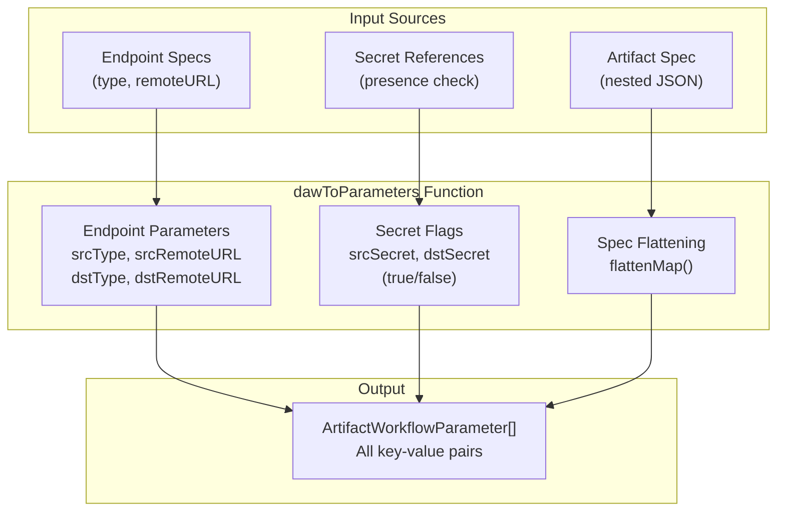
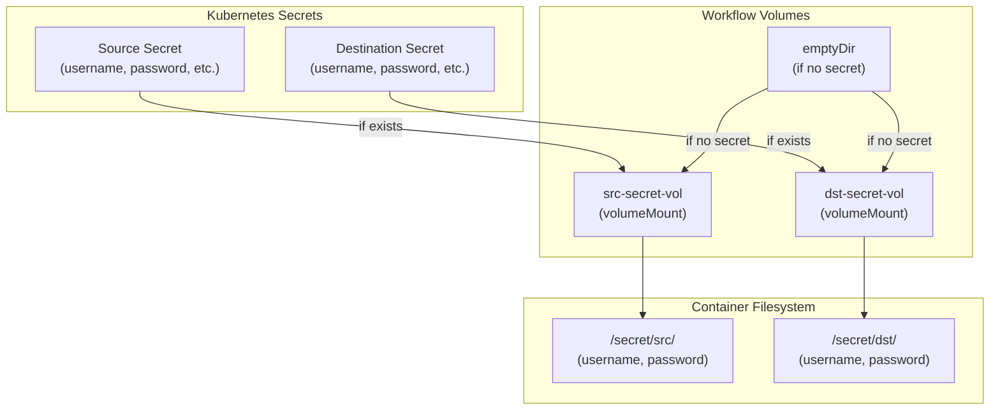
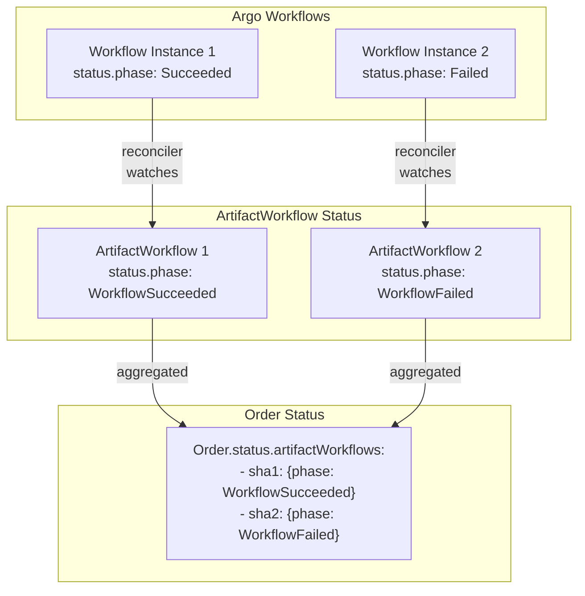

# Workflow Execution

This page describes how ARC translates declarative `ArtifactWorkflow` resources into executable Argo Workflow instances. It covers the parameter mapping process, secret mounting strategy, and the integration with Argo Workflows as the execution engine.

---

## Execution Model Overview

ARC follows a two-phase execution model:

1. **Orchestration Phase**: The `OrderReconciler` creates `ArtifactWorkflow` resources for each artifact in an `Order`
2. **Execution Phase**: The `ArtifactWorkflowReconciler` instantiates Argo `Workflow` resources based on `ArtifactWorkflow` specifications

This separation allows ARC to manage artifact processing intent (orchestration) while delegating the actual execution to Argo Workflows, a mature workflow engine designed for Kubernetes.

---

## ArtifactWorkflow Structure

An `ArtifactWorkflow` resource contains all information needed to instantiate a workflow execution.
The `ArtifactWorkflowReconciler` reads this specification and performs the following operations:

1. Resolve the `ArtifactType` resource by `spec.type`
2. Validate that source/destination endpoint types are compatible with the `ArtifactType`'s `srcTypes`/`dstTypes` rules
3. Retrieve the `WorkflowTemplate` reference from the `ArtifactType`
4. Create an Argo `Workflow` instance with appropriate parameters and volume mounts

---

## Parameter Derivation and Flattening

### Parameter Generation Process

The `OrderReconciler` generates workflow parameters through the `dawToParameters` function, which aggregates data from multiple sources:

**Parameter Derivation**



### Flattening Algorithm

The `flattenMap` function converts nested JSON structures into flat key-value parameters with camelCase naming:

**Input Artifact Spec:**

```json
{
  "image": "library/alpine:3.18",
  "override": "myteam/alpine:3.18-dev",
  "tags": ["latest", "v1.0"]
}
```

**Output Parameters:**

- `specImage`: `library/alpine:3.18`
- `specOverride`: `myteam/alpine:3.18-dev`
- `specTags0`: `latest`
- `specTags1`: `v1.0`

The flattening process handles:

- **Nested objects**: Recursively flattened (e.g., `spec.foo.bar` → `specFooBar`)
- **Arrays**: Indexed numerically (e.g., `spec.tags[0]` → `specTags0`)
- **Primitives**: Direct conversion to string values

**Implementation Details:**

The parameter name transformation follows this pattern:

- Prefix: Always `"spec"` for artifact specification fields
- Suffix: First letter capitalized (e.g., `"image"` → `"Image"`)
- Combined: `prefix + suffix` (e.g., `"specImage"`)

For endpoint parameters, a different prefix is used (`"src"` or `"dst"`).

---

## Secret Mounting Strategy

ARC mounts credentials from Kubernetes `Secret` resources into workflow pods at standardized paths, allowing workflow steps to access them without embedding sensitive data in parameters.

### Volume Mount Configuration

**Secret Mounting Architecture**



### Conditional Secret Mounting

The `srcSecret` and `dstSecret` parameters are boolean flags (string `"true"` or `"false"`) that indicate whether credentials are available:

| Condition                               | `srcSecret` Value | Volume Type                        |
| --------------------------------------- | ----------------- | ---------------------------------- |
| `srcEndpoint.spec.secretRef.name != ""` | `"true"`          | `secret` (actual Secret reference) |
| `srcEndpoint.spec.secretRef.name == ""` | `"false"`         | `emptyDir` (empty volume)          |

This allows workflow templates to use conditional logic:

```yaml
# From workflow-template-oci.yaml
CREDS_FLAG=""
if [ "{{workflow.parameters.srcSecret}}" = "true" ]; then
    CREDS_FLAG="--src-authfile /tmp/src-creds/.dockerconfigjson"
fi
```

**Note**: Even when no secret is provided, an `emptyDir` volume is mounted to maintain consistent volume mount paths across all workflow executions, preventing Argo Workflows from failing due to missing volume definitions.

---

### Workflow Instantiation

The workflow instance references the `WorkflowTemplate` by name and provides:

- **Parameters**: All flattened parameters from `ArtifactWorkflow.spec.parameters[]`
- **Volumes**: Secret volumes for source/destination credentials
- **Metadata**: Owner references linking back to the `ArtifactWorkflow`

---

## Execution Lifecycle

The `ArtifactWorkflowReconciler` watches Argo `Workflow` resources and updates the corresponding `ArtifactWorkflow.status.phase` field.

### Status Propagation

**Status Flow**



The `OrderReconciler` aggregates `ArtifactWorkflow` statuses into the parent `Order.status.artifactWorkflows` map, providing users with a consolidated view of all artifact processing operations in an order.
