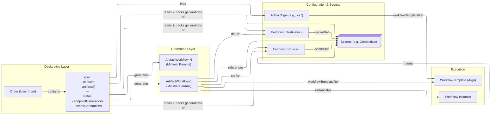

# Home

## What is Artifact Conduit (ARC)?

ARC (Artifact Conduit) is an open-source system that acts as a gateway for procuring various artifact types and transferring them across security zones while ensuring policy compliance through automated scanning and validation. The system addresses the challenge of bringing external artifacts—container images, Helm charts, software packages, and other resources—into restricted environments where direct internet access is prohibited.

## System Architecture

ARC is implemented as a Kubernetes Extension API Server integrated with the Kubernetes API Aggregation Layer. This architectural approach provides several advantages over Custom Resource Definitions (CRDs), including dedicated storage isolation, custom API implementation flexibility, and reduced risk to the hosting cluster's control plane.

**Architecture: ARC System Components and Data Flow**

The system follows a layered architecture where users interact through the Kubernetes API, requests flow through the Kubernetes API aggregation layer to the ARC API Server, and the Order Controller orchestrates workflow execution by decomposing high-level Orders into executable ArtifactWorkflows.

ARC isn't a workflow engine itself but uses [Argo Workflows](https://argo-workflows.readthedocs.io/en/stable/) to orchestrate the workflows.
This enables operators to define and execute complex workflows without needing to write custom code.

## Core Concepts

ARC introduces four primary custom resource types under the `arc.opendefense.cloud/v1alpha1` API group:

| Resource             | Purpose                                                                                    | Scope                            |
| -------------------- | ------------------------------------------------------------------------------------------ | -------------------------------- |
| **Order**            | Declares intent to procure one or more artifacts with shared configuration defaults        | User-facing, high-level          |
| **ArtifactWorkflow** | Represents a single artifact operation decomposed from an Order                            | System-generated, execution unit |
| **Endpoint**         | Defines a source or destination location with credentials                                  | Configuration, reusable          |
| **ArtifactType**     | Specifies processing rules and workflow templates for artifact types (e.g., "oci", "helm") | Configuration, system-wide       |

## Quickstart

- [Get started here](getting-started.md)
- [Walk-through Workflow Configuration](./operator-manual/workflow-config.md)

## Features

An incomplete list of features ARCs provides:

- **Artifact Procurement**: Pull artifacts from diverse sources including OCI registries, Helm repositories, S3-compatible storage, and HTTP endpoints
- **Security Validation**: Perform malware scanning, CVE analysis, license verification, and signature validation before artifact transfer
- **Policy Enforcement**: Ensure only artifacts meeting defined security and compliance policies cross security boundaries
- **Declarative Management**: Leverage Kubernetes-native declarative configuration for artifact lifecycle management
- **Auditability**: Provide attestation and traceability of all artifact processing operations
- **Artifact Type Definitions**: Define the types of artifacts that can be procured by ARC, including container images, Helm charts, software packages, and other resources
- **Workflow Templates**: Configure workflows for artifact procurement, validation, and transfer, allowing for customization based on specific use cases or environments
- **Customizable Artifact Types**: Allow users to define their own custom artifact types along with Argo Workflow Templates to solve their unique requirements

## Project Resources

- [Open Defense Cloud Organization](https://github.com/opendefensecloud)
- [Artifact Conduit Repository](https://github.com/opendefensecloud/artifact-conduit)
