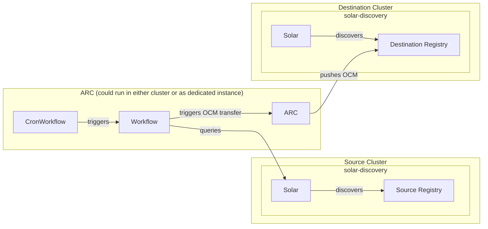

# Catalog Chaining

> **⚠️ Disclaimer**
>
> Catalog Chaining is still under development and has some known limitations
> e.g transferring components located in sub-namespaces of a registry. See
> [#747](https://github.com/opendefensecloud/solution-arsenal/issues/747) for
> more information.

Catalog chaining syncs the catalog of a source SOLAR instance to one or more
destination SOLAR instances across a security boundary. Applications travel as
[Open Component Model (OCM)](https://ocm.software) packages: only OCM packages
cross the boundary, while SOLAR's own resources (Releases, Profiles, Targets)
always stay local to their environment.

The chaining design and its decisions are captured in
[ADR-013](../developer-guide/adrs/013-catalog-chaining.md). The topology is
always the same - a source SOLAR instance on one side of the security boundary,
one or more destination SOLAR instances on the other:



## How it works

A transfer runs as an Argo Workflows pipeline in the environment that owns the
[Artifact Conduit](https://github.com/opendefensecloud/artifact-conduit) (ARC)
instance. The pipeline is defined by the `solar-catalog-transfer`
`ClusterWorkflowTemplate` in
[`assets/workflows/chaining-cluster-workflow-template.yaml`](../../assets/workflows/chaining-cluster-workflow-template.yaml):

1. **Source catalog is populated.** SOLAR Discovery on the source side scans
   the source registry and creates the source `Component` and
   `ComponentVersion` resources.
2. **Transfer items are derived.** The workflow's `query-resources` step uses a
   mounted kubeconfig to read the source SOLAR catalog (via the Kubernetes
   API). For every `ComponentVersion` it resolves the source registry and
   repository from the matching `Component` and emits one transfer item.
3. **OCM packages are pulled, scanned, and pushed.** For each transfer item the
   workflow creates an `ArtifactWorkflow` (`arc.opendefense.cloud/v1alpha1`)
   that runs ARC's `ocm-transfer-pipeline`. ARC pulls the OCM package from the
   source registry, scans the container images it contains with Trivy, and
   pushes the package to the destination registry.
4. **Destination catalog is populated.** SOLAR Discovery on the destination
   side scans the destination registry and creates the destination `Component`
   and `ComponentVersion` resources. Per ADR-013, every OCM package that lands
   in the destination registry is assumed to become a catalog entry.

## Prerequisites

- A source OCI registry hosting the OCM packages, reachable from ARC.
- A destination OCI registry, reachable from ARC.
- A source SOLAR instance whose catalog is populated (via Discovery, GitOps, or
  API calls - see [Discovery](../user-guide/discovery.md)).
- A destination SOLAR instance with Discovery running against
  the destination registry.
- ARC installed:

  ```bash
  helm upgrade --install arc oci://ghcr.io/opendefensecloud/charts/arc \
    --create-namespace \
    --namespace arc-system
  ```

- ARC and Argo Workflows installed (see [ARC Quickstart](https://arc.opendefense.cloud/latest/getting-started/)).
- ARC configured to support OCM scanning (e.g. [arc-ocm-example]).
- RBAC setup to allow ARC to access the source cluster, as described in [Access setup](#access-setup).

## Access setup

### Workflow identity

The `ClusterWorkflowTemplate` runs as the `arc-workflow` `ServiceAccount` in the
workflow namespace. Grant it read / write access on
`artifactworkflows.arc.opendefense.cloud` and full access to `argoproj.io`
resources, and bind the `ServiceAccount` via a `ClusterRoleBinding`.

### Source catalog reader

On the source cluster, create a `ServiceAccount` with a token Secret and grant
it `get`/`list`/`watch` on `components.solar.opendefense.cloud` and
`componentversions.solar.opendefense.cloud`. This is the identity the kubeconfig
secret points at; the `query-resources` step must be able to read the source
catalog through it.

### Kubeconfig secret

Assemble a kubeconfig whose `server` and `certificate-authority-data` address
the source cluster's API and whose user token is the source reader
`ServiceAccount`'s token. Store it as the `kubeconfigSecret` in the workflow
namespace. In a single-cluster setup the in-cluster API endpoint can be used;
multi-cluster setups point it at the source cluster's reachable API server.

## The transfer workflow

The `solar-catalog-transfer` `ClusterWorkflowTemplate` is applied to the ARC
cluster once. It runs with the `arc-workflow` `ServiceAccount` and is driven
entirely by workflow parameters:

| Parameter | Default | Description |
|-----------|---------|-------------|
| `kubeconfigSecret` | — | Secret (in the workflow namespace) holding the kubeconfig used to query the source catalog |
| `dstRemoteURL` | — | Destination OCI registry, `hostname:port` |
| `dstScheme` | `https` | Scheme used to reach the destination registry |
| `srcSecretName` | — | Secret (in the workflow namespace) with source registry credentials; used as the `srcSecretRef` on each `ArtifactWorkflow` |
| `dstSecretName` | — | Secret (in the workflow namespace) with destination registry credentials; used as the `dstSecretRef` on each `ArtifactWorkflow` |
| `srcSecret` | `false` | Whether the transfer pipeline configures OCM credentials for the source registry (`true` enables authenticated pull) |
| `dstSecret` | `false` | Whether the transfer pipeline configures OCM credentials for the destination registry (`true` enables authenticated push) |
| `scanSeverity` | `CRITICAL,HIGH` | Trivy severity filter applied to the images inside each transferred package |
| `scanExitCode` | `0` | Trivy exit code used when findings match |

> **ℹ️ Note**
>
> These parameters assume you are using the [arc-ocm-example]
> to scan and transfer OCM Packages. You might need to adjust the parameters if
> you use another workflow / ArtifactType.

### `query-resources`

The step runs with the kubeconfig mounted from `kubeconfigSecret` and reads
`components.solar.opendefense.cloud` and `componentversions.solar.opendefense.cloud`
from the source cluster. A `ComponentVersion` only produces a transfer item if
its `Component` declares a `spec.registry`.

An empty source catalog generates no transfer items and is treated as an error.
Populate the source catalog before running the workflow.

### `submit-artifactworkflow`

One `ArtifactWorkflow` is created per transfer item in the workflow's
namespace. The `ArtifactWorkflow` references the `ocm-transfer-pipeline`
`ClusterWorkflowTemplate` and passes the resolved source registry, repository,
and version, together with `dstRemoteURL`, the secret references, and the scan
gate parameters. The workflow step succeeds once the `ArtifactWorkflow` reaches
phase `Succeeded`.

## Running a transfer

### Scheduled sync

The vendored `CronWorkflow` in
[`assets/workflows/chaining-cron-workflow.yaml`](../../assets/workflows/chaining-cron-workflow.yaml)
runs the `solar-catalog-transfer` workflow on a schedule:

```bash
kubectl apply -f assets/workflows/chaining-cron-workflow.yaml
```

Adjust the parameter values in the manifest (`dstRemoteURL`,
`kubeconfigSecret`, the secret names and flags) and, if desired, the
`spec.schedules` cron expression before applying. Each scheduled run creates a
`Workflow` that carries the label `solar.opendefense.cloud/cron=solar-catalog-transfer`,
which can be used to find and group the generated runs:

```bash
kubectl get workflows.argoproj.io --namespace <workflow-namespace> \
  --selector solar.opendefense.cloud/cron=solar-catalog-transfer
```

The default `concurrencyPolicy: Replace` ensures a new run replaces a
still-running one, and `successfulJobsHistoryLimit`/`failedJobsHistoryLimit`
bound how many completed runs are retained.

### On-demand transfer

An on-demand transfer is a `argo` CLI submission against the cluster-scoped
workflow template:

```bash
argo submit --from clusterworkflowtemplate/solar-catalog-transfer \
  --namespace <workflow-namespace> \
  -p dstRemoteURL=<dst-registry> \
  -p kubeconfigSecret=<kubeconfig-secret> \
  -p srcSecret=true \
  -p srcSecretName=src-reg-secret \
  -p dstSecret=true \
  -p dstSecretName=dst-reg-secret
```

Track the run with `argo get <workflow-name>` and inspect the steps with
`argo logs <workflow-name>`.

## Troubleshooting

### Workflow ends with `No transfer items were generated`

- Empty source catalog (check for components/componentversions in source
  cluster)
- The kubeconfig identity lacks read access to the source catalog (check logs
  of the `query-resources` step Pod)

### The `query-resources` step fails

- `kubeconfigSecret` missing
- wrong CA or server endpoint
- expired/absent `ServiceAccount` token

Check logs of the `query-resources` step Pod.

### An `ArtifactWorkflow` does not reach phase `Succeeded`

- Wrong source/destination registry credentials
- The registry unreachable from the ARC environment
- The image scan gate failing the run.

Describe the workflow and inspect the logs of the created scan / transfer
workflows.

### Destination catalog is not updated

- Destination Discovery failed to discover the OCM Packages in the registry

Check logs of the destination discovery.

## See also

- [ADR-013: Solar Catalog Chaining via ARC](../developer-guide/adrs/013-catalog-chaining.md) — the design decisions behind chaining
- [Discovery](../user-guide/discovery.md) — how the catalog is populated, including scan mode
- [Reference architecture](reference-architecture.md) — where the source and destination SOLAR instances fit in a deployment

[arc-ocm-example]: https://github.com/opendefensecloud/artifact-conduit/tree/main/examples/ocm "ARC ocm example"
