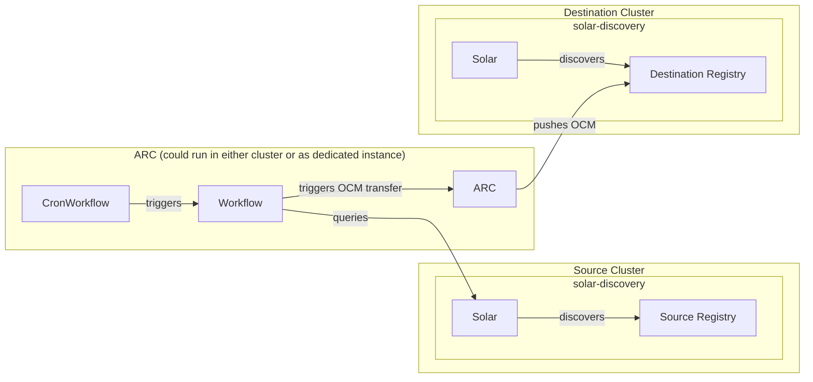

# Catalog Chaining

> **⚠️ Disclaimer**
>
> Catalog Chaining is still under development and has some known limitations
> e.g transferring components located in sub-namespaces of a registry. See
> [#747](https://github.com/opendefensecloud/solution-arsenal/issues/747) for
> more information.

Catalog chaining syncs the catalog of a source SOLAR instance to one or more
destination SOLAR instances across a security boundary. Applications travel as
[Open Component Model (OCM)](https://ocm.software) packages: only OCM packages
cross the boundary, while SOLAR's own resources (Releases, Profiles, Targets)
always stay local to their environment.

The chaining design and its decisions are captured in
[ADR-013](../developer-guide/adrs/013-catalog-chaining.md). The topology is
always the same - a source SOLAR instance on one side of the security boundary,
one or more destination SOLAR instances on the other:



## How it works

A transfer runs as an Argo Workflows pipeline in the environment that owns the
[Artifact Conduit](https://github.com/opendefensecloud/artifact-conduit) (ARC)
instance. The pipeline is defined by the `solar-catalog-transfer`
`ClusterWorkflowTemplate` in
[`assets/workflows/chaining-cluster-workflow-template.yaml`](../../assets/workflows/chaining-cluster-workflow-template.yaml):

1. **Source catalog is populated.** SOLAR Discovery on the source side scans
   the source registry and creates the source `Component` and
   `ComponentVersion` resources.
2. **Transfer items are derived.** The workflow's `query-resources` step uses a
   mounted kubeconfig to read the source SOLAR catalog (via the Kubernetes
   API). For every `ComponentVersion` it resolves the source registry and
   repository from the matching `Component` and emits one transfer item.
3. **OCM packages are pulled, scanned, and pushed.** For each transfer item the
   workflow creates an `ArtifactWorkflow` (`arc.opendefense.cloud/v1alpha1`)
   that runs ARC's `ocm-transfer-pipeline`. ARC pulls the OCM package from the
   source registry, scans the container images it contains with Trivy, and
   pushes the package to the destination registry.
4. **Destination catalog is populated.** SOLAR Discovery on the destination
   side scans the destination registry and creates the destination `Component`
   and `ComponentVersion` resources. Per ADR-013, every OCM package that lands
   in the destination registry is assumed to become a catalog entry.

## Prerequisites

- A source OCI registry hosting the OCM packages, reachable from ARC.
- A destination OCI registry, reachable from ARC.
- A source SOLAR instance whose catalog is populated (via Discovery, GitOps, or
  API calls - see [Discovery](../user-guide/discovery.md)).
- A destination SOLAR instance with Discovery running against
  the destination registry.
- ARC installed:

  ```bash
  helm upgrade --install arc oci://ghcr.io/opendefensecloud/charts/arc \
    --create-namespace \
    --namespace arc-system
  ```

- ARC and Argo Workflows installed (see [ARC Quickstart](https://arc.opendefense.cloud/latest/getting-started/)).
- ARC configured to support OCM scanning (e.g. [arc-ocm-example]).
- RBAC setup to allow ARC to access the source cluster, as described in [Access setup](#access-setup).

## Access setup

### Workflow identity

The `ClusterWorkflowTemplate` runs as the `arc-workflow` `ServiceAccount` in the
workflow namespace. Grant it read / write access on
`artifactworkflows.arc.opendefense.cloud` and full access to `argoproj.io`
resources, and bind the `ServiceAccount` via a `ClusterRoleBinding`.

It additionally needs cluster-scoped `get`/`list` on
`components.solar.opendefense.cloud` and `componentversions.solar.opendefense.cloud`
in the **destination** cluster, so it can skip packages that already arrived
(see [Skipping already-transferred packages](#skipping-already-transferred-packages)),
plus cluster-scoped `get` on `namespaces`, used to confirm a non-empty
`dstCatalogNamespace` exists before trusting an empty read.
The shipped `arc-workflow-solar-reader-binding` hardcodes `namespace: default`
for its subject; edit it if the workflow runs in another namespace.

### Source catalog reader

On the source cluster, create a `ServiceAccount` with a token Secret and grant
it `get`/`list`/`watch` on `components.solar.opendefense.cloud` and
`componentversions.solar.opendefense.cloud`. This is the identity the kubeconfig
secret points at; the `query-resources` step must be able to read the source
catalog through it.

For more details, see [Source registry credentials](#source-registry-credentials).

### Kubeconfig secret

Assemble a kubeconfig whose `server` and `certificate-authority-data` address
the source cluster's API and whose user token is the source reader
`ServiceAccount`'s token. Store it as the `kubeconfigSecret` in the workflow
namespace. In a single-cluster setup the in-cluster API endpoint can be used;
multi-cluster setups point it at the source cluster's reachable API server.

## The transfer workflow

The `solar-catalog-transfer` `ClusterWorkflowTemplate` is applied to the ARC
cluster once. It runs with the `arc-workflow` `ServiceAccount` and is driven
entirely by workflow parameters:

| Parameter              | Default         | Description                                                                                                                                                                                       |
| ---------------------- | --------------- | ------------------------------------------------------------------------------------------------------------------------------------------------------------------------------------------------- |
| `kubeconfigSecret`     | —               | Secret (in the workflow namespace) holding the kubeconfig used to query the source catalog                                                                                                        |
| `dstRemoteURL`         | —               | Destination OCI registry, `hostname:port`                                                                                                                                                         |
| `dstScheme`            | `https`         | Scheme used to reach the destination registry                                                                                                                                                     |
| `srcSecretName`        | —               | Catch-all Secret (in the workflow namespace) used as `srcSecretRef` for any registry with no `srcSecrets` entry. See [Source registry credentials](#source-registry-credentials)                  |
| `dstSecretName`        | —               | Secret (in the workflow namespace) with destination registry credentials; used as the `dstSecretRef` on each `ArtifactWorkflow`                                                                   |
| `srcSecret`            | `false`         | Fallback flag, used only alongside `srcSecretName`. Per item this is derived from whether a credential resolved                                                                                   |
| `dstSecret`            | `false`         | Whether the transfer pipeline configures OCM credentials for the destination registry (`true` enables authenticated push)                                                                         |
| `scanSeverity`         | `CRITICAL,HIGH` | Trivy severity filter applied to the images inside each transferred package                                                                                                                       |
| `scanExitCode`         | `0`             | Trivy exit code used when findings match                                                                                                                                                          |
| `dstCatalogNamespace`  | `""`            | Namespace holding the **destination** Solar catalog, read to skip already-transferred ComponentVersions. Empty means the workflow's own namespace                                                 |
| `srcCatalogNamespaces` | `""`            | Comma-separated namespaces holding the **source** catalog. Empty means all namespaces. See [Source catalog namespaces](#source-catalog-namespaces)                                                |
| `srcSecrets`           | `{}`            | JSON object mapping registry hostname to the Secret name to use in the workflow namespace. The per-registry credential mechanism. See [Source registry credentials](#source-registry-credentials) |

> **ℹ️ Note**
>
> These parameters assume you are using the [arc-ocm-example]
> to scan and transfer OCM Packages. You might need to adjust the parameters if
> you use another workflow / ArtifactType.

### `query-resources`

The step runs with the kubeconfig mounted from `kubeconfigSecret` and reads
`components.solar.opendefense.cloud` and
`componentversions.solar.opendefense.cloud` from the source cluster. It then reads
the destination catalog to skip what has already been transferred.

Its logic lives in the `solar-catalog-transfer-scripts` ConfigMap, shipped in the
same manifest as the workflow template and mounted at `/scripts`. It is kept
there rather than inline so it can be unit-tested by
`test/fixtures/chaining/cv-list-test.sh`.

A `ComponentVersion` produces a transfer item unless one of these applies, each
of which is counted and logged by reason in the step's output:

| Skip reason       | Meaning                                                                                      |
| ----------------- | -------------------------------------------------------------------------------------------- |
| `no_component`    | The referenced `Component` is missing or has no `spec.registry`                              |
| `no_name`         | The `Component` predates `spec.name` and cannot be resolved back to an OCM reference         |
| `suffix_mismatch` | `spec.repository` does not end in `spec.name`, so the sub-namespace cannot be derived safely |
| `root_level`      | Stripping `spec.name` leaves no sub-namespace, so the package sits at the registry root      |
| `already_present` | The destination catalog holds a `ComponentVersion` of that name with the same fingerprint    |

An empty item list is not an error: once everything has been transferred it
is the normal steady state of a recurring sync.

#### Source catalog namespaces

A source catalog can span several namespaces: each source registry gets
its own `solar-discovery` worker, and each worker writes into its own namespace.
Querying only the kubeconfig's context namespace would silently sync one of them
and quietly ignore the rest.

By default the step therefore reads **all** namespaces, which is what you want
when the source Solar runs in its own cluster. On a shared cluster setup the
destination catalog needs to not be part of the source namespaces.

Set `srcCatalogNamespaces` to a comma-separated list when source and destination
catalogs share a cluster, so destination Components are not picked up and fed
back in as source items.

> **ℹ️ Note**
>
> The source reader `ServiceAccount` needs a `ClusterRole`/`ClusterRoleBinding`
> rather than a namespaced `Role`, since it reads across namespaces.

#### Source registry credentials

Source credentials are resolved per registry, so one destination can sync from
several source registries that use different accounts.

The `srcSecrets` parameter maps a registry **hostname** to the name of a Secret
in the workflow namespace:

```yaml
- name: srcSecrets
  value: '{"registry-a.example.org:443": "src-a-pull",
    "registry-b.example.org:443": "src-b-pull"}'
```

Resolution per transfer item:

1. `srcSecrets`, keyed by the Component's `spec.registry`.
2. Otherwise the `srcSecretName` parameter, as a catch-all.
3. If both are empty, the item transfers anonymously.

Every resolved Secret must exist in the **workflow namespace** — the
`ArtifactWorkflow` is created there and its `srcSecretRef` is a bare name, so
ARC resolves it in that same namespace, not in ARC's own namespace.

`srcSecrets` must be a JSON object; the query step fails with a clear message
rather than silently ignoring a malformed value.

If the resolved Secret is missing from the workflow namespace, the
`ArtifactWorkflow` fails while fetching it and emits an `InvalidSecret` warning
event:

```bash
kubectl get events --namespace <workflow-namespace> \
  --field-selector reason=InvalidSecret
```

#### Skipping already-transferred packages

The step also lists `componentversions.solar.opendefense.cloud` from the
**destination** catalog and drops any item that already exists there unchanged.
Set `dstCatalogNamespace` to the namespace the destination discovery writes into.

Matching is on name plus a content fingerprint, so a package is skipped only
when the destination already holds the same content:

- Destination object names derive from the OCM component name and version only,
  never from the registry, so the same package has the same `ComponentVersion`
  name on both sides.
- The fingerprint is the sorted list of `<resourceName>=<tag>` pairs built from
  `spec.resources`. Those tags carry the OCI content digest and are preserved
  verbatim across a transfer, so adding, removing, or repointing a single
  resource changes the fingerprint.

If a source tag is repointed at new content, the fingerprint changes and the
package is re-transferred. That case is reported separately in the step log:

```text
re-transferring 1 ComponentVersion(s): content changed since the last sync
```

so a genuine content update is never confused with an up-to-date item.

Without this, every scheduled run would re-pull, re-scan and re-push every
package in the catalog.

### `submit-artifactworkflow`

One `ArtifactWorkflow` is created per transfer item in the workflow's
namespace. The `ArtifactWorkflow` references the `ocm-transfer-pipeline`
`ClusterWorkflowTemplate` and passes the resolved source registry, the OCM
sub-namespace (`specRepo`) and component name (`specComponent`), and the
version, together with `dstRemoteURL`, the per-item source secret reference,
the destination secret reference, and the scan gate parameters. The workflow
step succeeds once the `ArtifactWorkflow` reaches phase `Succeeded`.

## Running a transfer

### Scheduled sync

The vendored `CronWorkflow` in
[`assets/workflows/chaining-cron-workflow.yaml`](../../assets/workflows/chaining-cron-workflow.yaml)
runs the `solar-catalog-transfer` workflow on a schedule:

```bash
kubectl apply -f assets/workflows/chaining-cron-workflow.yaml
```

Adjust the parameter values in the manifest (`dstRemoteURL`,
`kubeconfigSecret`, the secret names and flags) and, if desired, the
`spec.schedules` cron expression before applying. Each scheduled run creates a
`Workflow` that carries the label `solar.opendefense.cloud/cron=solar-catalog-transfer`,
which can be used to find and group the generated runs:

```bash
kubectl get workflows.argoproj.io --namespace <workflow-namespace> \
  --selector solar.opendefense.cloud/cron=solar-catalog-transfer
```

The `CronWorkflow` runs hourly and uses `concurrencyPolicy: Forbid`, which skips
a tick while a previous run is still going. Skipping is safe because the sync is
idempotent. The next tick picks up whatever is still missing.

`successfulJobsHistoryLimit`/`failedJobsHistoryLimit` bound how many completed
runs are retained.

### On-demand transfer

An on-demand transfer is a `argo` CLI submission against the cluster-scoped
workflow template:

```bash
argo submit --from clusterworkflowtemplate/solar-catalog-transfer \
  --namespace <workflow-namespace> \
  -p dstRemoteURL=<dst-registry> \
  -p kubeconfigSecret=<kubeconfig-secret> \
  -p dstCatalogNamespace=<destination-catalog-namespace> \
  -p srcCatalogNamespaces=<source-namespaces-or-empty> \
  -p dstSecret=true \
  -p dstSecretName=dst-reg-secret
```

Source credentials come from `srcSecrets`, keyed by the registry hostname in
each Component's `spec.registry`. Pass one entry per authenticated source
registry; `srcSecret`/`srcSecretName` are only the catch-all for registries with
no entry:

```bash
  -p srcSecrets='{"registry-a.example.org:443": "src-a-pull"}' \
```

Source `Registry` objects are not consulted for credentials.

Track the run with `argo get <workflow-name>` and inspect the steps with
`argo logs <workflow-name>`.

## Troubleshooting

### The workflow succeeds but transfers nothing

An empty transfer list is normal once everything has been synced. Check the
`query-resources` step log: it prints one `skipped N ComponentVersion(s): <reason>`
line per reason. If everything was skipped as `already_present`, the sync is
simply up to date.

If the `Found N Component(s)` count is lower than the source catalog actually
holds, the step is reading the wrong namespaces — check `srcCatalogNamespaces`
and confirm the source reader is bound with a `ClusterRoleBinding`. Each pinned
namespace that returns nothing is reported individually:

```text
warning: namespace 'solar-x' returned no components.solar.opendefense.cloud; check srcCatalogNamespaces for a typo
```

because `kubectl` exits successfully with an empty list for a namespace that
does not exist, making a typo otherwise indistinguishable from an empty catalog.

### The step fails with "destination catalog namespace ... does not exist"

`dstCatalogNamespace` names a namespace that is absent or unreadable. The step
refuses to continue rather than treating the empty read as "nothing has been
transferred yet", which would disable deduplication and re-pull, re-scan and
re-push the entire catalog on every run. Correct the parameter, or confirm the
workflow ServiceAccount can `get` namespaces.

### The step fails with "failed to read the destination catalog"

Usually RBAC, not the catalog. `arc-workflow-solar-reader-binding` ships with
`subjects[0].namespace: default` baked in, and `kubectl apply -n <ns>` does not
override an explicitly set subject namespace. Applying the template into any
other namespace therefore binds the read grant to an `arc-workflow`
`ServiceAccount` that is not the one running the workflow. Edit the subject
namespace to match before applying, and verify with:

```bash
kubectl auth can-i list componentversions.solar.opendefense.cloud \
  --as system:serviceaccount:<workflow-namespace>:arc-workflow
```

### The `query-resources` step fails

- `kubeconfigSecret` missing
- wrong CA or server endpoint
- expired/absent `ServiceAccount` token

Check logs of the `query-resources` step Pod.

### An `ArtifactWorkflow` does not reach phase `Succeeded`

- Wrong source/destination registry credentials
- The registry unreachable from the ARC environment
- The image scan gate failing the run.

Describe the workflow and inspect the logs of the created scan / transfer
workflows.

### Destination catalog is not updated

- Destination Discovery failed to discover the OCM Packages in the registry

Check logs of the destination discovery.

## See also

- [ADR-013: Solar Catalog Chaining via ARC](../developer-guide/adrs/013-catalog-chaining.md) — the design decisions behind chaining
- [Discovery](../user-guide/discovery.md) — how the catalog is populated, including scan mode
- [Reference architecture](reference-architecture.md) — where the source and destination SOLAR instances fit in a deployment

[arc-ocm-example]: https://github.com/opendefensecloud/artifact-conduit/tree/main/examples/ocm 'ARC ocm example'
