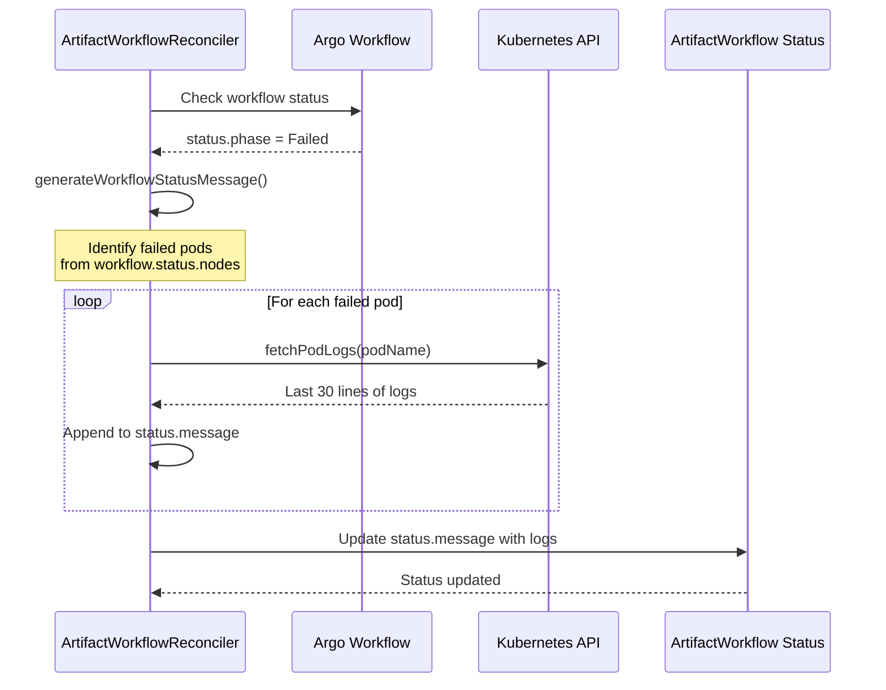

# Failed Workflow Debugging

## Automatic Pod Log Collection

When Argo Workflows fail, the `ArtifactWorkflowReconciler` automatically collects logs from failed pods for debugging:

**Key Points**:

- Only the **last 30 lines** are collected (configurable via `TailLines`)
- Logs are retrieved from the `main` container
- Errors during log fetching are logged but don't fail the reconciliation

## Debugging Workflow Failures

When investigating failed workflows:

1. Check `ArtifactWorkflow.status.message` for collected pod logs
2. Inspect `Order.status.message` for validation errors
3. Review Kubernetes events: `kubectl describe order <name>` and `kubectl describe artifactworkflow <name>`
4. Query Argo Workflow status: `kubectl get workflow <name> -o yaml`
5. Check controller logs for detailed reconciliation traces (enable debug logging)
