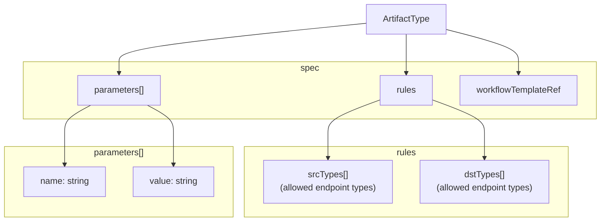

# Extending ArtifactTypes

This guide explains how to add support for new artifact types in ARC by creating custom ArtifactType resources and corresponding Argo WorkflowTemplates.

## Overview

ARC's artifact processing pipeline is extensible through the `ArtifactType` custom resource. Each ArtifactType defines:

- **Rules**: Which source and destination endpoint types are compatible
- **Parameters**: Default parameters passed to workflows
- **WorkflowTemplateRef**: The Argo Workflows template that implements the processing logic

When an `Order` is created, the `OrderReconciler` generates `ArtifactWorkflow` resources for each artifact, which then instantiate Argo `Workflow` instances based on the referenced WorkflowTemplate.

## Creating a WorkflowTemplate

WorkflowTemplates define the actual processing steps for an artifact type. ARC uses Argo Workflows as its execution engine.

### WorkflowTemplate Structure

A typical WorkflowTemplate for ARC includes:

| Component              | Purpose                                        |
| ---------------------- | ---------------------------------------------- |
| `arguments.parameters` | Input parameters passed from ArtifactWorkflow  |
| `volumeClaimTemplates` | Persistent storage for inter-step data sharing |
| `templates`            | Step definitions (pull, scan, push, etc.)      |
| `entrypoint`           | Main pipeline orchestration                    |

### Standard Parameters

All WorkflowTemplates receive these parameters from ARC:

| Parameter Name | Source                    | Description                            |
| -------------- | ------------------------- | -------------------------------------- |
| `srcType`      | `Endpoint.spec.type`      | Source endpoint type                   |
| `srcRemoteURL` | `Endpoint.spec.remoteURL` | Source endpoint URL                    |
| `srcSecret`    | Computed                  | `"true"` or `"false"` if secret exists |
| `dstType`      | `Endpoint.spec.type`      | Destination endpoint type              |
| `dstRemoteURL` | `Endpoint.spec.remoteURL` | Destination endpoint URL               |
| `dstSecret`    | Computed                  | `"true"` or `"false"` if secret exists |

### Volume Mount Conventions

ARC workflows follow these conventions:

| Volume Type      | Mount Path        | Purpose                                           |
| ---------------- | ----------------- | ------------------------------------------------- |
| `src-secret-vol` | `/tmp/src-creds/` | Source authentication (e.g., `.dockerconfigjson`) |
| `dst-secret-vol` | `/tmp/dst-creds/` | Destination authentication                        |
| `work-volume`    | `/data/`          | Inter-step data persistence                       |

Secrets contain standard Kubernetes secret keys (e.g., `username`, `password`, `.dockerconfigjson`).

## Defining the ArtifactType Resource

Once the WorkflowTemplate is created, define the corresponding ArtifactType resource:

### ArtifactType Spec Structure



### Example ArtifactType Definition

For the OCI pipeline, the ArtifactType would be defined as:

```yaml
apiVersion: arc.opendefense.cloud/v1alpha1
kind: ArtifactType
metadata:
  name: oci
spec:
  rules:
    srcTypes:
      - oci
    dstTypes:
      - oci
  parameters:
    - name: scanSeverity
      value: "HIGH,CRITICAL"
  workflowTemplateRef: oci-image-pipeline-flexible
```

**Key fields:**

- `rules.srcTypes`: Validates source `Endpoint.spec.type` compatibility
- `rules.dstTypes`: Validates destination `Endpoint.spec.type` compatibility  
- `parameters`: Default values merged with artifact spec (artifact spec takes precedence)
- `workflowTemplateRef`: Name of the WorkflowTemplate to instantiate

### Parameter Naming Convention

The `OrderReconciler` flattens nested JSON specs into camelCase parameters:

| Input (spec field)  | Output Parameter  | Transformation Rule              |
| ------------------- | ----------------- | -------------------------------- |
| `spec.image`        | `specImage`       | prefix + capitalize first letter |
| `spec.override`     | `specOverride`    | prefix + capitalize first letter |
| `spec.nested.field` | `specNestedField` | flatten + capitalize each word   |
| `spec.array[0]`     | `specArray0`      | flatten + append index           |

### Parameter Flattening Logic

The flattening algorithm in `flattenMap()` handles:

1. **Nested objects**: Recursively flatten with concatenated keys
2. **Arrays**: Convert to indexed parameters (e.g., `spec.tags[0]` → `specTags0`)
3. **Primitives**: Convert to string values using `fmt.Sprintf("%v", value)`

**All parameter values are strings** — WorkflowTemplates must parse/convert as needed.

## Testing a New ArtifactType

### Integration Testing

1. **Deploy WorkflowTemplate**: Apply your custom WorkflowTemplate to the cluster
2. **Create ArtifactType**: Apply the ArtifactType definition
3. **Create Endpoints**: Define source and destination endpoints
4. **Submit Test Order**: Create an Order using your new artifact type
5. **Verify Workflow**: Check that Argo Workflow executes correctly

Test both success and failure paths:

- Valid parameters → successful workflow completion
- Invalid source/destination types → validation error
- Missing secrets → workflow failure with clear error message
- Security scan failures → workflow halts appropriately

## Best Practices

### WorkflowTemplate Design

1. **Conditional Steps**: Use `when` conditions to enable multi-type template reuse
2. **Fail-Fast**: Exit workflows early on critical errors (security scans, authentication failures)
3. **Artifact Outputs**: Save important results (scan reports, manifests) as Argo Workflow artifacts
4. **Resource Limits**: Set appropriate CPU/memory limits for container steps
5. **Idempotency**: Design steps to be safely retryable

### Parameter Design

1. **Sensible Defaults**: Provide defaults in ArtifactType.spec.parameters for common use cases
2. **Required vs Optional**: Document which spec fields are required
3. **Type Safety**: Validate parameter types in WorkflowTemplate scripts
4. **Secret Handling**: Never pass secrets as parameters — always use volume mounts

### Naming Conventions

| Resource         | Naming Pattern               | Example                            |
| ---------------- | ---------------------------- | ---------------------------------- |
| ArtifactType     | Lowercase artifact category  | `oci`, `helm`, `maven`             |
| WorkflowTemplate | `{type}-{purpose}-{variant}` | `oci-image-pipeline-flexible`      |
| Parameters       | `spec{Field}` (camelCase)    | `specImage`, `specOverride`        |
| Volume Mounts    | `{purpose}-secret-vol`       | `src-secret-vol`, `dst-secret-vol` |

### Error Handling

1. **Descriptive Messages**: Set clear status messages in ArtifactWorkflow status
2. **Exit Codes**: Use non-zero exit codes for workflow step failures
3. **Logging**: Output structured logs for debugging (JSON format recommended)
4. **Retry Strategy**: Configure Argo Workflows retry policies for transient failures

