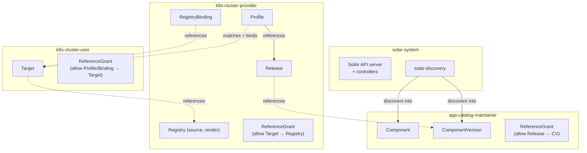

# Reference Architecture

SolAr is intentionally flexible: roles, namespaces, registries and resources can be
laid out in many ways. That flexibility can lead to *choice paralysis* when standing
up a new environment. This page describes one **opinionated, end-to-end blueprint**
that covers the common single-tenant-per-cluster case. It is a sound starting point that you can adapt later.

It pulls together the building blocks documented elsewhere — the
[role model](../developer-guide/roles.md), [ReferenceGrants](../user-guide/reference-grants.md)
and [SolAr Discovery](../user-guide/discovery.md) — into a single, applyable layout,
and links to ready-to-use example manifests.

## At a glance



Dotted arrows cross a namespace boundary and therefore require a `ReferenceGrant` in
the namespace that **owns the referenced resource**.

## Namespaces

The blueprint uses one namespace for the SolAr control plane plus one namespace per
role. Keeping each role in its own namespace gives every team an isolated blast
radius and a natural place to attach RBAC and ReferenceGrants.

| Namespace               | Owner                  | Contains                                                              |
| ---                     | ---                    | ---                                                                  |
| `solar-system`          | SolAr Operator         | SolAr API server, controllers, `solar-discovery`                     |
| `app-catalog-maintainer`| App Catalog Maintainer | `Component`, `ComponentVersion` (the catalog)                        |
| `k8s-cluster-provider`  | K8s Cluster Provider   | `Registry`, `Release`, `Profile`, `ReleaseBinding`, `RegistryBinding`|
| `k8s-cluster-user`      | K8s Cluster User       | `Target`                                                             |

For a single team that owns everything, all of the SolAr resources can be collapsed
into one namespace and the ReferenceGrants dropped entirely. The multi-namespace
split below is the recommended default because it scales cleanly to multiple cluster
users and catalog maintainers.

## Roles and RBAC

The blueprint maps directly onto the four roles in the
[role model](../developer-guide/roles.md):

- **App Catalog Maintainer** — curates `Component`/`ComponentVersion` resources.
- **K8s Cluster Provider** — owns registries and drives deployments (`Release`,
  `Profile`, `RegistryBinding`) on behalf of cluster users; manages the `Target`
  lifecycle.
- **K8s Cluster User** — owns the `Target` resources representing their clusters.
- **SolAr Operator** — runs the control plane.

Apply the RBAC manifests from the role model to create the ClusterRoles,
RoleBindings and the ReferenceGrants that the cross-namespace references below rely
on. **Apply order matters:** the K8s Cluster Provider manifest defines a shared
`solar:acm-reader` ClusterRole that the K8s Cluster User manifest binds, so apply it
first.

```bash
kubectl apply -f app-catalog-maintainer.yaml
kubectl apply -f k8s-cluster-provider.yaml
kubectl apply -f k8s-cluster-user.yaml
```

See [Roles](../developer-guide/roles.md) for the full permission matrix and the
manifests themselves.

## Cross-namespace references and ReferenceGrants

Because resources are split across namespaces, references cross namespace
boundaries. A `ReferenceGrant` in the namespace **owning the referenced resource**
authorizes each crossing; without it the controllers set a `NotGranted` condition
and refuse to follow the reference.

| Reference (from → to)                          | From namespace         | Grant lives in           |
| ---                                            | ---                    | ---                      |
| `Release` → `ComponentVersion`                 | `k8s-cluster-provider` | `app-catalog-maintainer` |
| `Target` → `Registry`                          | `k8s-cluster-user`     | `k8s-cluster-provider`   |
| `Profile` / `ReleaseBinding` → `Target`        | `k8s-cluster-provider` | `k8s-cluster-user`       |
| `RegistryBinding` → `Target`                   | `k8s-cluster-provider` | `k8s-cluster-user`       |

These grants are already included in the three RBAC manifests above. For the
mechanics, debugging tips and the multi-tenant provisioning pattern (e.g. generating
grants per tenant with Kyverno), see the
[ReferenceGrants guide](../user-guide/reference-grants.md).

## SolAr Discovery integration

[SolAr Discovery](../user-guide/discovery.md) scans the **source** registry for OCM
components and writes `Component`/`ComponentVersion` resources directly into the
`app-catalog-maintainer` namespace, keeping the catalog in sync without manual
intervention. It runs in `solar-system` alongside the control plane.

Point discovery's created resources at the catalog namespace and scan the source
registry:

```yaml
# solar-discovery values.yaml
namespace: app-catalog-maintainer   # where Component/ComponentVersion are created
registries:
  - name: source
    hostname: registry.example.com
    scanInterval: 10m               # full scan; add webhookPath for near-real-time
```

```bash
helm upgrade --install solar-discovery \
  oci://ghcr.io/opendefensecloud/charts/solar-discovery \
  --namespace solar-system \
  --values values.yaml
```

Discovery is optional — the catalog can also be populated via GitOps or direct API
calls — but it is the recommended default. Enable webhook mode (`webhookPath` +
`flavor`) for near-real-time updates on registries that support it. See the
[Discovery guide](../user-guide/discovery.md) for all configuration options.

## Resource topology

With RBAC, grants and discovery in place, a deployment is described by the SolAr
resources below. Discovery populates the catalog; the provider creates everything
else. The example manifests are concrete and applyable — adjust the hostnames,
component version and labels to your environment.

### Catalog (App Catalog Maintainer namespace)

`Component` and `ComponentVersion` are created automatically by discovery. The
`ComponentVersion` name is derived from the component identity and version (e.g.
`ocm-demo-1-0-0`); reference that name from the `Release` below.

### Registries (K8s Cluster Provider namespace)

Two registries: `source` holds the OCM components and application images target
clusters pull; `render` receives the Helm charts SolAr renders.

```yaml
--8<-- "docs/operator-manual/manifests/registries.yaml"
```

### Release (K8s Cluster Provider namespace)

The `Release` selects a `ComponentVersion` from the catalog namespace (a
cross-namespace reference) and declares the target namespace on the cluster.

```yaml
--8<-- "docs/operator-manual/manifests/release.yaml"
```

### Target (K8s Cluster User namespace)

The `Target` represents a registered cluster. Its labels are matched by the
`Profile`; its `renderRegistryRef` points at the provider's `render` Registry.

```yaml
--8<-- "docs/operator-manual/manifests/target.yaml"
```

### Profile and RegistryBindings (K8s Cluster Provider namespace)

The `Profile` matches Targets by label and automatically creates a `ReleaseBinding`
for each — this is the trigger that starts rendering. The `RegistryBinding`s grant
the Target permission to use the source and render registries.

```yaml
--8<-- "docs/operator-manual/manifests/profile.yaml"
```

```yaml
--8<-- "docs/operator-manual/manifests/registry-bindings.yaml"
```

!!! note "Profile vs. manual ReleaseBinding"
    A `Profile` is the recommended way to bind a Release to a fleet of Targets
    because it scales to many clusters and reconciles new Targets automatically. For
    a one-off deployment to a single Target you can create the `ReleaseBinding`
    directly instead of a Profile.

## End-to-end flow

1. **Catalog ingestion** — The App Catalog Maintainer pushes an OCM component to the
   source registry. Discovery scans it and creates `Component`/`ComponentVersion` in
   `app-catalog-maintainer`.
2. **Cluster registration** — The K8s Cluster Provider registers the cluster by
   creating a `Target` in the user's namespace and the matching `RegistryBinding`s.
3. **Deployment** — The provider creates the `Release` (referencing the catalog
   `ComponentVersion`) and a `Profile`. The Profile matches the Target and creates a
   `ReleaseBinding`, which drives the Target controller to render a Helm chart and
   push it to the `render` registry.
4. **Reconciliation** — Flux on the target cluster pulls the rendered chart from the
   `render` registry and the application images from the `source` registry, and
   deploys the application.
5. **Upgrade / rollback** — Point the `Release` at a different `ComponentVersion`;
   SolAr re-renders and Flux reconciles. Deleting the `Profile` (or `ReleaseBinding`)
   undeploys the application.

## Further reading

- [Roles](../developer-guide/roles.md) — permission matrix and RBAC manifests
- [ReferenceGrants](../user-guide/reference-grants.md) — cross-namespace authorization
- [SolAr Discovery](../user-guide/discovery.md) — catalog population
- [Architecture](../developer-guide/architecture.md) — system components and the
  rendering pipeline
