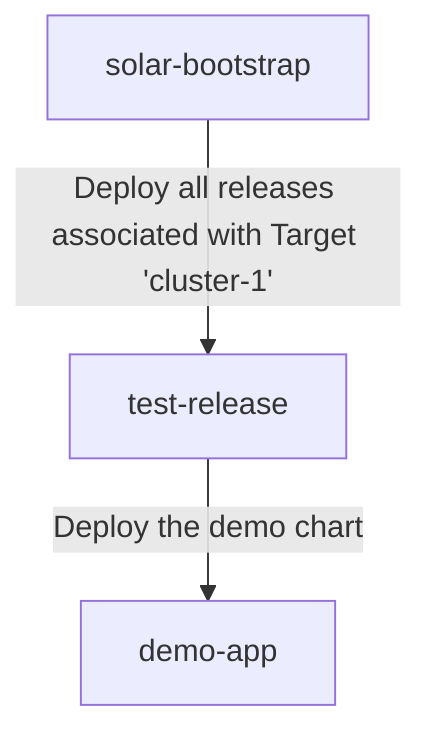

# Bootstrap

## Register the local cluster as a target

In order to deploy our demo application to the cluster we first need to
register it as a `Target`:

```yaml
# target.yaml
apiVersion: solar.opendefense.cloud/v1alpha1
kind: Target
metadata:
  name: cluster-1
  namespace: test
spec:
  releases:
    test-release:
      name: test-opendefense-cloud-ocm-demo-v26-4-0-release
  userdata:
    foo: bar
    environment: dev
```

```bash
kubectl apply -n test -f target.yaml
```

```console
$ kubectl get target -n test
NAME        CREATED AT
cluster-1   2026-04-10T11:26:06Z
```

After the target was created a `Bootstrap` resource was automatically
generated. Its purpose is to create the Helm chart which deploys all
`HelmReleases` from the associated `Release`s. This acts similar to the "App
of Apps" pattern from GitOps.

```console
$ kubectl get bootstrap -n test
NAME        CREATED AT
cluster-1   2026-04-10T11:26:06Z
```

The `Bootstrap` created another `RenderTask` in order to create and push the
associated Helm chart.

```console
$ kubectl get rendertasks
NAME                                                     CREATED AT
test-cluster-1-0                                         2026-04-10T11:26:06Z
test-test-opendefense-cloud-ocm-demo-v26-4-0-release-0   2026-04-10T11:20:36Z
```

## Create a helm release for the bootstrap chart

Now that the desired state in form of the `Bootstrap` was created and pushed to
the registry, it can be deployed to the cluster.

For this the initial flux resources can be created:

- `Secret` regcred with credentials to the zot-deploy registry
- `OCIRepository` pointing to the bootstrap Helm chart
- `HelmReleases` rolling out the bootstrap Helm chart

```yaml
# regcred.yaml
apiVersion: v1
kind: Secret
metadata:
  name: regcred
type: kubernetes.io/dockerconfigjson
stringData:
  .dockerconfigjson: |
    {
      "auths": {
        "zot-deploy.zot.svc.cluster.local": {
          "username":"user",
          "password":"user",
          "auth":"dXNlcjp1c2Vy"
        },
        "zot-deploy.zot.svc.cluster.local:443": {
          "username":"user",
          "password":"user",
          "auth":"dXNlcjp1c2Vy"
        },
        "zot-discovery.zot.svc.cluster.local": {
          "username":"user",
          "password":"user",
          "auth":"dXNlcjp1c2Vy"
        },
        "zot-discovery.zot.svc.cluster.local:443": {
          "username":"user",
          "password":"user",
          "auth":"dXNlcjp1c2Vy"
        }
      }
    }
```

```bash
kubectl apply -f regcred.yaml
```

```yaml
# helmrelease.yaml
---
apiVersion: source.toolkit.fluxcd.io/v1
kind: OCIRepository
metadata:
  name: solar-bootstrap
spec:
  interval: 5m0s
  url: oci://zot-deploy.zot.svc.cluster.local/test/bootstrap-cluster-1
  layerSelector:
    mediaType: "application/vnd.cncf.helm.chart.content.v1.tar+gzip"
    operation: copy
  ref:
    semver: "^0.0.0"
  secretRef:
    name: regcred
---
apiVersion: helm.toolkit.fluxcd.io/v2
kind: HelmRelease
metadata:
  name: solar-bootstrap
spec:
  interval: 10m
  chartRef:
    kind: OCIRepository
    name: solar-bootstrap
  install:
    remediation:
      retries: 3
  upgrade:
    remediation:
      retries: 3
  test:
    enable: true
  driftDetection:
    mode: enabled
  values:
    userdata: {}
```

```bash
kubectl apply -f helmrelease.yaml
```

```console
$ kubectl get helmreleases
NAME                                                    AGE   READY   STATUS
solar-bootstrap                                         74m   True    Helm test succeeded for release default/solar-bootstrap.v1 with chart bootstrap-cluster-1@0.0.0+4f075db0d617: no test hooks
solar-bootstrap-test-opendefense-cloud-ocm-20082b8c4e   74m   True    Helm test succeeded for release default/solar-bootstrap-test-opendefense-cloud-ocm-20082b8c4e.v1 with chart release-test-opendefense-cloud-ocm-demo-v26-4-0-release@0.0.0+1b252f99eeff: no test hooks
solar-bootstrap-test-opendefense-cloud-ocm-f38aa46a9c   74m   True    Helm test succeeded for release default/solar-bootstrap-test-opendefense-cloud-ocm-f38aa46a9c.v1 with chart demo@0.1.0+d15a54675db0: no test hooks
```



## Demo app nginx got deployed 🎉

And that's it. Now the desired state was deployed to our cluster. The nginx
deployment is available in the default namespace:

```console
$ kubectl get pod
NAME                                                              READY   STATUS    RESTARTS   AGE
solar-bootstrap-test-opendefense-cloud-ocm-f38aa46a9c-demod266t   1/1     Running   0          22s
solar-bootstrap-test-opendefense-cloud-ocm-f38aa46a9c-demomr992   1/1     Running   0          22s
solar-bootstrap-test-opendefense-cloud-ocm-f38aa46a9c-demoszpsh   1/1     Running   0          22s
```
