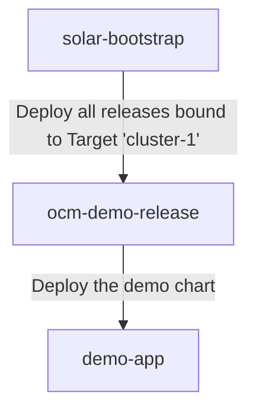

# Bootstrap

## Register the render registry

A `Target` renders and pushes its charts to a render `Registry`. Register
`zot-deploy` for that purpose:

```yaml
# render-registry.yaml
---
apiVersion: v1
kind: Secret
metadata:
  name: zot-deploy-auth
  namespace: test
type: kubernetes.io/basic-auth
stringData:
  username: admin
  password: admin
---
apiVersion: solar.opendefense.cloud/v1alpha1
kind: Registry
metadata:
  name: deploy-registry
  namespace: test
spec:
  hostname: zot-deploy.zot.svc.cluster.local
  solarSecretRef:
    name: zot-deploy-auth
  targetPullSecretName: regcred
```

```bash
kubectl apply -n test -f render-registry.yaml
```

## Register the local cluster as a target

Register a `RegistryBinding` for each Registry the target cluster needs pull
credentials for — this is how the Target controller resolves
`targetPullSecretName` into the resources it renders (see [Target
Controller](../developer-guide/target_controller.md#pull-secret-resolution)):

```yaml
# registry-bindings.yaml
---
apiVersion: solar.opendefense.cloud/v1alpha1
kind: RegistryBinding
metadata:
  name: cluster-1-deploy-registry
  namespace: test
spec:
  targetRef:
    name: cluster-1
  registryRef:
    name: deploy-registry
---
apiVersion: solar.opendefense.cloud/v1alpha1
kind: RegistryBinding
metadata:
  name: cluster-1-discovery-registry
  namespace: test
spec:
  targetRef:
    name: cluster-1
  registryRef:
    name: zot-webhook
```

```bash
kubectl apply -n test -f registry-bindings.yaml
```

Now register the local cluster as a `Target`:

```yaml
# target.yaml
apiVersion: solar.opendefense.cloud/v1alpha1
kind: Target
metadata:
  name: cluster-1
  namespace: test
spec:
  renderRegistryRef:
    name: deploy-registry
  userdata:
    foo: bar
    environment: dev
```

```bash
kubectl apply -n test -f target.yaml
```

```console
$ kubectl get target -n test
NAME        CREATED AT
cluster-1   2026-07-24T11:26:06Z
```

At this point the Target has nothing to render yet — no Release is bound to
it. Bind the Release created in [Releases](02-releases.md) with a
`ReleaseBinding`:

```yaml
# releasebinding.yaml
apiVersion: solar.opendefense.cloud/v1alpha1
kind: ReleaseBinding
metadata:
  name: cluster-1-ocm-demo
  namespace: test
spec:
  targetRef:
    name: cluster-1
  releaseRef:
    name: ocm-demo-release
```

```bash
kubectl apply -n test -f releasebinding.yaml
```

This triggers the Target controller's two-stage render (see [Rendering
Pipeline](../developer-guide/rendering-pipeline.md)):

1. A per-release `RenderTask` renders the Release into a standalone chart and
   pushes it to `deploy-registry`.
2. Once that succeeds, a bootstrap `RenderTask` bundles all of the Target's
   rendered release charts into a single chart and pushes it too. This acts
   similar to the "App of Apps" pattern from GitOps.

```console
$ kubectl get rendertasks -n test
NAME                                CREATED AT
render-rel-ocm-demo-release-a1b2c   2026-07-24T11:27:02Z
render-tgt-cluster-1-0              2026-07-24T11:27:11Z
```

Let's create a port-forward to the cluster to look inside the zot-deploy
registry:

```bash
kubectl port-forward -n zot svc/zot-deploy 4444:443 &
```

The zot UI can now be accessed at
[https://localhost:4444](https://localhost:4444/explore) — you'll find both
the `test/release-ocm-demo-release` chart and the `test/bootstrap-cluster-1`
chart that bundles it.

## Create a helm release for the bootstrap chart

Now that the desired state in form of the bootstrap chart was rendered and
pushed to the registry, it can be deployed to the cluster.

For this the initial flux resources can be created:

- `Secret` regcred with credentials to the zot-deploy registry
- `OCIRepository` pointing to the bootstrap Helm chart
- `HelmRelease` rolling out the bootstrap Helm chart

```yaml
# regcred.yaml
apiVersion: v1
kind: Secret
metadata:
  name: regcred
  namespace: test
type: kubernetes.io/dockerconfigjson
stringData:
  .dockerconfigjson: |
    {
      "auths": {
        "zot-deploy.zot.svc.cluster.local": {
          "username":"user",
          "password":"user",
          "auth":"dXNlcjp1c2Vy"
        },
        "zot-deploy.zot.svc.cluster.local:443": {
          "username":"user",
          "password":"user",
          "auth":"dXNlcjp1c2Vy"
        },
        "zot-discovery.zot.svc.cluster.local": {
          "username":"user",
          "password":"user",
          "auth":"dXNlcjp1c2Vy"
        },
        "zot-discovery.zot.svc.cluster.local:443": {
          "username":"user",
          "password":"user",
          "auth":"dXNlcjp1c2Vy"
        },
        "10.96.200.10:443": {
          "username":"user",
          "password":"user",
          "auth":"dXNlcjp1c2Vy"
        }
      }
    }
```

```bash
kubectl apply -n test -f regcred.yaml
```

```yaml
# helmrelease.yaml
---
apiVersion: source.toolkit.fluxcd.io/v1
kind: OCIRepository
metadata:
  name: solar-bootstrap
  namespace: test
spec:
  interval: 5m0s
  url: oci://zot-deploy.zot.svc.cluster.local/test/bootstrap-cluster-1
  layerSelector:
    mediaType: "application/vnd.cncf.helm.chart.content.v1.tar+gzip"
    operation: copy
  ref:
    semver: ">=0.0.0"
  secretRef:
    name: regcred
---
apiVersion: helm.toolkit.fluxcd.io/v2
kind: HelmRelease
metadata:
  name: solar-bootstrap
  namespace: test
spec:
  interval: 10m
  chartRef:
    kind: OCIRepository
    name: solar-bootstrap
  install:
    remediation:
      retries: 3
  upgrade:
    remediation:
      retries: 3
  test:
    enable: true
  driftDetection:
    mode: enabled
  values:
    userdata: {}
```

```bash
kubectl apply -n test -f helmrelease.yaml
```

```console
$ kubectl get helmreleases -n test
NAME                                          AGE   READY   STATUS
solar-bootstrap                               74m   True    Helm test succeeded for release test/solar-bootstrap.v1 with chart bootstrap-cluster-1@0.0.0+4f075db0d617: no test hooks
solar-bootstrap-ocm-demo-release-20082b8c4e   74m   True    Helm test succeeded for release test/solar-bootstrap-ocm-demo-release-20082b8c4e.v1 with chart release-ocm-demo-release@0.0.0+1b252f99eeff: no test hooks
```


```mermaid
flowchart TD
    Bootstrap[solar-bootstrap]
    OcmDemoRelease[ocm-demo-release]
    DemoApp[demo-app]
    Bootstrap -->|Deploy all releases bound to Target 'cluster-1'| OcmDemoRelease
    OcmDemoRelease -->|Deploy the demo chart| DemoApp
```

## Demo app nginx got deployed 🎉

And that's it. Now the desired state was deployed to our cluster. The nginx
deployment is available in the `test` namespace:

```console
$ kubectl get pod -n test
NAME                                                 READY   STATUS    RESTARTS   AGE
solar-bootstrap-ocm-demo-release-f38aa46a9c-demod266t   1/1     Running   0          22s
solar-bootstrap-ocm-demo-release-f38aa46a9c-demomr992   1/1     Running   0          22s
solar-bootstrap-ocm-demo-release-f38aa46a9c-demoszpsh   1/1     Running   0          22s
```
