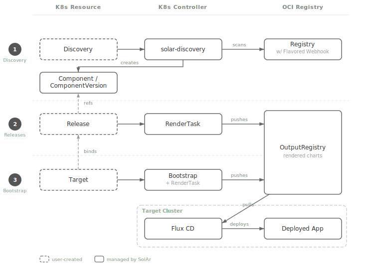

# Walk-Through

This walk-through deploys an OCM-packaged application through SolAr's full pipeline: from registry discovery to a running workload on a target cluster.

## How SolAr Uses OCM and Flux CD

SolAr combines two technologies to turn software packages into running deployments:

**Open Component Model (OCM)** is the package format. An OCM component version is stored in a standard OCI registry and bundles:

- A **component descriptor** — metadata that names the component, declares its version, and lists the resources it contains.
- **Helm charts** — stored as OCI artifacts alongside the descriptor in the same registry.
- **Container image references** — declared in the component descriptor so that downstream tooling knows which images the component needs.

OCM uses a repository layout convention (`{namespace}/component-descriptors/{component-name}`) that SolAr's discovery pipeline scans to find available packages automatically.

**Flux CD** is the deployment engine. SolAr does not install Helm charts directly. Instead, it renders a Helm chart that wraps Flux resources (`OCIRepository` + `HelmRelease`). When this rendered chart is applied to a target cluster, Flux pulls the original application chart from the OCI registry and installs it. This gives targets self-managing, continuously reconciled deployments.

The pipeline between these two — turning discovered OCM packages into Flux-ready charts — is what SolAr automates.

## Architecture



The walk-through follows three steps through SolAr's pipeline:

1. **Discovery** — SolAr scans an OCI registry for OCM component versions and creates `Component` / `ComponentVersion` resources in the Kubernetes API.
2. **Releases** — A `Release` references a `ComponentVersion`. SolAr renders a Helm chart containing the Flux resources needed to deploy it, and pushes the chart to a deploy registry.
3. **Bootstrap** — A `Target` binds releases to a cluster. SolAr creates a `Bootstrap` with a rendered chart that bundles all the target's releases. Flux on the target cluster picks up the chart and deploys the application.

## Prerequisites

You need a running dev cluster with SolAr and its dependencies installed.

**Option 1: `make dev-cluster` (recommended)**

```bash
git clone https://github.com/opendefensecloud/solution-arsenal.git solar
cd solar
make dev-cluster
```

This creates a Kind cluster named `solar-dev` with everything pre-installed:

| Component     | Namespace      | Purpose                        |
|---------------|----------------|--------------------------------|
| cert-manager  | cert-manager   | TLS certificate management     |
| trust-manager | cert-manager   | CA trust bundle distribution   |
| zot-discovery | zot            | OCI registry for OCM packages  |
| zot-deploy    | zot            | OCI registry for rendered charts |
| SolAr         | solar-system   | API server and controllers     |

See [Development Cluster with Kind](../developer-guide/dev-cluster-with-kind.md) for details.

**Option 2: existing cluster**

If you have your own cluster, install SolAr via kustomize and ensure cert-manager, trust-manager, and two Zot registries (discovery + deploy) are available. See [Getting Started](../getting-started.md).

**Tools on your workstation:**

- `kubectl`
- `helm` (v4)
- `yq`
- `ocm` CLI — the [OCM command-line tool](https://ocm.software/docs/guides/getting-started-with-ocm/installation/) for transferring component versions

## Steps

1. [Discovery](01-discovery.md) — Set up a Discovery resource, transfer an OCM component to the registry, and verify SolAr discovers it.
2. [Releases](02-releases.md) — Create a Release from the discovered ComponentVersion and inspect the rendered chart.
3. [Bootstrap](03-bootstrap.md) — Register a Target, apply the Flux HelmRelease, and confirm the application is running.

For a complete description of SolAr's architecture, see the [Architecture documentation](../developer-guide/architecture.md) and [ADRs](../developer-guide/adrs/).
